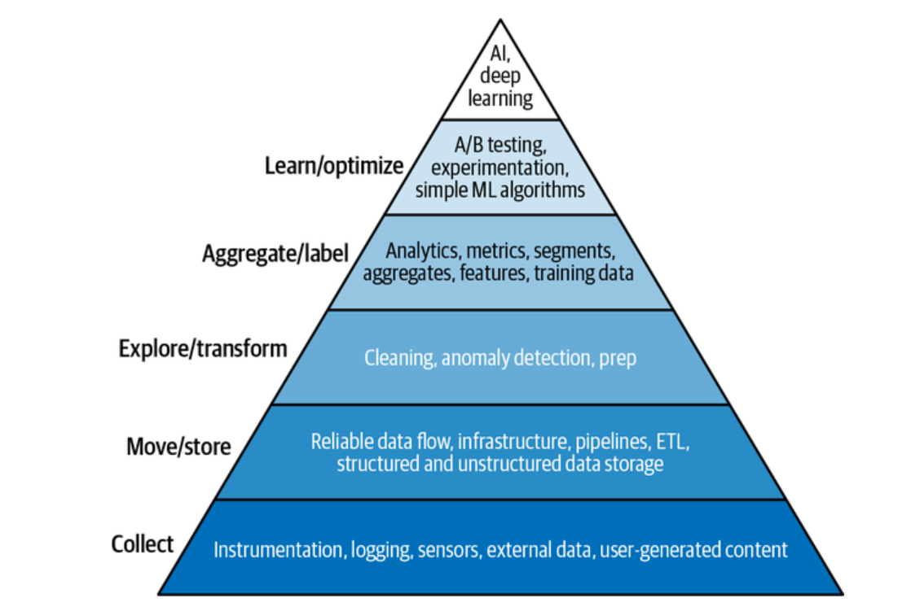
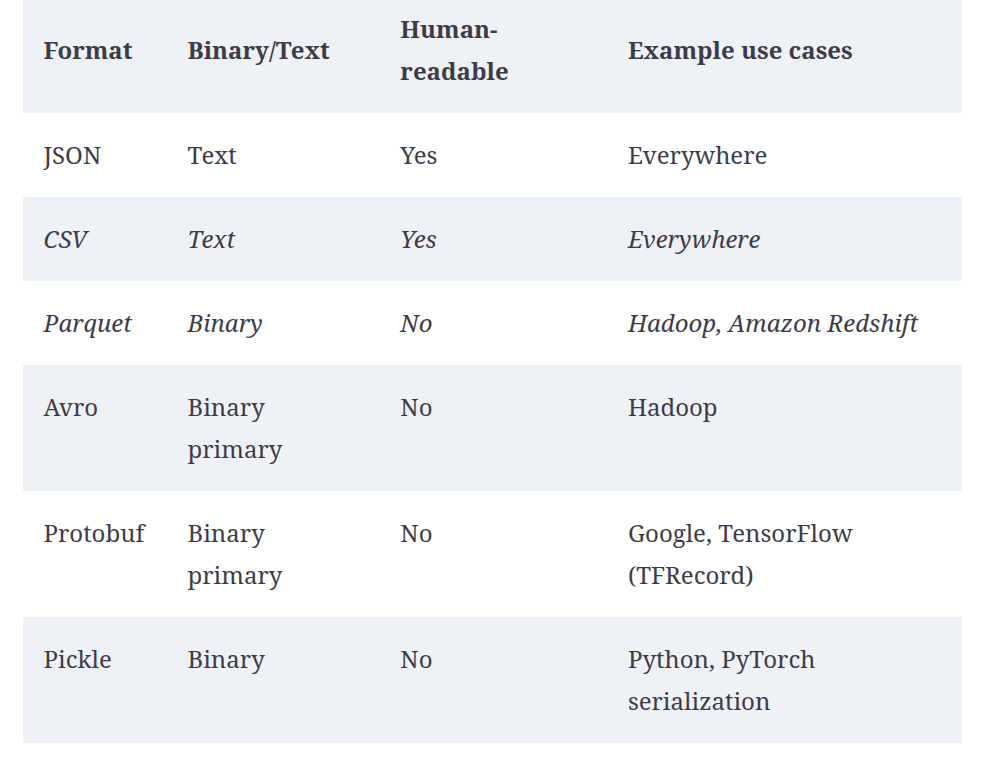
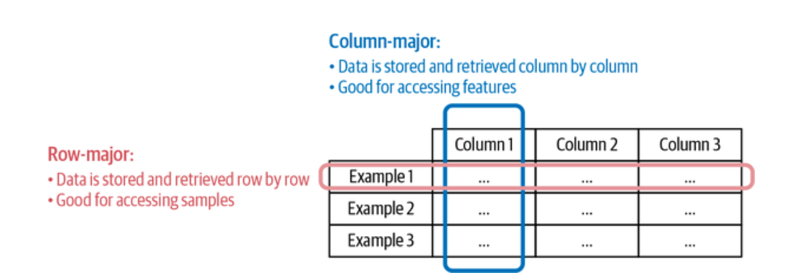
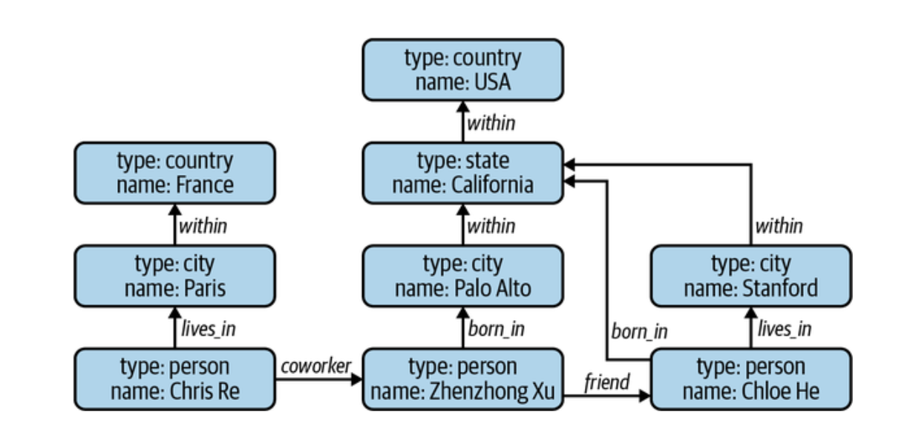

# Designing Machine Learning Systems

# Overview of Machine Learning Systems

1) The book and its sections

2) It is possible to roll out an ML model without training it. Continual learning would be in this category. When data arrives, it will train.

3) Training data and unseen data should come from the same distribution.

4) ML is useful when the cost of a wrong prediction is low.

5) If ML can't solve our problem, we can break the problem into subproblems and apply ML to each subproblem.

6) When you type on your phone, the next word would be predicted via ML. This problem is known as predictive typing.

7) Price optimization is an ML problem happening in flight tickets, accomodation bookings, internet ads, ride sharing. ML based price optimization is mostly usef for businesses that have huge amount of transactions, changing demands and eager customers that can pay dynamic price.

8) Acquiring a new customer is 5 to 25 times more expensive than retaining an old customer.

9) Some ML problems:

- Support Ticket Classification
- Brand monitoring: Sentiment analysis problem.

10) ML in Research vs ML in production

11) It is crucial for ML engineers to understand requirements from all stakeholders.

12) Ensembling techniques aren't generally used in production due to high latency characteristic.

13) ML is different than traditional SWE. In SWE, data and code are aimed to be separated. Whereas, ML systems are composed of data, code and artifacts generated by data and code.

# Chapter 2. Introduction to Machine Learning Systems Design

1) One of the typical characteristic of a failed ML project is that data scientists focus on model metrics without paying enough attention to business metrics.

2) In CTR(Click Through Rate) and Fraud Detection, model metrics and business metrics align together. Therefore, they are the most popular ML problems.

3) Most ML systems should have the following characteristics:

    - Reliability
    - Scalability
    - Maintainability
    - Adaptability

4) Code, data, and artifacts should be versioned.

5) ML project lifecycle

6) Binary classification is simpler than multiclass classification.

7) It is a good practice to have at least 100 examples for each class in a multiclass classification setup.

8) When the number of classes is high, hierarchical classification is useful. Let's assume we work in an e-commerce website. We are trying to predict the subcategory of a product. Instead of predicting subgroup via single model, split the problem into two: the first ML model predicts product category as fashion, electronics, kitchen etc. Then, the second model is going to predict as skirt, t-shirt, jacket etc.

9) Multilabel classification can be handled in two ways:
    - One model, one sample can have many labels as positive. The target array is like (0,1,1,0) instead of (0,1,0,0).
    - A separate model for each label. COnverting the problem into multiclass.

10) Multilabel classification is hard to solve compared to multiclass classification and binary classification. The first reason is the ambiguity in labeling. One labeller might think differently than another labeller. Another reason is the interpretation of the output. In multiclass classification, we predict the category with the highest category. However, in a multilabel classification, we aren't sure to assign a label because multiple labels can be assigned.

11) Framing a problem might differ. The problem is next app opening. The latter approacih is more correct. The former is vulnerable to app delete, new installed app because it requires retraining. However, the second approach doesn't require retraining.

12) Pareto optimization is about optimizing several competing objectives at the same time. Let's assume we have an ML project. We want best model performance on test data, lower latency in inference, small model in RAM, no bias in model etc. These different objectives sometimes conflict with each other. Improving one can make another one worse. "Pareto Optimization finds a set of solutions where no objective can be improved without hurting at least one other objective."

13) Let's assume we want to feed a social media homepage using ML. We want high quality content to appear at the top and we want contents resulting in more engagement to appear at the top. These two objectives are goals of the project. In such a scenario, it is a good practice to decouple objectives. One model for quality score, one model for engagement score.

14) Data Science Hierarchy

# Chapter 3 - Data Engineering

1) Storing data is interesting if you are going to retrieve it later. To grab stored data, its structure is also as important as its format. "Data models define how the data stored in a particular data format is structured".

2) Migrating logs from a log service such as datadog or logstash to object storage such as s3 might be a cheaper alternative to preserve logs in the long run.

3) Different types of data:
- First party data: Data owned by the company
- Second party data: Data owned by another company, our company buy it from them.
- Third party data: Data obtained from another company, which sells data to our company.

4) Each phone used to have a unique advertiser ID.

5) Data serialization is the process of transforming a data structure or object state into a format which can be stored, transmitted or reconstructed later.

6) Common data formats and how they are used

7) JSON is text. Thus, it consumes a lot of space.

8) CSV is row-major, which means consecutive elements in a row are stored next to each other in memory. Parquet is column-major, which means consecutive elements in a column are stored next to each other in memory. Row-major formats is faster in data writes. Pandas library in Python is in columnar format. Accessing a variable by row in pandas is much slower than accessing a variable by column in numpy.

9) AWS recommends parquet over CSV. Parquet is 2x faster in unloading and consumes up to 6x less storage in S3, according to AWS study.

10) Data model tells us how data is represented. Let's assume we can store the information of a car with its model, its year and its color. We can also store its plate number, its address, its owner. These are 2 different data models. How data is stored matters a lot.

11) Python is an imperative language. Whereas, SQL is a declarative language.

12) [Ludwig](https://github.com/ludwig-ai/ludwig) and [H2o Auto ML](https://docs.h2o.ai/h2o/latest-stable/h2o-docs/automl.html) are 2 declarative ML frameworks.

13) Declarative ML is useful in development. However, things get complicated when moving into the production.

14) The first reason why some companies start using NoSQL is that schema management in RDBMS's is painful.

15) PostgreSQL and MySQL support both RDBMS and NoSQL.

15) There are 2 types of non-relational data models:
    - Document: The relationship between one document and another is rare. Document databases move the responsibility of assuming structures from apps writing to databases to apps reading from databases. Structure is cared in reading, not in writing. The con is that retrieving data such as filtering all items whose prices are less than 30 dollars. In order to do this, you should read all documents, extract price field, compare the price to 30 dollars. The content of a document is important.
    - Graph: Relationship between data items is common and important. The relationship between data items is important.

16) An example graph database

17) Data warehouses store structured data. Data lakes store unstructured data.

18) Transactional databases(OLTP db's) require low latency and high availability. These databases have ACID(Atomicity, Consistency, Isolation, Durability).
    - Atomicity: All transactions in a group must be completed successfully. If payment fails on Uber app, no ride should be ordered.
    - Consistency: All transactions must follow predefined rules.Only logged in users can order a ride on Uber app. 
    - Isolation: 2 transactions can be carried out at the same time if there are isolated. 2 people can't have the same taxi ordered on Uber appç
    - Durability: When a change is commited, it should persist even the system breaks. Let's assume we order a ride on Uber app and our phone died. The taxi should come to us.

    