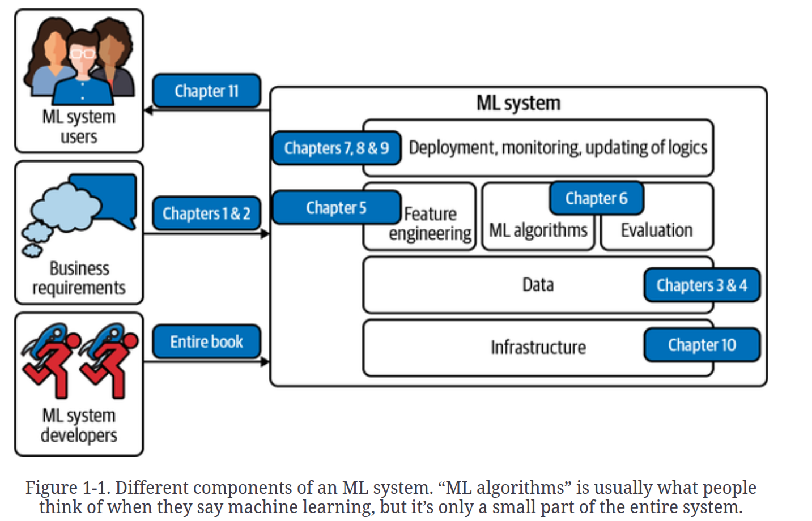
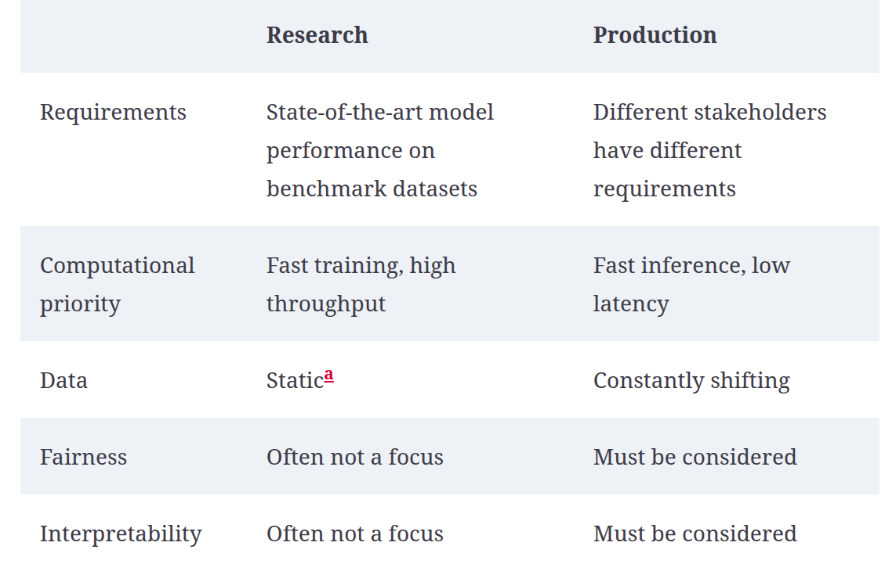
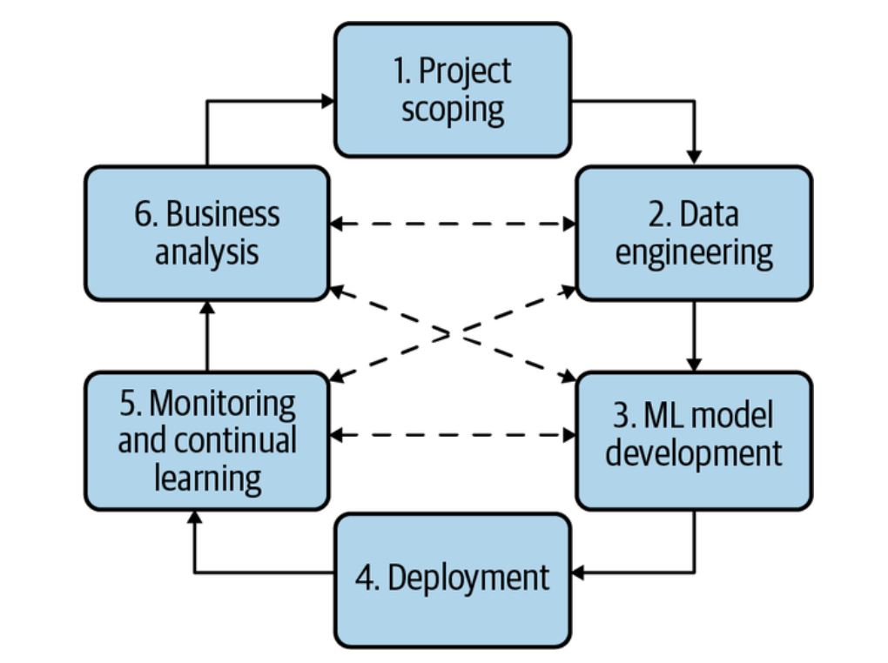
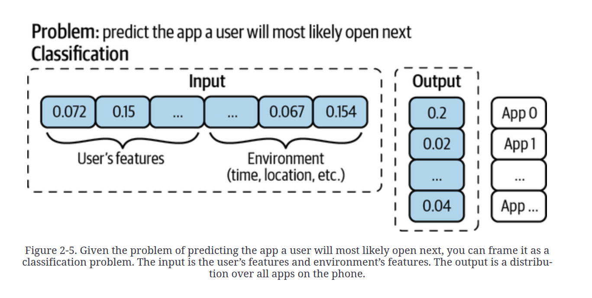
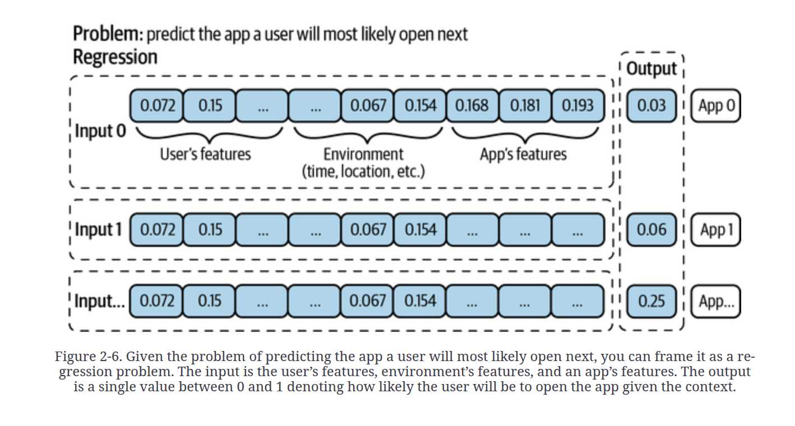

# Designing Machine Learning Systems

# Overview of Machine Learning Systems

1) The book and its sections

2) It is possible to roll out an ML model without training it. Continual learning would be in this category. When data arrives, it will train.

3) Training data and unseen data should come from the same distribution.

4) ML is useful when the cost of a wrong prediction is low.

5) If ML can't solve our problem, we can break the problem into subproblems and apply ML to each subproblem.

6) When you type on your phone, the next word would be predicted via ML. This problem is known as predictive typing.

7) Price optimization is an ML problem happening in flight tickets, accomodation bookings, internet ads, ride sharing. ML based price optimization is mostly usef for businesses that have huge amount of transactions, changing demands and eager customers that can pay dynamic price.

8) Acquiring a new customer is 5 to 25 times more expensive than retaining an old customer.

9) Some ML problems:

- Support Ticket Classification
- Brand monitoring: Sentiment analysis problem.

10) ML in Research vs ML in production

11) It is crucial for ML engineers to understand requirements from all stakeholders.

12) Ensembling techniques aren't generally used in production due to high latency characteristic.

13) ML is different than traditional SWE. In SWE, data and code are aimed to be separated. Whereas, ML systems are composed of data, code and artifacts generated by data and code.

# Chapter 2. Introduction to Machine Learning Systems Design

1) One of the typical characteristic of a failed ML project is that data scientists focus on model metrics without paying enough attention to business metrics.

2) In CTR(Click Through Rate) and Fraud Detection, model metrics and business metrics align together. Therefore, they are the most popular ML problems.

3) Most ML systems should have the following characteristics:

    - Reliability
    - Scalability
    - Maintainability
    - Adaptability

4) Code, data, and artifacts should be versioned.

5) ML project lifecycle

6) Binary classification is simpler than multiclass classification.

7) It is a good practice to have at least 100 examples for each class in a multiclass classification setup.

8) When the number of classes is high, hierarchical classification is useful. Let's assume we work in an e-commerce website. We are trying to predict the subcategory of a product. Instead of predicting subgroup via single model, split the problem into two: the first ML model predicts product category as fashion, electronics, kitchen etc. Then, the second model is going to predict as skirt, t-shirt, jacket etc.

9) Multilabel classification can be handled in two ways:
    - One model, one sample can have many labels as positive. The target array is like (0,1,1,0) instead of (0,1,0,0).
    - A separate model for each label. COnverting the problem into multiclass.

10) Multilabel classification is hard to solve compared to multiclass classification and binary classification. The first reason is the ambiguity in labeling. One labeller might think differently than another labeller. Another reason is the interpretation of the output. In multiclass classification, we predict the category with the highest category. However, in a multilabel classification, we aren't sure to assign a label because multiple labels can be assigned.

11) Framing a problem might differ. The problem is next app opening. The latter approacih is more correct. The former is vulnerable to app delete, new installed app because it requires retraining. However, the second approach doesn't require retraining.

12) Pareto optimization is about optimizing several competing objectives at the same time. Let's assume we have an ML project. We want best model performance on test data, lower latency in inference, small model in RAM, no bias in model etc. These different objectives sometimes conflict with each other. Improving one can make another one worse. "Pareto Optimization finds a set of solutions where no objective can be improved without hurting at least one other objective."

13) Let's assume we want to feed a social media homepage using ML. We want high quality content to appear at the top and we want contents resulting in more engagement to appear at the top. These two objectives are goals of the project. In such a scenario, it is a good practice to decouple objectives. One model for quality score, one model for engagement score.

