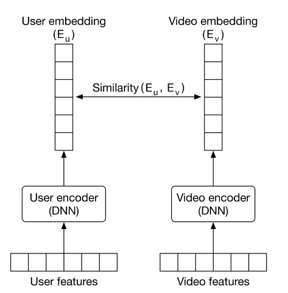

# Machine Learning System Design Interview

# Introduction and Overview

1) ML system design steps


2) When we are in an interview, the first thing is to clarify the requirements.

- Business objective

- Features the system needs to support

- Data

- Constraints

- Scale of the system

- Performance

- Privacy and Ethics

3) In an interview, the first thing is to determine whether ML is necessary or not.

4) Application, business objective and ML objective


5) ETL visualized


6) Data categorization for Machine Learning


7) "Many ML models struggle to learn a task when the features of the dataset are in different ranges"

8) Labelling can be done in two ways:

- Hand Labeling: Done by humans, expensive and slow

- Natural Labeling: No need of human annotators

9) Focal loss is a loss function to mitigate class imbalance.

10) "Model compression refers to the process of making a model smaller".

11) Shadow deployment is a technique to evaluate the performance of a new model in the online environment. The new model and the existing model are predicting the same input but the predictions of the existing model are shown to the user. When we become confident, the predictions of the new model are used. Thanks to shadow deployment, we are minimizing the risk of unreliable outcomes. The con of this method is that we are increasing the serving duration because one input is scored by 2 different models instead of a single one. 


12) The most common reason why an ML model fails is data distribution shift.

# Visual Search System

1) A visual search problem can be thought as a ranking problem.


2) Common image processing operations


3) In order to create a training dataset, we should have a positive image similar to anchor image and many negative images. The number of negative images should be tuned. Negative images can be chosen randomly. However, there are 3 ways to label an image as a positive example.

    - Human Labeling: Accurate training data but expensive operation.
    - User Interactions: It can generate noisy data and lead to poor performance.
    - Artifically create a similar image from the query image, known as self supervision: It can be implemented via rotating the image and labelling it as a positive. The frameworks named [SimCLR](https://github.com/google-research/simclr) and [MoCo](https://paperswithcode.com/method/moco-v2) use this approach efficiently.


4) Contrastive loss function should be chosen. There are different contrastive loss functions.


5) In order to compute similarities, cosine similarity or dot product should can be chosen. Euclidean distance performs bad due to curse of dimensionality. After computing similarities, the computed similarities are fed into a softmax function and then the cross entropy loss is calculated in order for backpropagation.

6) Some offline evaluation metrics for this ranking problem.


7) MRR criteria takes care of only the positive image's prediction.

8) mAP means mean average precision. It is designed for binary relevances.

9) "nDCG works well most times. Its primary shortcoming is that deriving ground truth relevance scores is not always possible. In our case, since the evaluation dataset contains similarity scores, we can use nDCG to measure the performance of the model during the offline evaluation"

10) Some online metrics for evaluation

- Click Through Rate

- Average daily, weekly, and monthly time spent on the suggested images

11) Serving is composed of 2 pipelines. One pipeline is responsible for keeping index table of embeddings of images updated. The other one is responsible for generating similar images for query image.


12) Reranking service is taking care of filtering unappropriate images, removing duplicates and near duplicate images, filtering out private images etc.

13) Approximate nearest neighbor(ANN) should be implemented when data is huge. There are 3 types of ANN's.

- Tree-based ANN:


- Locality-sensitive hashing (LSH)-based ANN: Using a hash function to map points into buckets. Query image is fed into hash function. The images in in the predicted bucket of query image should be recommended.


- Clustering-based ANN: Creating clusters and searching similar images among the cluster

14) There are 2 common libraries to implement ANN. One of them is [faiss](https://github.com/facebookresearch/faiss) of Facebook and the other one is [scann](https://github.com/google-research/google-research/tree/master/scann) of Google.

# Google Street View Blurring System

1) The purpose is to blur license plates and human faces.

2) The input will be an image that may contain zero or multiple objects in itself. The output will contain objects and their locations. The problem should be framed as object detection problem.


3) Generally, an object detection(OD) system has 2 responsibilities.

- Detecting an object's location: Regression

- Determining the class of object: Multiclass classification

4) There are 3 typearchitecturess of OD system.

- One Stage Networks

- Two Stage Networks

- Transformer based architectures: DETR is an example.

5) There are 2 components in two stage networks. The first network is Region Proposal Network and the second network is classifier. Examples of two stage networks are RCNN, Fast R-CNN, Faster R-CNN. Two stage networks run slower but more accurate compared to one stage networks.


6) In one stage networks, there is only one network. YOLO and SSD are examples of one stage networks. It is faster but less accurate compared to two stage networks.


7) A dataset of 1 million images isn't considered to be huge by modern standards.

8) The annotated data is structured as follows.


9) Some augmentation techniques


10) There are 2 approaches to augment data. The first method is offline augmentation. Dataset is first augmented and then stored in storage. Finally, it is used in training. Whereas, the second method is online augmentation. Dataset is augmented in the phase of training. Both approaches have advantages and disadvantages. The pro of offline training is less time spent in training. The con of offline training is storage difficulties. The pro of online augmentation is no need for storage because everything is on the fly. The con of online augmentation is more time spent in training.


11) Some preprocessing operations are resizing, scaling and normalizing.

12) How 2 stage object detection network works


13) MSE(Mean Squared Error) should be use in regression task and Cross Entropy loss should be used in classification task. The final loss should be the sum of regression and classification losses.

14) How Intersection Over Union(IoU) is calculated


15) The performance of the model can be checked via Precision, Average Precision and Mean Average Precision. Precision is dependent on the selected threshold. The less the threshold, the more the precision. In order to remove the effect of threshold, Average Precision is invented. It is calculating the precision against different thresholds using integral for one class(human face). Average Precision can be calculated via a discrete summation over a predefined list of thresholds instead of using integral. Mean Average Precision is the mean of average precisions for different classes.

    - Precision: 
    
    - Average Precision using integral
    
    - Discretized Average Precision
    
    - Mean Average Precision
    

16) A very common problem in object detection is the overlapping boundary boxes. It is necessary to lower the number of overlapping boundary boxes. NMS(Non Maximum Suppression) is a technique to decrease the number of overlapping boundary boxes. "NMS is a post-processing algorithm designed to select the most appropriate bounding boxes. It keeps highly confident bounding boxes and removes overlapping bounding boxes". NMS is a commonly asked algorithm in interviews.


17) The overall design is below.


18) Preprocessing and blurring services are 2 decoupled because preprocessing is a CPU-bound operation and blurring is a GPU-bound operation. It is easier to scale them when they are separated. Blurring service is responsible for making predictions, applying NMS, blurring predicted areas and storing the blurred images in object storage.

# YouTube Video Search

1) The problem can be framed as a ranking problem. The input(video with its metadata like description and title) will be fed into **visual search** and **text search** components separately. Then, the results will be combined.


2) How visual search works. The similarity score between video embedding and text embedding is calculated using dot product. Then, most similar vides are shown for a query.


3) How text search works. Videos which have the most similar titles, descriptions and tags are shown for a query.


4) Inverted index is a popular technique for creating text based document search. Elastic search is an example of Inverted Index. It doesn't use ML. Elastic search is a scalable search engine and document store. For more information as to Elastic Search, click here[https://www.tutorialspoint.com/elasticsearch/elasticsearch_query_dsl.htm].

5) How to represent a text with a numerical vector


6) 3 steps of converting a text to a numerical vector

- Normalization

    - Lowercasing
    - Removing punctuations
    - Trimming whitespaces
    - Removing accents: Noël → Noel
    - Lemmatization

- Tokenization

    - Word tokenization: ["I", "have", "a", "car"]
    - Subword tokenization: n grams
    - Character tokenization

- Tokens to ID's:

    - Lookup table:

    

    - Hashing:

    

6) Converting tokens to ID's are done via Lookup table or Hashing. The comparison is below


7) How to process a video


8) Video decoding is the operation of transforming a video into multiple frames. The total number of frames is by the multiplication of FPS(Frame Per Second) and Duration of Video. If FPS is 25 and the duration of video is 20, there are 500(25*20) frames in the video.

9) There are 2 categories to process text. 

- Statistical Models:
    - Bag Of Words
    - TF-IDF
- ML Based Models:
    - Embedding: Simple and efficient solution to map high-cardinal data into dense vectors
    
    - Word2Vec:
    
    - Transformers: ıts advantage is capturing context
    

10) Video encoding can be done in 2 ways:

- Video Level Model: Expensive, slow in serving


- Frame Level Model: Faster, should be used when temporality isn't crucial. Frame level models aren't good at capturing understanding actions and motions. ViT(Vision transformer) is a frame level model which can be chosen.


11) Contrastive Learning can be used in training. Our annotated dataset is depicted below. The training pipeline is taking video as one input, taking many queries of 1 corresponding positive label and n-1 negative(irrelevant) labels as text input, computing similarities, scaling on softmax and outputing a probability of each text input for the input video.


12) Mean Reciprocal Rank can be a good offline metric.


13) Some online metrics

- CTR: Click Through Rate

- Video Completion Rate

- Total watch time of search results

14) Simplified Design for indexing video pipeline, prediction pipeline and indexing text pipeline.


15) Fusing layer is taking videos(visual search and text search) from the previous step and reranking according to relevance score(like time).

16) Reranking service is applying business-level logic and policies at the end.

# Harmful Content Detection

1) Posts that contain violence, nudity, self-harm and hate speech are recognized as harmful content.

2) Fusion is a concept that is related to combining different inputs of different modalities. There are 2 types of fusions.

    - Late Fusion: Separating each model independently for each modality first. Secondly, the outputs of each model for each modality are fused. Not capturing the relationship for a meme that has a text and image.
    
    

    - Early Fusion: Combining the vectors for each modality first. Then, the combined vector is fed into a single neural network. This approach captures more potentially than late fusion. This approach is harder to train. In the absence of training data, early fusion method fails.

    

3) Choosing the right ML strategy is hard. We have 4 options.

- Simple Binary Classifier: Easy to train, but it lacks of explanation why a content is harmful.


- One binary classifier for each harmful class: Hard to maintain and train.


- Multilabel classifier: Single model is its advantage. But using the same vector for each class isn't appropriate because the inputs may require different transformations.


- Multi task classifier: Learning together to some extent, then each class has its own classification head. This approach is a single model solution and allowing different harmful criteria to get specialized in their classification heads.


4) Framing the problem as a Machine Learning problem using multi task classifier. The advantages of multi task classifier are its simplicity to train(one ML model), redundant operations for each harmful class are removed thanks to transformed features and the learning of a harmful class may contribute to the learning of other harmful class. In multi task training, each task is assigned a loss function based on its ML category.


5) The following data available

- User Data:


- Post Data:


- User-Post Interation Data:


6) BERT is trained in English only. Therefore, DistilmBERT can be used. DistilmBERT is an efficient variant of BERT to produce embeddings. If a sentence in language #1 is close to another sentence in language #2, their embeddings are so similar.

7) [CLIP's visual encoder](https://openai.com/research/clip) and [SimCLR](https://arxiv.org/pdf/2002.05709.pdf) are 2 alternatives to convert an image into a feature vector.

8) [VideoMoCo](https://arxiv.org/pdf/2103.05905.pdf) is a video model transforming a video into a feature vector.

9) The following types of data can be used.

- Textual content
- Image or video
- User reactions to the post
- Author
- Contextual information

10) User reactions such as the number of likes, the number of shares, the number of comments and the number of reports can be fed into the model.

11) User comments should be transformed into a feature vector and the aggregated via averaging.

12) The summary of how textual data, image data, video data, reaction data and comments data can be concatenated


13) Some features on authors can be extracted.

- Violation based features:
    - Number of violations in the past
    - Total user reports: How many times other users reported the author of the post.
    - Profane words rate
- Demographics based features:
    - Age
    - Gender
    - Location(City and country): It is sparse when one-hot encoded. To solve this problem, use embeddings.
- Account Information
    - The age of account
    - The number of followers and followings

14) Contextual information represents information which is not related to the post and the author of the post.
    - Time of day
    - Device: Mobile or Desktop or Tablet

15) Summary of Feature Engineering


16) It would be a good practice to employ natural labeling on training phase and human labeling on validation phase. Natural labeling is less costly but less accurate. Human labeling is more costly and more accurate. Natural labeling can be programmed based on user reports. The reason why to select human labeling in validation is to be sure about the performance of the ML model trained on naturally labeled data.


17) How to compute loss. Each task can have its specific loss functions and their sum can be the total loss.


18) A common challenge in training multimodel ML models is overfitting. One modality(image etc) may prevail over the others. In order to solve this problem, [gradient blending](https://arxiv.org/pdf/1905.12681.pdf) or focal loss can be used.

19) Precision and Recall can be insufficient to evaluate the performance. Therefore, AUROC(Area Under Receiver Operating Characteristic) and AUPRC(Area Under Precision Recall Curve) can be used as offline metrics. To learn the difference between both, take a look at [here](https://machinelearningmastery.com/roc-curves-and-precision-recall-curves-for-classification-in-python/).

20) Some online metrics should also be used to evaluate the performance of the model.

21) How to serve in a real-time system


22) If a post is predicted as harmful with low confidence, it should be manually reviewed. After the manual review, a human assigns a label to the post. Then, this manually labeled post should be stored in the storage and can be useful for further trainings.

# Video Recommendation System

1) A customized homepage is going to be fed via ML.


2) There might be multiple ML objectives.

    - Maximizing number of clicks: Recommending clickbait videos more. Worsening customer experience.
    - Maximizing number of completed videos: Bias to recommending short videos
    - Maximizing total watch time: Biased to the videos watched more
    - Maximizing the number of relevant videos: Based on business rules such as whether a user clicks like button or a user watches at least 50 percent of video, a relevance can be defined. We can construct a dataset and train a model to predict a relevance score.

3) Common types of recommendation systems


4) Youtube is using a CF based model as the first stage to generate candidates. Then it uses content based RS as the second stage to recommend videos.

5) Most companies use hybrid RS. There are 2 types of Hybrid RS's. Parallel or Sequential. Sequential Hybrid RS's are used more. The following design will be based on Sequential Hybrid RS.


6) Available data

- Video


- User


- User-Video Interaction


7) 4 types of different data

- Video features:

    - Video ID: Converted to dense vectors thanks to embedding layer
    - Duration
    - Language
    - Titles and tags: Titles are converted to feature vectors thanks to a context-aware word embedding model such as BERT. Tags are converted to feature vectors thanks to a lightweight pretrained model such as CBOW.


- User demographics


- Contextual Information


- User historical interactions

    - Search History: Mapping each search query into an embedding vector. A user's search history is a variable-sized list of textual queries. To create a fixed size feature vector, average the query embeddings.
    - Liked videos: Video ID's are mapped into an embedding vector using embedding layer. Similar to search history, they are averaged.
    - Watched videos: Similar to liked videos
    - Impressions: Similar to liked videos


8) What we are optimizing is relevancy. Therefore, both implicit and explicit feedbacks are so important for Matrice Factorization methods.


9) The loss function will include the loss computer for observed and unobserved pairs.


10) There are 2 MF optimization techniques. WALS converges faster and it is parallelizable.

- Stochastic Gradient Descent: Used to minimize losses
- Weighted Alternating Least Squares (WALS): Specific to matrix factorization
    - Fix one embedding matrix (U), and optimize the other embedding (V)
    - Fix the other embedding matrix (V), and optimize the embedding matrix (U)
    - Repeat.

11) RS returns predictions based o relevancy score.


12) MF optimizes user-video matrices and obtains video embeddings and user embeddings.

13) MF is built on top of user-video interactions. Thus, it doesn't take other features such as age, time, video and user features into consideration.

14) Matrix Factorization Inference


15) Pros and cons of MF

- Pros:
    - Training Speed: Only 2 embedding spaces(user and video) learned, thus fast.
    - Serving Speed: The learned embeddings are the same. We can reuse them.
- Cons:
    - No content data used.
    - Handling new users aka cold start problem.

16) The two tower neural network is an alternative to Matrix Factorization.



17) How to construct the dataset. Labels are assigned according to explicit likes(1) or dislikes(0) or whether half of the video is watched(1) etc.


18) Only a small fraction of videos attract a person's attention. Therefore, negative samples should outweight positive samples. This introduces the problem of imbalanced datasets.

19) The problem is a binary classification problem. It is trained via cross entropy loss.


20) At inference of two tower networks, embeddings are used to find the most relevant videos of a given user. This is a classic nearest neighbor problem.


21) Matrix Factorization vs Two Tower Networks


22) Some offline metrics to evaluate

- Precision@K

- mAP

- Diversity: When 10 items are recommended, there are 45 pairs(combination(10,2)). For each pair, calculate similarity between 2 items. Average the similarity of 45 pairs. If it is low, it is a good indication of diverse recommendations. Diversity shouldn't be the number 1 metric.

23) Some online metrics to keep an eye

- CTR: Click Through Rate, its drawback is that clickbait videos might be misleading.


- The number of completed videos:

- Total Watch Time:

- Explicit User Feedback: The total number of explicitly liked or disliked videos

24) Prediction pipeline at serving. 2 ML models used consecutively. The first one will generate candidates via a lightweight ML model, the second one will score and rank them via a heavier model.


25) The prediction pipeline has the following 3 components.

- Candidate generation

- Scoring

- Reranking

26) Candidate Generation

- The goal of Candidate generation is to narrow down the videos from billions to thousands.

- We prioritize efficiency over accuracy at this phase and we don't care false positives.

- To keep candidate generation fast, we choose a model which doesn't rely on video features. In adddition to this, the model should handle new users. **Two tower neural networks** are pretty useful in this phase.

- A user's embedding is computed. Then, a nearest neigbor service is run to retrieve the most similar videos. The retrieved videos are ranked based on similarity in the embedding space and returned as the output.


27) In practice, companies tend to run many parallel candidate generation services based on trending, popular and relevant videos. Using many candidate generation services improve the performance.


28) Scoring component is also known as ranking. Scoring is prioritizing accuracy over efficiency. Video features are taken into account. Two tower neural networks are also used in this phase with video features. Scoring component is taking user and candidate videos as input, scores each video and outputs a ranked list of videos.


29) Reranking is another component to rerank the output videos of scoring components. It does reranking according to below criteria.

    - Region-restricted videos
    - Video freshness
    - Videos spreading misinformation
    - Duplicate or near-duplicate videos
    - Fairness and bias

30) Challenges of a video recommendation system

- Serving speed: The reason to use a two step solution is to be fast.

- Precision: A lightweight model used to generate candidates, a heavier model used to create the output list

- Diversity: Having different candidate generation services in parallel can bring diversity to our recommendations

- Cold start problem:
    - For new users, features like gender, age, location can be utilized.
    - For new videos, new videos are presented to random users to collect interaction data

31) Some more resources:

- [Youtube RS Paper](https://static.googleusercontent.com/media/research.google.com/en//pubs/archive/45530.pdf) and [Blog Post](https://blog.youtube/inside-youtube/on-youtubes-recommendation-system/)
- [Instagram RS](https://ai.meta.com/blog/powered-by-ai-instagrams-explore-recommender-system/)
- [Seasonality in RS](https://www.computer.org/csdl/proceedings-article/big-data/2019/09005954/1hJsfgT0qL6)

# Event Recommendation System

1) The design will be similar to [eventbrite](https://www.eventbrite.com/). Eventbrite is an event management and ticketing marketplace. The aim is to display a list of personalized events to users.

2) Different approaches to recommendation systems. Showing popular items is an aeample of rule based systems. CB Filtering and CF are examples of embedding based solutions.


3) A book on [Learning to Rank(LTR)](https://livebook.manning.com/book/practical-recommender-systems/chapter-13/15). "LTR is a class of algorithmic techniques that apply supervised machine learning to solve ranking problems. The ranking problem can be formally defined as: "having a query and a list of items, what is the optimal ordering of the items from most relevant to least relevant to the query?""

4) Pointwise LTR. Each item is predicted independently. The final ranking is achieved by sorting the predicted relevancy scores.


5) Pairwise LTR. Taking 2 items and finding which one is more relevant. Some popular algoritms are [RankNet](https://icml.cc/2015/wp-content/uploads/2015/06/icml_ranking.pd), [LambdaRank](https://www.microsoft.com/en-us/research/wp-content/uploads/2016/02/lambdarank.pdf) and [LambdaMart](https://www.microsoft.com/en-us/research/wp-content/uploads/2016/02/MSR-TR-2010-82.pdf)


6) Listwise LTR. Some popular listwise LTR algorithms are [SoftRank](https://www.microsoft.com/en-us/research/wp-content/uploads/2016/02/SoftRankWsdm08Submitted.pdf), [Listnet](https://www.microsoft.com/en-us/research/wp-content/uploads/2016/02/tr-2007-40.pdf) and [AdaRank](https://dl.acm.org/doi/10.1145/1277741.1277809).


8) In general, listwise LTR and pairwise LTR perform better than pointwise LTR. But they are difficult to implement and train.

9) The selected approach of LTR is pointwise as below.


10) Available data in the system can be visualized like below:

- Users


- Events


- Friendship


- Interactions


11) Event based recommendations are essentially different than movie recommendation or book recommendation. When an event is created, it will occur after a few days or weeks. When an event occurs, it shouldn't be recommended to other users because it pasted away. This is because of the fact that events are short-lived. Moreover, interaction data is limited. Due to these, event based recommendations suffer from cold start problem of new items(events).

12) Due to the hard nature of event based recommendations, more effeorts should be put on feature engineering. We can generate different features such as below

- Location related features

- Time-related features

- Social-related features

- User-related features

- Event related features

13) Below is an example of location related features. Some of the features are elaborated.

- Walk score: The measure of how hard to walk to the location of the event.

- Walk score similarity: For a specific user, the difference between the walk score of an event and the average walk score of events that the user joined before.

- Distance: The distance between the user's location and the event's location. Then, bucketize it.

- Distance similarity: The difference between Distance depicted above and the average distance of a specific user in previous events


14) Below is an example of time related features.

- Remaining time means the time between current time and the event time. Then, bucketize it.

- Estimated travel time: The time required to go to the location of an event from the location of a user.

- Similarity features are obtained as similar to walk score similarity and distance similarity of location based features


15) Social related features

- How many people are attending this event?

    - Number of users registered for this event
    - The ratio of the total number of registered users to the number of impressions
    - Registered user similarity: The difference between the number of registered users for the event in question and previously registered events

- Features related to attendance by friends

    - Number of the user's friends who registered for this event
    - The ratio of the number of registered friends to the total number of friends
    - Registered friend similarity: Difference between the number of registered friends for the event in question and previously registered events

- Is the user invited to this event by others?

    - The number of friends who invited this user to the event

    - The number of fellow users who invited this person to the event

- Is the event's host a friend of the user?

- How often has the user attended previous events created by this host?

16) User related features

- Gender

- Age

17) Event related features

- Price: Bucketize it.

- Price Similarity: The difference between the price of an event and the average price of events attended by a specific user.

- How similar is this event's description to previously registered descriptions? This feature might be noisy.

18) An example of social, user and event related features.


19) What we did to create features is to generate embeddings of users and events.

20) Some more topics to be discussed:

- Batch vs Streaming Features: Batch features cover less frequently changing features such as gender and age. Streaming features are dynamic features that change more frequently such as the time difference between prediction time and event time.

- Feature computation efficiency: Instead of computing distances between 2 points(location of the event and location of the user) explicitly, give them as input separately and expect the model to infer this information behind the scenes. Computing a distance on the fly might be time consuming

- Using a decay factor: Think of it like an exponential smoothing. Assign more weights to latest interactions.

- Representation Learning: Represent the features of event as an embedding, represent the features of a user as an embedding.

21) [A small video on Logistic Regression](https://www.youtube.com/watch?v=yIYKR4sgzI8&ab_channel=StatQuestwithJoshStarmer)

22) Continual learning, also known as lifelong learning or incremental learning, is a machine learning paradigm where a model learns continuously over time from a stream of data, adapting to new information while retaining previously acquired knowledge. Unlike traditional batch learning approaches where models are trained on fixed datasets and then deployed without further updates, continual learning models are designed to continually update their knowledge as new data becomes available.

23) NN's are more preferrable over Gradient Boosting Algorithms. Continual learning is possible in NN's.

24) Input pair is composed of user embedding and event embedding. Output is whether a user registered for an event or not. If registered, label is 1. Otherwise, label is 0.


25) To solve class imbalance problem, choose one of the followings

- Use focal loss or class balanced loss

- Undersample the majority class

26) MRR means Mean Reciprocal Rank. It is a metric used in information retrieval. It focuses on the first relevant item in the list, which is suitable for systems that look for only one relevant item. In an event recommendation system, many events might be relevant to a user. Thus, MRR can't be the best metric. An MRR example.

```python

def reciprocal_rank(rank_list):
    """Calculate the reciprocal rank for a given ranked list of items."""
    for i, item in enumerate(rank_list, 1):
        if item == 1:  # Assuming relevant items are labeled as 1
            return 1.0 / i
    return 0.0  # If no relevant item is found in the list


def mean_reciprocal_rank(rankings):
    """Calculate the Mean Reciprocal Rank (MRR) for a list of query rankings."""
    total_rr = 0.0
    for rank_list in rankings:
        rr = reciprocal_rank(rank_list)
        print(rr)
        total_rr += rr
    return total_rr / len(rankings)


# Example rankings for three queries (binary relevance: 1 for relevant, 0 for irrelevant)
rankings = [
    [0, 0, 1, 0, 1],  # Query 1: Relevant items at positions 3 and 5
    [0, 1, 0, 0, 0],  # Query 2: Relevant item at position 2
    [0, 0, 0, 0, 0],  # Query 3: No relevant items
]

# 0.333333333333
# 0.5
# 0.0
# ('Mean Reciprocal Rank (MRR):', 0.277777777778)

# Calculate MRR for the example rankings
mrr = mean_reciprocal_rank(rankings)
```

27) mAP is another metric to be used in IR. mAP works only when relevancy scores are binary. In our case, relevancy score is binary, corresponding to whether a user is registered or not. Therefore, mAP is an offline metric that we look for.

```python
def average_precision(relevant_items):
    """Calculate the Average Precision (AP) for a single query."""
    precision_sum = 0.0
    num_relevant = 0.0
    temp_dict = {}
    for i, item in enumerate(relevant_items, 1):
        if item == 1:  # Assuming relevant items are labeled as 1
            num_relevant += 1
            temp_dict[str(i)] = num_relevant / i
    if num_relevant == 0:
        return 0.0
    return sum(temp_dict.values())/num_relevant

def mean_average_precision(relevance_list):
    """Calculate the Mean Average Precision (mAP) for a list of query relevance lists."""
    total_ap = 0.0
    for relevant_items in relevance_list:
        ap = average_precision(relevant_items)
        print(ap)
        total_ap += ap
    return total_ap / len(relevance_list)


# Example relevance lists for three queries (binary relevance: 1 for relevant, 0 for irrelevant)
relevance_lists = [
    [1, 0, 0, 1, 0],  # Query 1: Relevant items at positions 1 and 4
    [0, 1, 1, 0, 0],  # Query 2: Relevant items at positions 2 and 3
    [0, 0, 1, 0, 0],  # Query 3: Relevant item at position 3
]

# Calculate mAP for the example relevance lists
mAP = mean_average_precision(relevance_lists)
print("Mean Average Precision (mAP):", mAP)

# 0.75
# 0.583333333333
# 0.333333333333
# ('Mean Average Precision (mAP):', 0.555555555556)


```

28) nDCG works when relevancy scores aren't binary. Thus, it isn't our metric in event recommendation.

29) Below are some online metrics to consider:

- Click-through rate (CTR)
- Conversion rate
- Bookmark rate
- Revenue lift

30) Our design composes of 2 pipelines, online learning pipeline and prediction pipeline.


31) Online learning pipeline is responsible for continously training new models by incorporating new data, evaluating the trained models and deploying them.

32) Event filtering service of prediction pipeline. It is responsible for subsetting the search space based on event locations, event type(concert) etc.


33) Ranking service workflow. It takes the anchor user and candidate events and outputs a prediction score and ranks them according to prediction scores.


34) References of the chapter

- Learning to rank methods. https://livebook.manning.com/book/practical-recommender-systems/chapter-13/53.
- RankNet paper. https://icml.cc/2015/wp-content/uploads/2015/06/icml_ranking.pd f.
- LambdaRank paper. https://www.microsoft.com/en-us/research/wp-content/uploads/2016/02/lambdarank.pdf.
- LambdaMART paper. https://www.microsoft.com/en-us/research/wp-content/uploads/2016/02/MSR-TR-2010-82.pdf.
- SoftRank paper. https://www.microsoft.com/en-us/research/wp-content/uploads/2016/02/SoftRankWsdm08Submitted.pdf.
- ListNet paper. https://www.microsoft.com/en-us/research/wp-content/uploads/2016/02/tr-2007-40.pdf.
- AdaRank paper. https://dl.acm.org/doi/10.1145/1277741.1277809.
- Batch processing vs stream processing. https://www.confluent.io/learn/batch-vs-real-time-data-processing/#:~:text=Batch%20processing%20is%20when%20the,data%20flows%20through%20a%20system.
- Leveraging location data in ML systems. https://towardsdatascience.com/leveraging-geolocation-data-for-machine-learning-essential-techniques-192ce3a969bc#:~:text=Location%20data%20is%20an%20important,based%20on%20your%20customer%20data.
- Logistic regression. https://www.youtube.com/watch?v=yIYKR4sgzI8.
- Decision tree. https://careerfoundry.com/en/blog/data-analytics/what-is-a-decision-tree/.
- Random forests. https://en.wikipedia.org/wiki/Random_forest.
- Bias/variance trade-off. http://www.cs.cornell.edu/courses/cs578/2005fa/CS578.bagging.boosting.lecture.pdf.
- AdaBoost. https://en.wikipedia.org/wiki/AdaBoost.
- XGBoost. https://xgboost.readthedocs.io/en/stable/.
- Gradient boosting. https://machinelearningmastery.com/gentle-introduction-gradient-boosting-algorithm-machine-learning/.
- XGBoost in Kaggle competitions. https://www.kaggle.com/getting-started/145362.
- GBDT. https://blog.paperspace.com/gradient-boosting-for-classification/.
- An introduction to GBDT. https://www.machinelearningplus.com/machine-learning/an-introduction-to-gradient-boosting-decision-trees/.
- Introduction to neural networks. https://www.youtube.com/watch?v=0twSSFZN9Mc.
- Bias issues and solutions in recommendation systems. https://www.youtube.com/watch?v=pPq9iyGIZZ8.
- Feature crossing to encode non-linearity. https://developers.google.com/machine-learning/crash-course/feature-crosses/encoding-nonlinearity.
- Freshness and diversity in recommendation systems. https://developers.google.com/machine-learning/recommendation/dnn/re-ranking.
- Privacy and security in ML. https://www.microsoft.com/en-us/research/blog/privacy-preserving-machine-learning-maintaining-confidentiality-and-preserving-trust/.
- Two-sides marketplace unique challenges. https://www.uber.com/blog/uber-eats-recommending-marketplace/.
- Data leakage. https://machinelearningmastery.com/data-leakage-machine-learning/.
- Online training frequency. https://huyenchip.com/2022/01/02/real-time-machine-learning-challenges-and-solutions.html#towards-continual-learning.

# Ad Click Prediction on Social Platforms

1) "Online advertising allows advertisers to bid and place their advertisements (ads) on a platform for measurable responses such as impressions, clicks, and conversions. Displaying relevant ads to users is a fundamental for many online platforms such as Google, Facebook, and Instagram."


2) THe training dataset is constucted via user and ad data. If an ad is clicked, it is labeled as positive. There might be some strategies to label negatives such as viewing an ad for a certain time but not clicking, labeling all impressions before a click as negatives, labeling a hide/block reaction as negative etc. 

3) Continual learning is a necessity. Event a 5 minute delay might worsen the performance.

4) A high level design


5) A pointwise Learning To Rank approach


6) Available data are listed below

- Ads:


- Users:


- Interaction data covering click, conversion and impression:


7) Some features to be engineered from ad data

- ID's: Advertise ID, Campaign ID, Ad ID and Ad Group Id to represented as embedding layer separately.

- Image/Video: A feature vector to be generated via a pretrained model.

- Ad category and subcategory such as Arts & Entertainment, Autos & Vehicles, Beauty & Fitness.

- Impressions and click numbers:

    - Total Impression/Click on Ad
    - Total Impression/Click on ads supplied by an advertiser
    - Total impressions of the campaign


8) User features

- Demographics: Age, gender, city, county

- Contextual information: Time of day, device

- Interaction-related features: Clicked ads, user's historical engagement statistics

    - Clicked ads mean previosly clicked ads
    - Historical engagement statistics means the more a user clicked in the past, the more a user clicks in the future.


9) High cardinality may lead to thousands or millions of features mostly filled with zeroes.


