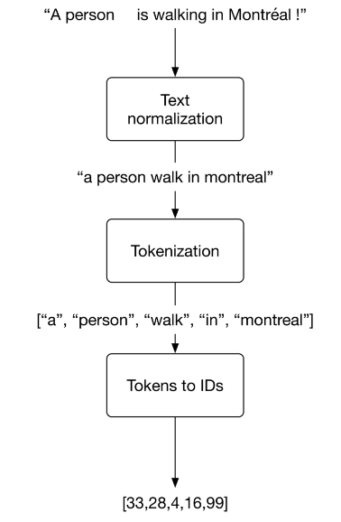
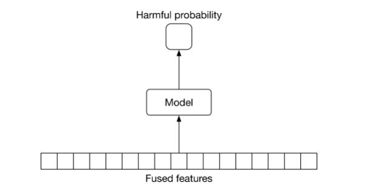
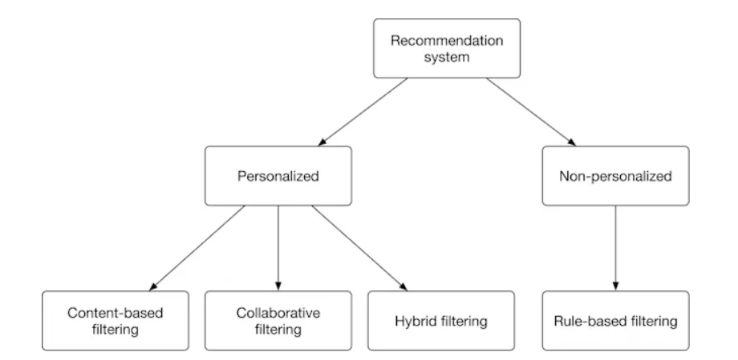
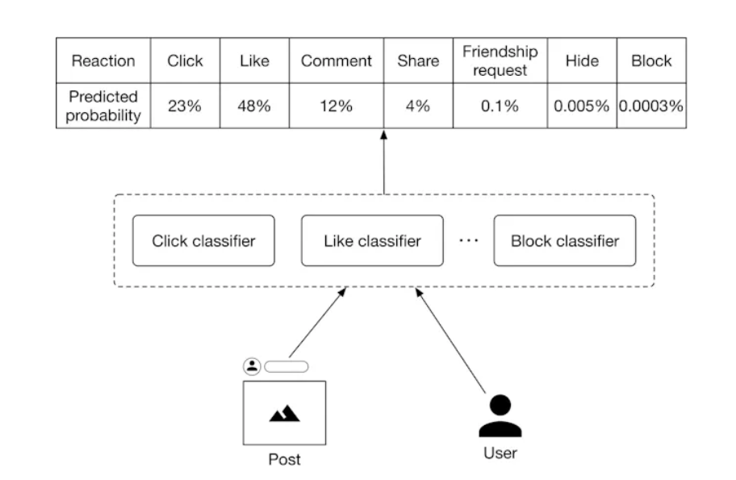
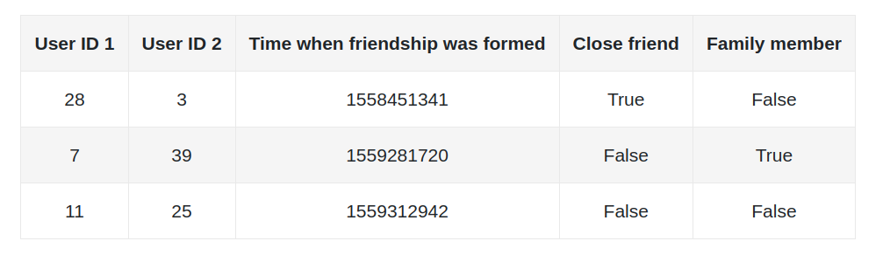
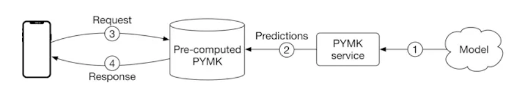
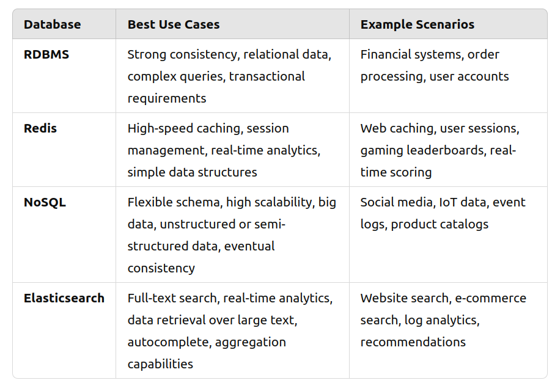

# Machine Learning System Design Interview

# 01) Introduction and Overview

1) ML system design steps


2) When we are in an interview, the first thing is to clarify the requirements.

- Business objective

- Features the system needs to support

- Data

- Constraints

- Scale of the system

- Performance

- Privacy and Ethics

3) In an interview, the first thing is to determine whether ML is necessary or not.

4) Application, business objective and ML objective


5) ETL visualized


6) Data categorization for Machine Learning


7) "Many ML models struggle to learn a task when the features of the dataset are in different ranges"

8) Labelling can be done in two ways:

- Hand Labeling: Done by humans, expensive and slow

- Natural Labeling: No need of human annotators

9) Focal loss is a loss function to mitigate class imbalance.

10) "Model compression refers to the process of making a model smaller".

11) Shadow deployment is a technique to evaluate the performance of a new model in the online environment. The new model and the existing model are predicting the same input but the predictions of the existing model are shown to the user. When we become confident, the predictions of the new model are used. Thanks to shadow deployment, we are minimizing the risk of unreliable outcomes. The con of this method is that we are increasing the serving duration because one input is scored by 2 different models instead of a single one. 


12) The most common reason why an ML model fails is data distribution shift.

13) References:
- Data warehouse. https://cloud.google.com/learn/what-is-a-data-warehouse.
- Structured vs. unstructured data. https://signal.onepointltd.com/post/102gjab/machine-learning-libraries-for-tabular-data-problems.
- Bagging technique in ensemble learning. https://en.wikipedia.org/wiki/Bootstrap_aggregating.
- Boosting technique in ensemble learning. https://aws.amazon.com/what-is/boosting/.
- Stacking technique in ensemble learning. https://machinelearningmastery.com/stacking-ensemble-machine-learning-with-python/.
- Interpretability in Machine Mearning. https://blog.ml.cmu.edu/2020/08/31/6-interpretability/.
- Traditional machine learning algorithms. https://machinelearningmastery.com/a-tour-of-machine-learning-algorithms/.
- Sampling strategies. https://www.scribbr.com/methodology/sampling-methods/.
- Data splitting techniques. https://machinelearningmastery.com/train-test-split-for-evaluating-machine-learning-algorithms/.
- Class-balanced loss. https://arxiv.org/pdf/1901.05555.pdf.
- Focal loss paper. https://arxiv.org/pdf/1708.02002.pdf.
- Focal loss. https://medium.com/swlh/focal-loss-an-efficient-way-of-handling-class-imbalance-4855ae1db4cb.
- Data parallelism. https://www.telesens.co/2017/12/25/understanding-data-parallelism-in-machine-learning/.
- Model parallelism. https://docs.aws.amazon.com/sagemaker/latest/dg/model-parallel-intro.html.
- Cross entropy loss. https://en.wikipedia.org/wiki/Cross_entropy.
- Mean squared error loss. https://en.wikipedia.org/wiki/Mean_squared_error.
- Mean absolute error loss. https://en.wikipedia.org/wiki/Mean_absolute_error.
- Huber loss. https://en.wikipedia.org/wiki/Huber_loss.
- L1 and l2 regularization. https://www.analyticssteps.com/blogs/l2-and-l1-regularization-machine-learning.
- Entropy regularization. https://paperswithcode.com/method/entropy-regularization.
- K-fold cross validation. https://en.wikipedia.org/wiki/Cross-validation_(statistics).
- Dropout paper. https://jmlr.org/papers/volume15/srivastava14a/srivastava14a.pdf.
- Overview of optimization algorithm. https://ruder.io/optimizing-gradient-descent/.
- Stochastic gradient descent. https://en.wikipedia.org/wiki/Stochastic_gradient_descent.
- AdaGrad optimization algorithm. https://optimization.cbe.cornell.edu/index.php?title=AdaGrad.
- Momentum optimization algorithm. https://optimization.cbe.cornell.edu/index.php?title=Momentum.
- RMSProp optimization algorithm. https://optimization.cbe.cornell.edu/index.php?title=RMSProp.
- ELU activation function. https://ml-cheatsheet.readthedocs.io/en/latest/activation_functions.html#elu.
- ReLU activation function. https://ml-cheatsheet.readthedocs.io/en/latest/activation_functions.html#relu.
- Tanh activation function. https://ml-cheatsheet.readthedocs.io/en/latest/activation_functions.html#tanh.
- Sigmoid activation function. https://ml-cheatsheet.readthedocs.io/en/latest/activation_functions.html#softmax.
- FID score. https://en.wikipedia.org/wiki/Fr%C3%A9chet_inception_distance.
- Inception score. https://en.wikipedia.org/wiki/Inception_score.
- BLEU metrics. https://en.wikipedia.org/wiki/BLEU.
- METEOR metrics. https://en.wikipedia.org/wiki/METEOR.
- ROUGE score. https://en.wikipedia.org/wiki/ROUGE_(metric).
- CIDEr score. https://arxiv.org/pdf/1411.5726.pdf.
- SPICE score. https://arxiv.org/pdf/1607.08822.pdf.
- Quantization-aware training. https://pytorch.org/docs/stable/quantization.html.
- Model compression survey. https://arxiv.org/pdf/1710.09282.pdf.
- Shadow deployment. https://christophergs.com/machine%20learning/2019/03/30/deploying-machine-learning-applications-in-shadow-mode/.
- A/B testing. https://en.wikipedia.org/wiki/A/B_testing.
- Canary release. https://blog.getambassador.io/cloud-native-patterns-canary-release-1cb8f82d371a.
- Interleaving experiment. https://netflixtechblog.com/interleaving-in-online-experiments-at-netflix-a04ee392ec55.
- Multi-armed bandit. https://vwo.com/blog/multi-armed-bandit-algorithm/.
- ML infrastructure. https://www.run.ai/guides/machine-learning-engineering/machine-learning-infrastructure.
- Interpretability in ML. https://fullstackdeeplearning.com/spring2021/lecture-6/.
- Chip Huyen. Designing Machine Learning Systems: An Iterative Process for Production-Ready Application. ” O’Reilly Media, Inc.”, 2022.

# 02) Visual Search System

1) A visual search problem can be thought as a ranking problem.


2) Common image processing operations


3) In order to create a training dataset, we should have a positive image similar to anchor image and many negative images. The number of negative images should be tuned. Negative images can be chosen randomly. However, there are 3 ways to label an image as a positive example.

    - Human Labeling: Accurate training data but expensive operation.
    - User Interactions: It can generate noisy data and lead to poor performance.
    - Artifically create a similar image from the query image, known as self supervision: It can be implemented via rotating the image and labelling it as a positive. The frameworks named [SimCLR](https://github.com/google-research/simclr) and [MoCo](https://paperswithcode.com/method/moco-v2) use this approach efficiently.


4) Contrastive loss function should be chosen. There are different contrastive loss functions.


5) In order to compute similarities, cosine similarity or dot product should can be chosen. Euclidean distance performs bad due to curse of dimensionality. After computing similarities, the computed similarities are fed into a softmax function and then the cross entropy loss is calculated in order for backpropagation.

6) Some offline evaluation metrics for this ranking problem.


7) MRR criteria takes care of only the positive image's prediction.

8) mAP means mean average precision. It is designed for binary relevances.

9) "nDCG works well most times. Its primary shortcoming is that deriving ground truth relevance scores is not always possible. In our case, since the evaluation dataset contains similarity scores, we can use nDCG to measure the performance of the model during the offline evaluation"

10) Some online metrics for evaluation

- Click Through Rate

- Average daily, weekly, and monthly time spent on the suggested images

11) Serving is composed of 2 pipelines. One pipeline is responsible for keeping index table of embeddings of images updated. The other one is responsible for generating similar images for query image.


12) Reranking service is taking care of filtering unappropriate images, removing duplicates and near duplicate images, filtering out private images etc.

13) There are 2 approaches in nearest neighbor search. Exact Nearest Neighbor and Approximate Nearest Neighbor. Exact Nearest Neighbor is linear search. It is computing similarities and returning the closest candidates. However, it isn't practical for large systems when the number of images becomes billions.

14) Approximate nearest neighbor(ANN) should be implemented when data is huge. There are 3 types of ANN's.

- Tree-based ANN, Rtrees, Kdtrees and Annoy.


- Locality-sensitive hashing (LSH)-based ANN: Using a hash function to map points into buckets. Query image is fed into hash function. The images in in the predicted bucket of query image should be recommended.


- Clustering-based ANN: Creating clusters and searching similar images among the cluster

15) There are 2 common libraries to implement ANN. One of them is [faiss](https://github.com/facebookresearch/faiss) of Facebook and the other one is [scann](https://github.com/google-research/google-research/tree/master/scann) of Google.

16) References:

- Visual search at pinterest. https://arxiv.org/pdf/1505.07647.pdf.
- Visual embeddings for search at Pinterest. https://medium.com/pinterest-engineering/unifying-visual-embeddings-for-visual-search-at-pinterest-74ea7ea103f0.
- Representation learning. https://en.wikipedia.org/wiki/Feature_learning.
- ResNet paper. https://arxiv.org/pdf/1512.03385.pdf.
- Transformer paper. https://arxiv.org/pdf/1706.03762.pdf.
- Vision Transformer paper. https://arxiv.org/pdf/2010.11929.pdf.
- SimCLR paper. https://arxiv.org/pdf/2002.05709.pdf.
- MoCo paper. https://openaccess.thecvf.com/content_CVPR_2020/papers/He_Momentum_Contrast_for_Unsupervised_Visual_Representation_Learning_CVPR_2020_paper.pdf.
- Contrastive representation learning methods. https://lilianweng.github.io/posts/2019-11-10-self-supervised/.
- Dot product. https://en.wikipedia.org/wiki/Dot_product.
- Cosine similarity. https://en.wikipedia.org/wiki/Cosine_similarity.
- Euclidean distance. https://en.wikipedia.org/wiki/Euclidean_distance.
- Curse of dimensionality. https://en.wikipedia.org/wiki/Curse_of_dimensionality.
- Curse of dimensionality issues in ML. https://www.mygreatlearning.com/blog/understanding-curse-of-dimensionality/.
- Cross-entropy loss. https://en.wikipedia.org/wiki/Cross_entropy.
- Vector quantization. http://ws.binghamton.edu/fowler/fowler%20personal%20page/EE523_files/Ch_10_1%20VQ%20Description%20(PPT).pdf.
- Product quantization. https://towardsdatascience.com/product-quantization-for-similarity-search-2f1f67c5fddd.
- R-Trees. https://en.wikipedia.org/wiki/R-tree.
- KD-Tree. https://kanoki.org/2020/08/05/find-nearest-neighbor-using-kd-tree/.
- Annoy. https://towardsdatascience.com/comprehensive-guide-to-approximate-nearest-neighbors-algorithms-8b94f057d6b6.
- Locality-sensitive hashing. https://web.stanford.edu/class/cs246/slides/03-lsh.pdf.
- Faiss library. https://github.com/facebookresearch/faiss/wiki.
- ScaNN library. https://github.com/google-research/google-research/tree/master/scann.
- Content moderation with ML. https://appen.com/blog/content-moderation/.
- Bias in AI and recommendation systems. https://www.searchenginejournal.com/biases-search-recommender-systems/339319/#close.
- Positional bias. https://eugeneyan.com/writing/position-bias/.
- Smart crop. https://blog.twitter.com/engineering/en_us/topics/infrastructure/2018/Smart-Auto-Cropping-of-Images.
- Better search with gnns. https://arxiv.org/pdf/2010.01666.pdf.
- Active learning. https://en.wikipedia.org/wiki/Active_learning_(machine_learning).
- Human-in-the-loop ML. https://arxiv.org/pdf/2108.00941.pdf.

# 03) Google Street View Blurring System

1) The purpose is to blur license plates and human faces.

2) The input will be an image that may contain zero or multiple objects in itself. The output will contain objects and their locations. The problem should be framed as object detection problem.


3) Generally, an object detection(OD) system has 2 responsibilities.

- Detecting an object's location: Regression

- Determining the class of object: Multiclass classification

4) There are 3 typearchitecturess of OD system.

- One Stage Networks

- Two Stage Networks

- Transformer based architectures: DETR is an example.

5) There are 2 components in two stage networks. The first network is Region Proposal Network and the second network is classifier. Examples of two stage networks are RCNN, Fast R-CNN, Faster R-CNN. Two stage networks run slower but more accurate compared to one stage networks.


6) In one stage networks, there is only one network. YOLO and SSD are examples of one stage networks. It is faster but less accurate compared to two stage networks.


7) A dataset of 1 million images isn't considered to be huge by modern standards.

8) The annotated data is structured as follows.


9) Some augmentation techniques


10) There are 2 approaches to augment data. The first method is offline augmentation. Dataset is first augmented and then stored in storage. Finally, it is used in training. Whereas, the second method is online augmentation. Dataset is augmented in the phase of training. Both approaches have advantages and disadvantages. The pro of offline training is less time spent in training. The con of offline training is storage difficulties. The pro of online augmentation is no need for storage because everything is on the fly. The con of online augmentation is more time spent in training.


11) Some preprocessing operations are resizing, scaling and normalizing.

12) How 2 stage object detection network works


13) MSE(Mean Squared Error) should be use in regression task and Cross Entropy loss should be used in classification task. The final loss should be the sum of regression and classification losses.

14) How Intersection Over Union(IoU) is calculated. It is also called as Jaccard Index


15) The performance of the model can be checked via Precision, Average Precision and Mean Average Precision. Precision is dependent on the selected threshold. The less the threshold, the more the precision. In order to remove the effect of threshold, Average Precision is invented. It is calculating the precision against different thresholds using integral for one class(human face). Average Precision can be calculated via a discrete summation over a predefined list of thresholds instead of using integral. Mean Average Precision is the mean of average precisions for different classes.

    - Precision: 
    
    - Average Precision using integral
    
    - Discretized Average Precision
    
    - Mean Average Precision
    

16) A very common problem in object detection is the overlapping boundary boxes. It is necessary to lower the number of overlapping boundary boxes. NMS(Non Maximum Suppression) is a technique to decrease the number of overlapping boundary boxes. "NMS is a post-processing algorithm designed to select the most appropriate bounding boxes. It keeps highly confident bounding boxes and removes overlapping bounding boxes". NMS is a commonly asked algorithm in interviews.


17) The overall design is below.


18) Preprocessing and blurring services are 2 decoupled services because preprocessing is a CPU-bound operation and blurring is a GPU-bound operation. It is easier to scale them when they are separated. Blurring service is responsible for making predictions, applying NMS, blurring predicted areas and storing the blurred images in object storage.

- Google Street View. https://www.google.com/streetview.
- DETR. https://github.com/facebookresearch/detr.
- RCNN family. https://lilianweng.github.io/posts/2017-12-31-object-recognition-part-3.
- Fast R-CNN paper. https://arxiv.org/pdf/1504.08083.pdf.
- Faster R-CNN paper. https://arxiv.org/pdf/1506.01497.pdf.
- YOLO family. https://pyimagesearch.com/2022/04/04/introduction-to-the-yolo-family.
- SSD. https://jonathan-hui.medium.com/ssd-object-detection-single-shot-multibox-detector-for-real-time-processing-9bd8deac0e06.
- Data augmentation techniques. https://www.kaggle.com/getting-started/190280.
- CNN. https://en.wikipedia.org/wiki/Convolutional_neural_network.
- Object detection details. https://dudeperf3ct.github.io/object/detection/2019/01/07/Mystery-of-Object-Detection.
- Forward pass and backward pass. https://www.youtube.com/watch?v=qzPQ8cEsVK8.
- MSE. https://en.wikipedia.org/wiki/Mean_squared_error.
- Log loss. https://en.wikipedia.org/wiki/Cross_entropy.
- Pascal VOC. http://host.robots.ox.ac.uk/pascal/VOC/voc2008/index.html.
- COCO dataset evaluation. https://cocodataset.org/#detection-eval.
- Object detection evaluation. https://github.com/rafaelpadilla/Object-Detection-Metrics.
- NMS. https://en.wikipedia.org/wiki/NMS.
- Pytorch implementation of NMS. https://learnopencv.com/non-maximum-suppression-theory-and-implementation-in-pytorch/.
- Recent object detection models. https://viso.ai/deep-learning/object-detection/.
- Distributed training in Tensorflow. https://www.tensorflow.org/guide/distributed_training.
- Distributed training in Pytorch. https://pytorch.org/tutorials/beginner/dist_overview.html.
- GDPR and ML. https://www.oreilly.com/radar/how-will-the-gdpr-impact-machine-learning.
- Bias and fairness in face detection. http://sibgrapi.sid.inpe.br/col/sid.inpe.br/sibgrapi/2021/09.04.19.00/doc/103.pdf.
- AI fairness. https://www.kaggle.com/code/alexisbcook/ai-fairness.
- Continual learning. https://towardsdatascience.com/how-to-apply-continual-learning-to-your-machine-learning-models-4754adcd7f7f.
- Active learning. https://en.wikipedia.org/wiki/Active_learning_(machine_learning).
- Human-in-the-loop ML. https://arxiv.org/pdf/2108.00941.pdf.

# 04) YouTube Video Search

1) The problem can be framed as a ranking problem. The input(video with its metadata like description and title) will be fed into **visual search** and **text search** components separately. Then, the results will be combined.


2) How visual search works. The similarity score between video embedding and text embedding is calculated using dot product. Then, most similar videos are shown for a query.


3) How text search works. Videos which have the most similar titles, descriptions and tags are shown for a query.


4) Inverted index is a popular technique for creating text based document search. Elastic search is an example of Inverted Index. It doesn't use ML. Elastic search is a scalable search engine and document store. For more information as to Elastic Search, click [here](https://www.tutorialspoint.com/elasticsearch/elasticsearch_query_dsl.htm)

5) How to represent a text with a numerical vector



6) 3 steps of converting a text to a numerical vector

- Normalization

    - Lowercasing
    - Removing punctuations
    - Trimming whitespaces
    - Removing accents: Noël → Noel
    - Lemmatization

- Tokenization

    - Word tokenization: ["I", "have", "a", "car"]
    - Subword tokenization: n grams
    - Character tokenization

- Tokens to ID's:

    - Lookup table:

    

    - Hashing:

    

6) Converting tokens to ID's are done via Lookup table or Hashing. The comparison is below


7) How to process a video


8) Video decoding is the operation of transforming a video into multiple frames. The total number of frames is by the multiplication of FPS(Frame Per Second) and Duration of Video. If FPS is 25 and the duration of video is 20, there are 500(25*20) frames in the video.

9) There are 2 categories to process text. 

- Statistical Models:
    - Bag Of Words
    - TF-IDF
- ML Based Models:
    - Embedding: Simple and efficient solution to map high-cardinal data into dense vectors
    
    - Word2Vec:
    
    - Transformers: Its advantage is capturing context
    

10) Video encoding can be done in 2 ways:

- Video Level Model: Expensive, slow in serving


- Frame Level Model: Faster, should be used when temporality isn't crucial. Frame level models aren't good at capturing understanding actions and motions. ViT(Vision transformer) is a frame level model which can be chosen.


11) Contrastive Learning can be used in training. Our annotated dataset is depicted below. The training pipeline is taking video as one input, taking many queries of 1 corresponding positive label and n-1 negative(irrelevant) labels as text input, computing similarities, scaling on softmax and outputing a probability of each text input for the input video.


12) Mean Reciprocal Rank can be a good offline metric.


13) Some online metrics

- CTR: Click Through Rate

- Video Completion Rate

- Total watch time of search results

14) Simplified Design for indexing video pipeline, prediction pipeline and indexing text pipeline.


15) Fusing layer is taking videos(visual search and text search) from the previous step and reranking according to relevance score(like time).

16) Reranking service is applying business-level logic and policies at the end.

17) References:

- Elasticsearch. https://www.tutorialspoint.com/elasticsearch/elasticsearch_query_dsl.htm.
- Preprocessing text data. https://huggingface.co/docs/transformers/preprocessing.
- NFKD normalization. https://unicode.org/reports/tr15/.
- What is Tokenization summary. https://huggingface.co/docs/transformers/tokenizer_summary.
- Hash collision. https://en.wikipedia.org/wiki/Hash_collision.
- Deep learning for NLP. http://cs224d.stanford.edu/lecture_notes/notes1.pdf.
- TF-IDF. https://en.wikipedia.org/wiki/Tf%E2%80%93idf.
- Word2Vec models. https://www.tensorflow.org/tutorials/text/word2vec.
- Continuous bag of words. https://www.kdnuggets.com/2018/04/implementing-deep-learning-methods-feature-engineering-text-data-cbow.html.
- Skip-gram model. http://mccormickml.com/2016/04/19/word2vec-tutorial-the-skip-gram-model/.
- BERT model. https://arxiv.org/pdf/1810.04805.pdf.
- GPT3 model. https://arxiv.org/pdf/2005.14165.pdf.
- BLOOM model. https://bigscience.huggingface.co/blog/bloom.
- Transformer implementation from scratch. https://peterbloem.nl/blog/transformers.
- 3D convolutions. https://www.kaggle.com/code/shivamb/3d-convolutions-understanding-use-case/notebook.
- Vision Transformer. https://arxiv.org/pdf/2010.11929.pdf.
- Query understanding for search engines. https://www.linkedin.com/pulse/ai-query-understanding-daniel-tunkelang/.
- Multimodal video representation learning. https://arxiv.org/pdf/2012.04124.pdf.
- Multilingual language models. https://arxiv.org/pdf/2107.00676.pdf.
- Near-duplicate video detection. https://arxiv.org/pdf/2005.07356.pdf.
- Generalizable search relevance. https://livebook.manning.com/book/ai-powered-search/chapter-10/v-10/20.
- Freshness in search and recommendation systems. https://developers.google.com/machine-learning/recommendation/dnn/re-ranking.
- Semantic product search by Amazon. https://arxiv.org/pdf/1907.00937.pdf.
- Ranking relevance in Yahoo search. https://www.kdd.org/kdd2016/papers/files/adf0361-yinA.pdf.
- Semantic product search in E-Commerce. https://arxiv.org/pdf/2008.08180.pdf.

# 05) Harmful Content Detection

1) Posts that contain violence, nudity, self-harm and hate speech are recognized as harmful content.

2) Fusion is a concept that is related to combining different inputs of different modalities. There are 2 types of fusions.

    - Late Fusion: Separating each model independently for each modality first. Secondly, the outputs of each model for each modality are fused. Not capturing the relationship for a meme that has a text and image.
    
    

    - Early Fusion: Combining the vectors for each modality first. Then, the combined vector is fed into a single neural network. This approach captures more potentially than late fusion. This approach is harder to train. In the absence of training data, early fusion method fails.

    

3) Choosing the right ML strategy is hard. We have 4 options.

- Simple Binary Classifier: Easy to train, but it lacks of explanation why a content is harmful.



- One binary classifier for each harmful class: Hard to maintain and train.


- Multilabel classifier: Single model is its advantage. But using the same vector for each class isn't appropriate because the inputs may require different transformations.


- Multi task classifier: Learning together to some extent, then each class has its own classification head. This approach is a single model solution and allowing different harmful criteria to get specialized in their classification heads.


4) Framing the problem as a Machine Learning problem using multi task classifier. The advantages of multi task classifier are its simplicity to train(one ML model), redundant operations for each harmful class are removed thanks to transformed features and the learning of a harmful class may contribute to the learning of other harmful class. In multi task training, each task is assigned a loss function based on its ML category.


5) The following data available

- User Data:


- Post Data:


- User-Post Interation Data:


6) BERT is trained in English only. Therefore, DistilmBERT can be used. DistilmBERT is an efficient variant of BERT to produce embeddings. If a sentence in language #1 is close to another sentence in language #2, their embeddings are so similar.

7) [CLIP's visual encoder](https://openai.com/research/clip) and [SimCLR](https://arxiv.org/pdf/2002.05709.pdf) are 2 alternatives to convert an image into a feature vector.

8) [VideoMoCo](https://arxiv.org/pdf/2103.05905.pdf) is a video model transforming a video into a feature vector.

9) The following types of data can be used.

- Textual content
- Image or video
- User reactions to the post
- Author
- Contextual information

10) User reactions such as the number of likes, the number of shares, the number of comments and the number of reports can be fed into the model.

11) User comments should be transformed into a feature vector and the aggregated via averaging.

12) The summary of how textual data, image data, video data, reaction data and comments data can be concatenated


13) Some features on authors can be extracted.

- Violation based features:
    - Number of violations in the past
    - Total user reports: How many times other users reported the author of the post.
    - Profane words rate
- Demographics based features:
    - Age
    - Gender
    - Location(City and country): It is sparse when one-hot encoded. To solve this problem, use embeddings.
- Account Information
    - The age of account
    - The number of followers and followings

14) Contextual information represents information which is not related to the post and the author of the post.
    - Time of day
    - Device: Mobile or Desktop or Tablet

15) Summary of Feature Engineering


16) It would be a good practice to employ natural labeling on training phase and human labeling on validation phase. Natural labeling is less costly but less accurate. Human labeling is more costly and more accurate. Natural labeling can be programmed based on user reports. The reason why to select human labeling in validation is to be sure about the performance of the ML model trained on naturally labeled data.


17) How to compute loss. Each task can have its specific loss functions and their sum can be the total loss.


18) A common challenge in training multimodel ML models is overfitting. One modality(image etc) may prevail over the others. In order to solve this problem, [gradient blending](https://arxiv.org/pdf/1905.12681.pdf) or focal loss can be used.

19) Precision and Recall can be insufficient to evaluate the performance. Therefore, AUROC(Area Under Receiver Operating Characteristic) and AUPRC(Area Under Precision Recall Curve) can be used as offline metrics. To learn the difference between both, take a look at [here](https://machinelearningmastery.com/roc-curves-and-precision-recall-curves-for-classification-in-python/).

20) Some online metrics should also be used to evaluate the performance of the model.

21) How to serve in a real-time system


22) If a post is predicted as harmful with low confidence, it should be manually reviewed. After the manual review, a human assigns a label to the post. Then, this manually labeled post should be stored in the storage and can be useful for further trainings.

23) References:

- Facebook’s inauthentic behavior. https://transparency.fb.com/policies/community-standards/inauthentic-behavior/.
- LinkedIn’s professional community policies. https://www.linkedin.com/legal/professional-community-policies.
- Twitter’s civic integrity policy. https://help.twitter.com/en/rules-and-policies/election-integrity-policy.
- Facebook’s integrity survey. https://arxiv.org/pdf/2009.10311.pdf.
- Pinterest’s violation detection system. https://medium.com/pinterest-engineering/how-pinterest-fights-misinformation-hate-speech-and-self-harm-content-with-machine-learning-1806b73b40ef.
- Abusive detection at LinkedIn. https://engineering.linkedin.com/blog/2019/isolation-forest.
- WPIE method. https://ai.facebook.com/blog/community-standards-report/.
- BERT paper. https://arxiv.org/pdf/1810.04805.pdf.
- Multilingual DistilBERT. https://huggingface.co/distilbert-base-multilingual-cased.
- Multilingual language models. https://arxiv.org/pdf/2107.00676.pdf.
- CLIP model. https://openai.com/blog/clip/.
- SimCLR paper. https://arxiv.org/pdf/2002.05709.pdf.
- VideoMoCo paper. https://arxiv.org/pdf/2103.05905.pdf.
- Hyperparameter tuning. https://cloud.google.com/ai-platform/training/docs/hyperparameter-tuning-overview.
- Overfitting. https://en.wikipedia.org/wiki/Overfitting.
- Focal loss. https://amaarora.github.io/2020/06/29/FocalLoss.html.
- Gradient blending in multimodal systems. https://arxiv.org/pdf/1905.12681.pdf.
- ROC curve vs precision-recall curve. https://machinelearningmastery.com/roc-curves-and-precision-recall-curves-for-classification-in-python/.
- Introduced bias by human labeling. https://labelyourdata.com/articles/bias-in-machine-learning.
- Facebook’s approach to quickly tackling trending harmful content. https://ai.facebook.com/blog/harmful-content-can-evolve-quickly-our-new-ai-system-adapts-to-tackle-it/.
- Facebook’s TIES approach. https://arxiv.org/pdf/2002.07917.pdf.
- Temporal interaction embedding. https://www.facebook.com/atscaleevents/videos/730968530723238/.
- Building and scaling human review system. https://www.facebook.com/atscaleevents/videos/1201751883328695/.
- Abusive account detection framework. https://www.youtube.com/watch?v=YeX4MdU0JNk.
- Borderline contents. https://transparency.fb.com/features/approach-to-ranking/content-distribution-guidelines/content-borderline-to-the-community-standards/.
- Efficient harmful content detection. https://about.fb.com/news/2021/12/metas-new-ai-system-tackles-harmful-content/.
- Linear Transformer paper. https://arxiv.org/pdf/2006.04768.pdf.
- Efficient AI models to detect hate speech. https://ai.facebook.com/blog/how-facebook-uses-super-efficient-ai-models-to-detect-hate-speech/.

# 06) Video Recommendation System

1) A customized homepage is going to be fed via ML.


2) There might be multiple ML objectives.

    - Maximizing number of clicks: Recommending clickbait videos more. Worsening customer experience.
    - Maximizing number of completed videos: Bias to recommending short videos
    - Maximizing total watch time: Biased to the videos watched more
    - Maximizing the number of relevant videos: Based on business rules such as whether a user clicks like button or a user watches at least 50 percent of video, a relevance can be defined. We can construct a dataset and train a model to predict a relevance score.

3) Common types of recommendation systems



4) Youtube is using a CF based model as the first stage to generate candidates. Then it uses content based RS as the second stage to recommend videos.

5) Most companies use hybrid RS. There are 2 types of Hybrid RS's. Parallel or Sequential. Sequential Hybrid RS's are used more. The following design will be based on Sequential Hybrid RS.


6) Available data

- Video


- User


- User-Video Interaction


7) 4 types of different data

- Video features:

    - Video ID: Converted to dense vectors thanks to embedding layer
    - Duration
    - Language
    - Titles and tags: Titles are converted to feature vectors thanks to a context-aware word embedding model such as BERT. Tags are converted to feature vectors thanks to a lightweight pretrained model such as CBOW.


- User demographics


- Contextual Information


- User historical interactions

    - Search History: Mapping each search query into an embedding vector. A user's search history is a variable-sized list of textual queries. To create a fixed size feature vector, average the query embeddings.
    - Liked videos: Video ID's are mapped into an embedding vector using embedding layer. Similar to search history, they are averaged.
    - Watched videos: Similar to liked videos
    - Impressions: Similar to liked videos


8) What we are optimizing is relevancy. Therefore, both implicit and explicit feedbacks are so important for Matrice Factorization methods.


9) The loss function will include the loss computer for observed and unobserved pairs.


10) There are 2 MF optimization techniques. WALS converges faster and it is parallelizable.

- Stochastic Gradient Descent: Used to minimize losses
- Weighted Alternating Least Squares (WALS): Specific to matrix factorization
    - Fix one embedding matrix (U), and optimize the other embedding (V)
    - Fix the other embedding matrix (V), and optimize the embedding matrix (U)
    - Repeat.

11) RS returns predictions based o relevancy score.


12) MF optimizes user-video matrices and obtains video embeddings and user embeddings.

13) MF is built on top of user-video interactions. Thus, it doesn't take other features such as age, time, video and user features into consideration.

14) Matrix Factorization Inference


15) Pros and cons of MF

- Pros:
    - Training Speed: Only 2 embedding spaces(user and video) learned, thus fast.
    - Serving Speed: The learned embeddings are the same. We can reuse them.
- Cons:
    - No content data used.
    - Handling new users aka cold start problem.

16) The two tower neural network is an alternative to Matrix Factorization.


17) How to construct the dataset. Labels are assigned according to explicit likes(1) or dislikes(0) or whether half of the video is watched(1) etc.


18) Only a small fraction of videos attract a person's attention. Therefore, negative samples should outweight positive samples. This introduces the problem of imbalanced datasets.

19) The problem is a binary classification problem. It is trained via cross entropy loss.


20) At inference of two tower networks, embeddings are used to find the most relevant videos of a given user. This is a classic nearest neighbor problem.


21) Matrix Factorization vs Two Tower Networks


22) Some offline metrics to evaluate

- Precision@K

- mAP

- Diversity: When 10 items are recommended, there are 45 pairs(combination(10,2)). For each pair, calculate similarity between 2 items. Average the similarity of 45 pairs. If it is low, it is a good indication of diverse recommendations. Diversity shouldn't be the number 1 metric.

23) Some online metrics to keep an eye

- CTR: Click Through Rate, its drawback is that clickbait videos might be misleading.


- The number of completed videos:

- Total Watch Time:

- Explicit User Feedback: The total number of explicitly liked or disliked videos

24) Prediction pipeline at serving. 2 ML models used consecutively. The first one will generate candidates via a lightweight ML model, the second one will score and rank them via a heavier model.


25) The prediction pipeline has the following 3 components.

- Candidate generation

- Scoring

- Reranking

26) Candidate Generation

- The goal of Candidate generation is to narrow down the videos from billions to thousands.

- We prioritize efficiency over accuracy at this phase and we don't care false positives.

- To keep candidate generation fast, we choose a model which doesn't rely on video features. In adddition to this, the model should handle new users. **Two tower neural networks** are pretty useful in this phase.

- A user's embedding is computed. Then, a nearest neigbor service is run to retrieve the most similar videos. The retrieved videos are ranked based on similarity in the embedding space and returned as the output.


27) In practice, companies tend to run many parallel candidate generation services based on trending, popular and relevant videos. Using many candidate generation services improve the performance.


28) Scoring component is also known as ranking. Scoring is prioritizing accuracy over efficiency. Video features are taken into account. Two tower neural networks are also used in this phase with video features. Scoring component is taking user and candidate videos as input, scores each video and outputs a ranked list of videos.


29) Reranking is another component to rerank the output videos of scoring components. It does reranking according to below criteria.

    - Region-restricted videos
    - Video freshness
    - Videos spreading misinformation
    - Duplicate or near-duplicate videos
    - Fairness and bias

30) Challenges of a video recommendation system

- Serving speed: The reason to use a two step solution is to be fast.

- Precision: A lightweight model used to generate candidates, a heavier model used to create the output list

- Diversity: Having different candidate generation services in parallel can bring diversity to our recommendations

- Cold start problem:
    - For new users, features like gender, age, location can be utilized.
    - For new videos, new videos are presented to random users to collect interaction data

31) Some more resources:

- [Youtube RS Paper](https://static.googleusercontent.com/media/research.google.com/en//pubs/archive/45530.pdf) and [Blog Post](https://blog.youtube/inside-youtube/on-youtubes-recommendation-system/)
- [Instagram RS](https://ai.meta.com/blog/powered-by-ai-instagrams-explore-recommender-system/)
- [Seasonality in RS](https://www.computer.org/csdl/proceedings-article/big-data/2019/09005954/1hJsfgT0qL6)

32) References:

- YouTube recommendation system. https://blog.youtube/inside-youtube/on-youtubes-recommendation-system.
- DNN for YouTube recommendation. https://static.googleusercontent.com/media/r esearch.google.com/en//pubs/archive/45530.pdf.
- CBOW paper. https://arxiv.org/pdf/1301.3781.pdf.
- BERT paper. https://arxiv.org/pdf/1810.04805.pdf.
- Matrix factorization. https://developers.google.com/machine-learning/recommendation/collaborative/matrix.
- Stochastic gradient descent. https://en.wikipedia.org/wiki/Stochastic_gradient_descent.
- WALS optimization. https://fairyonice.github.io/Learn-about-collaborative-filtering-and-weighted-alternating-least-square-with-tensorflow.html.
- Instagram multi-stage recommendation system. https://ai.facebook.com/blog/powered-by-ai-instagrams-explore-recommender-system/.
- Exploration and exploitation trade-offs. https://en.wikipedia.org/wiki/Multi-armed_bandit.
- Bias in AI and recommendation systems. https://www.searchenginejournal.com/biases-search-recommender-systems/339319/#close.
- Ethical concerns in recommendation systems. https://link.springer.com/article/10.1007/s00146-020-00950-y.
- Seasonality in recommendation systems. https://www.computer.org/csdl/proceedings-article/big-data/2019/09005954/1hJsfgT0qL6.
- A multitask ranking system. https://daiwk.github.io/assets/youtube-multitask.pdf.
- Benefit from a negative feedback. https://arxiv.org/abs/1607.04228?context=cs.

# 07) Event Recommendation System

1) The design will be similar to [eventbrite](https://www.eventbrite.com/). Eventbrite is an event management and ticketing marketplace. The aim is to display a list of personalized events to users.

2) Different approaches to recommendation systems. Showing popular items is an aeample of rule based systems. CB Filtering and CF are examples of embedding based solutions.


3) A book on [Learning to Rank(LTR)](https://livebook.manning.com/book/practical-recommender-systems/chapter-13/15). "LTR is a class of algorithmic techniques that apply supervised machine learning to solve ranking problems. The ranking problem can be formally defined as: "having a query and a list of items, what is the optimal ordering of the items from most relevant to least relevant to the query?""

4) Pointwise LTR. Each item is predicted independently. The final ranking is achieved by sorting the predicted relevancy scores.


5) Pairwise LTR. Taking 2 items and finding which one is more relevant. Some popular algoritms are [RankNet](https://icml.cc/2015/wp-content/uploads/2015/06/icml_ranking.pd), [LambdaRank](https://www.microsoft.com/en-us/research/wp-content/uploads/2016/02/lambdarank.pdf) and [LambdaMart](https://www.microsoft.com/en-us/research/wp-content/uploads/2016/02/MSR-TR-2010-82.pdf)


6) Listwise LTR. Some popular listwise LTR algorithms are [SoftRank](https://www.microsoft.com/en-us/research/wp-content/uploads/2016/02/SoftRankWsdm08Submitted.pdf), [Listnet](https://www.microsoft.com/en-us/research/wp-content/uploads/2016/02/tr-2007-40.pdf) and [AdaRank](https://dl.acm.org/doi/10.1145/1277741.1277809).


8) In general, listwise LTR and pairwise LTR perform better than pointwise LTR. But they are difficult to implement and train.

9) The selected approach of LTR is pointwise as below.


10) Available data in the system can be visualized like below:

- Users


- Events


- Friendship


- Interactions


11) Event based recommendations are essentially different than movie recommendation or book recommendation. When an event is created, it will occur after a few days or weeks. When an event occurs, it shouldn't be recommended to other users because it pasted away. This is because of the fact that events are short-lived. Moreover, interaction data is limited. Due to these, event based recommendations suffer from cold start problem of new items(events).

12) Due to the hard nature of event based recommendations, more effeorts should be put on feature engineering. We can generate different features such as below

- Location related features

- Time-related features

- Social-related features

- User-related features

- Event related features

13) Below is an example of location related features. Some of the features are elaborated.

- Walk score: The measure of how hard to walk to the location of the event.

- Walk score similarity: For a specific user, the difference between the walk score of an event and the average walk score of events that the user joined before.

- Distance: The distance between the user's location and the event's location. Then, bucketize it.

- Distance similarity: The difference between Distance depicted above and the average distance of a specific user in previous events


14) Below is an example of time related features.

- Remaining time means the time between current time and the event time. Then, bucketize it.

- Estimated travel time: The time required to go to the location of an event from the location of a user.

- Similarity features are obtained as similar to walk score similarity and distance similarity of location based features


15) Social related features

- How many people are attending this event?

    - Number of users registered for this event
    - The ratio of the total number of registered users to the number of impressions
    - Registered user similarity: The difference between the number of registered users for the event in question and previously registered events

- Features related to attendance by friends

    - Number of the user's friends who registered for this event
    - The ratio of the number of registered friends to the total number of friends
    - Registered friend similarity: Difference between the number of registered friends for the event in question and previously registered events

- Is the user invited to this event by others?

    - The number of friends who invited this user to the event

    - The number of fellow users who invited this person to the event

- Is the event's host a friend of the user?

- How often has the user attended previous events created by this host?

16) User related features

- Gender

- Age

17) Event related features

- Price: Bucketize it.

- Price Similarity: The difference between the price of an event and the average price of events attended by a specific user.

- How similar is this event's description to previously registered descriptions? This feature might be noisy.

18) An example of social, user and event related features.


19) What we did to create features is to generate embeddings of users and events.

20) Some more topics to be discussed:

- Batch vs Streaming Features: Batch features cover less frequently changing features such as gender and age. Streaming features are dynamic features that change more frequently such as the time difference between prediction time and event time.

- Feature computation efficiency: Instead of computing distances between 2 points(location of the event and location of the user) explicitly, give them as input separately and expect the model to infer this information behind the scenes. Computing a distance on the fly might be time consuming

- Using a decay factor: Think of it like an exponential smoothing. Assign more weights to latest interactions.

- Representation Learning: Represent the features of event as an embedding, represent the features of a user as an embedding.

21) [A small video on Logistic Regression](https://www.youtube.com/watch?v=yIYKR4sgzI8&ab_channel=StatQuestwithJoshStarmer)

22) Continual learning, also known as lifelong learning or incremental learning, is a machine learning paradigm where a model learns continuously over time from a stream of data, adapting to new information while retaining previously acquired knowledge. Unlike traditional batch learning approaches where models are trained on fixed datasets and then deployed without further updates, continual learning models are designed to continually update their knowledge as new data becomes available.

23) NN's are more preferrable over Gradient Boosting Algorithms. Continual learning is possible in NN's.

24) Input pair is composed of user embedding and event embedding. Output is whether a user registered for an event or not. If registered, label is 1. Otherwise, label is 0.


25) To solve class imbalance problem, choose one of the followings

- Use focal loss or class balanced loss

- Undersample the majority class

26) MRR means Mean Reciprocal Rank. It is a metric used in information retrieval. It focuses on the first relevant item in the list, which is suitable for systems that look for only one relevant item. In an event recommendation system, many events might be relevant to a user. Thus, MRR can't be the best metric. An MRR example.

```python

def reciprocal_rank(rank_list):
    """Calculate the reciprocal rank for a given ranked list of items."""
    for i, item in enumerate(rank_list, 1):
        if item == 1:  # Assuming relevant items are labeled as 1
            return 1.0 / i
    return 0.0  # If no relevant item is found in the list


def mean_reciprocal_rank(rankings):
    """Calculate the Mean Reciprocal Rank (MRR) for a list of query rankings."""
    total_rr = 0.0
    for rank_list in rankings:
        rr = reciprocal_rank(rank_list)
        print(rr)
        total_rr += rr
    return total_rr / len(rankings)


# Example rankings for three queries (binary relevance: 1 for relevant, 0 for irrelevant)
rankings = [
    [0, 0, 1, 0, 1],  # Query 1: Relevant items at positions 3 and 5
    [0, 1, 0, 0, 0],  # Query 2: Relevant item at position 2
    [0, 0, 0, 0, 0],  # Query 3: No relevant items
]

# 0.333333333333
# 0.5
# 0.0
# ('Mean Reciprocal Rank (MRR):', 0.277777777778)

# Calculate MRR for the example rankings
mrr = mean_reciprocal_rank(rankings)
```

27) mAP is another metric to be used in IR. mAP works only when relevancy scores are binary. In our case, relevancy score is binary, corresponding to whether a user is registered or not. Therefore, mAP is an offline metric that we look for.

```python
def average_precision(relevant_items):
    """Calculate the Average Precision (AP) for a single query."""
    precision_sum = 0.0
    num_relevant = 0.0
    temp_dict = {}
    for i, item in enumerate(relevant_items, 1):
        if item == 1:  # Assuming relevant items are labeled as 1
            num_relevant += 1
            temp_dict[str(i)] = num_relevant / i
    if num_relevant == 0:
        return 0.0
    return sum(temp_dict.values())/num_relevant

def mean_average_precision(relevance_list):
    """Calculate the Mean Average Precision (mAP) for a list of query relevance lists."""
    total_ap = 0.0
    for relevant_items in relevance_list:
        ap = average_precision(relevant_items)
        print(ap)
        total_ap += ap
    return total_ap / len(relevance_list)


# Example relevance lists for three queries (binary relevance: 1 for relevant, 0 for irrelevant)
relevance_lists = [
    [1, 0, 0, 1, 0],  # Query 1: Relevant items at positions 1 and 4
    [0, 1, 1, 0, 0],  # Query 2: Relevant items at positions 2 and 3
    [0, 0, 1, 0, 0],  # Query 3: Relevant item at position 3
]

# Calculate mAP for the example relevance lists
mAP = mean_average_precision(relevance_lists)
print("Mean Average Precision (mAP):", mAP)

# 0.75
# 0.583333333333
# 0.333333333333
# ('Mean Average Precision (mAP):', 0.555555555556)


```

28) nDCG works when relevancy scores aren't binary. Thus, it isn't our metric in event recommendation.

29) Below are some online metrics to consider:

- Click-through rate (CTR)
- Conversion rate
- Bookmark rate
- Revenue lift

30) Our design composes of 2 pipelines, online learning pipeline and prediction pipeline.


31) Online learning pipeline is responsible for continously training new models by incorporating new data, evaluating the trained models and deploying them.

32) Event filtering service of prediction pipeline. It is responsible for subsetting the search space based on event locations, event type(concert) etc.


33) Ranking service workflow. It takes the anchor user and candidate events and outputs a prediction score and ranks them according to prediction scores.


34) References of the chapter

- Learning to rank methods. https://livebook.manning.com/book/practical-recommender-systems/chapter-13/53.
- RankNet paper. https://icml.cc/2015/wp-content/uploads/2015/06/icml_ranking.pd f.
- LambdaRank paper. https://www.microsoft.com/en-us/research/wp-content/uploads/2016/02/lambdarank.pdf.
- LambdaMART paper. https://www.microsoft.com/en-us/research/wp-content/uploads/2016/02/MSR-TR-2010-82.pdf.
- SoftRank paper. https://www.microsoft.com/en-us/research/wp-content/uploads/2016/02/SoftRankWsdm08Submitted.pdf.
- ListNet paper. https://www.microsoft.com/en-us/research/wp-content/uploads/2016/02/tr-2007-40.pdf.
- AdaRank paper. https://dl.acm.org/doi/10.1145/1277741.1277809.
- Batch processing vs stream processing. https://www.confluent.io/learn/batch-vs-real-time-data-processing/#:~:text=Batch%20processing%20is%20when%20the,data%20flows%20through%20a%20system.
- Leveraging location data in ML systems. https://towardsdatascience.com/leveraging-geolocation-data-for-machine-learning-essential-techniques-192ce3a969bc#:~:text=Location%20data%20is%20an%20important,based%20on%20your%20customer%20data.
- Logistic regression. https://www.youtube.com/watch?v=yIYKR4sgzI8.
- Decision tree. https://careerfoundry.com/en/blog/data-analytics/what-is-a-decision-tree/.
- Random forests. https://en.wikipedia.org/wiki/Random_forest.
- Bias/variance trade-off. http://www.cs.cornell.edu/courses/cs578/2005fa/CS578.bagging.boosting.lecture.pdf.
- AdaBoost. https://en.wikipedia.org/wiki/AdaBoost.
- XGBoost. https://xgboost.readthedocs.io/en/stable/.
- Gradient boosting. https://machinelearningmastery.com/gentle-introduction-gradient-boosting-algorithm-machine-learning/.
- XGBoost in Kaggle competitions. https://www.kaggle.com/getting-started/145362.
- GBDT. https://blog.paperspace.com/gradient-boosting-for-classification/.
- An introduction to GBDT. https://www.machinelearningplus.com/machine-learning/an-introduction-to-gradient-boosting-decision-trees/.
- Introduction to neural networks. https://www.youtube.com/watch?v=0twSSFZN9Mc.
- Bias issues and solutions in recommendation systems. https://www.youtube.com/watch?v=pPq9iyGIZZ8.
- Feature crossing to encode non-linearity. https://developers.google.com/machine-learning/crash-course/feature-crosses/encoding-nonlinearity.
- Freshness and diversity in recommendation systems. https://developers.google.com/machine-learning/recommendation/dnn/re-ranking.
- Privacy and security in ML. https://www.microsoft.com/en-us/research/blog/privacy-preserving-machine-learning-maintaining-confidentiality-and-preserving-trust/.
- Two-sides marketplace unique challenges. https://www.uber.com/blog/uber-eats-recommending-marketplace/.
- Data leakage. https://machinelearningmastery.com/data-leakage-machine-learning/.
- Online training frequency. https://huyenchip.com/2022/01/02/real-time-machine-learning-challenges-and-solutions.html#towards-continual-learning.

# 08) Ad Click Prediction on Social Platforms

1) "Online advertising allows advertisers to bid and place their advertisements (ads) on a platform for measurable responses such as impressions, clicks, and conversions. Displaying relevant ads to users is a fundamental for many online platforms such as Google, Facebook, and Instagram."


2) THe training dataset is constucted via user and ad data. If an ad is clicked, it is labeled as positive. There might be some strategies to label negatives such as viewing an ad for a certain time but not clicking, labeling all impressions before a click as negatives, labeling a hide/block reaction as negative etc. 

3) Continual learning is a necessity. Even a 5 minute delay might worsen the performance.

4) A high level design


5) A pointwise Learning To Rank approach


6) Available data are listed below

- Ads:


- Users:


- Interaction data covering click, conversion and impression:


7) Some features to be engineered from ad data

- ID's: Advertise ID, Campaign ID, Ad ID and Ad Group Id to represented as embedding layer separately.

- Image/Video: A feature vector to be generated via a pretrained model. SimCLR can be used.

- Ad category and subcategory such as Arts & Entertainment, Autos & Vehicles, Beauty & Fitness.

- Impressions and click numbers:

    - Total Impression/Click on Ad
    - Total Impression/Click on ads supplied by an advertiser
    - Total impressions of the campaign


8) User features

- Demographics: Age, gender, city, county

- Contextual information: Time of day, device

- Interaction-related features: Clicked ads, user's historical engagement statistics

    - Clicked ads mean previosly clicked ads
    - Historical engagement statistics means the more a user clicked in the past, the more a user clicks in the future.


9) High cardinality may lead to thousands or millions of features mostly filled with zeroes.

10) Different options can be used to solve the problem like below:

- Logistic regression
- Feature crossing + logistic regression
- Gradient boosted decision trees
- Gradient boosted decision trees + logistic regression
- Neural networks
- Deep & Cross networks
- Factorization Machines
- Deep Factorization Machines

11) In ad prediction system, features interact with each other a lot. Hence, LR doesn't capture this and other complex relationships.

12) Feature Crossing can be useful in addition to original features.


13) Gradient Boosting isn't appropriate for continual learning.

14) In addition to feature selection, gradient boosting can be used for the purpose of feature extraction as shown below. Feature extraction approach is making continual learning possible. However, it is slower to extract relevant features for continual learning because fine-tuning GBDT models on new data takes time, which slows down continual learning overall.


15) A two tower neural network can be a posbbile solution but it doesn't capture feature interactions due to limited data access. 


16) Deep & Cross Network (DCN) can be used as an alternative but it isn't an ideal solution.

- Deep network: Learns complex and generalizable features using a Deep Neural Network (DNN) architecture.

- Cross network: Automatically captures feature interactions and learns good feature crosses.


17) Factorization machines is an extension to logistic regression. In addition to regular weights of logistic regression, the pairwise interactions are also integrated. However, it doesn't capture high order features unlike a neural network.


18) Deep Factorization Machines (DeepFM) is a better solution than factorization machines.


19) Deep & Cross Network and DeepFM are widely used in the industry.

20) The labeling strategy is as follows. When an ad is shown to a user(impression), if the user clicks less than t seconds, it is regarded as positive. Otherwise, it is negative.


21) Cross entropy loss is the loss function to track.

22) The below is listing online metrics:

    - CTR
    - Conversion rate
    - Revenue lift
    - Hide rate

23) Serving is composed of 3 pipelines:

- Data Preparation pipeline:

- Continual Learning pipeline:

- Prediction pipeline:


24) Continual learning is enabling us to continuously replace the existent model with a new one if the new one outperforms the former one.

26) A candidate generation service is used. Advertisers determine target criteria via such as age, gender and country etc. Then, the subsetted ads will be fed into ranking service. Ultimately, reranking service is used to output the final list based on heuristics and business logic such as removing similar ads from the output list for more diversity among ads.

27) References:

- Addressing delayed feedback. https://arxiv.org/pdf/1907.06558.pdf.
- AdTech basics. https://advertising.amazon.com/library/guides/what-is-adtech.
- SimCLR paper. https://arxiv.org/pdf/2002.05709.pdf.
- Feature crossing. https://developers.google.com/machine-learning/crash-course/feature-crosses/video-lecture.
- Feature extraction with GBDT. https://towardsdatascience.com/feature-generation-with-gradient-boosted-decision-trees-21d4946d6ab5.
- DCN paper. https://arxiv.org/pdf/1708.05123.pdf.
- DCN V2 paper. https://arxiv.org/pdf/2008.13535.pdf.
- Microsoft’s deep crossing network paper. https://www.kdd.org/kdd2016/papers/files/adf0975-shanA.pdf.
- Factorization Machines. https://www.jefkine.com/recsys/2017/03/27/factorization-machines/.
- Deep Factorization Machines. https://d2l.ai/chapter_recommender-systems/deepfm.html.
- Kaggle’s winning solution in ad click prediction. https://www.youtube.com/watch?v=4Go5crRVyuU.
- Data leakage in ML systems. https://machinelearningmastery.com/data-leakage-machine-learning/.
- Time-based dataset splitting. https://www.linkedin.com/pulse/time-based-splitting-determining-train-test-data-come-manraj-chalokia/?trk=public_profile_article_view.
- Model calibration. https://machinelearningmastery.com/calibrated-classification-model-in-scikit-learn/.
- Field-aware Factorization Machines. https://www.csie.ntu.edu.tw/~cjlin/papers/ffm.pdf.
- Catastrophic forgetting problem in continual learning. https://www.cs.uic.edu/~liub/lifelong-learning/continual-learning.pdf.

# 09) Similar Listings on Vacation Rental Platforms

1) The aim is to find similar listings to an anchor listing. There will be a similar listing carousel on a listing detail page. The project will work in the same way for anonymous users and registered users. No personalization is in use.


2) Similar listings in the embedding space


3) Available data:

- User data


- Listing Data


- User-Listing Interaction Data


4) A search session is composed of clicked listings and a final booked listing. It is visualized below.


    - Intput-Outpur pairs

    

5) An embedding layer is learn the vector representations of listings. The vectors are intialized randomly and updated thanks to training. No content data is utilized. The model is trained daily.


6) How to create positive and negative labels. Positives are generated from co-click data. Negatives are randomly chosen listings for an anchor listing.


7) How to compute loss


8) Loss computations differ among positives and negatives.


9) In addition to co-clicked labeling positive pairs, we should also an anchor listing and a booked listing as a positive pair to direct the training to learning booking.


10) In addition to integrating booked listings to the training, hard negatives should be integrated to the labeled data. Hard negatives mean negative(dissimilar) pairs whose region and some other characteristics are the same. The new loss function is displayed below.


11) Average rank of eventually booked listing can be used as offline evaluation metric. Let's assume there are 7 clicks in a session and the last one is a booking. We took the first click as anchor listing. Compute the similarities between the anchor listing and the following 6 listings. Rank the similarity scores in a descending order and take a look at the position of eventually booked listing. The more our ML model assigns a high rank to eventually booked listing, the more it means that our ML model captures booking relationship. Average the rank of eventually booked listing in validation data as a metric.


12) Some online metrics to use

- Click-through rate (CTR)
- Session book rate

13) At serving, we have 3 pipelines.

- Training pipeline: Responsible for training with new data. Its output is an ML model.

- Indexing pipeline: Responsible for creating the embeddings of listings. When a new ML model is created, existent embeddings are recreated with this ML model.

- Prediction pipeline:
    - Embedding Fetcher Service: Grabbing the learned embedding of a visited listing.
    - Nearest neighbor service: Dividing the embedding space into clusters and easen the searching.(IMHO, it should be a part of indexing pipeline to precompute the similar listings of an andhor listing, which is a batch operation instead of an online operation )
    - Reranking service: Responsible for adding business logics such as dropping listings whose cities aren't the same as the city of anchor listing, price upper limit etc.


14) References:

- Instagram’s Explore recommender system. https://ai.facebook.com/blog/powered-by-ai-instagrams-explore-recommender-system.
- Listing embeddings in search ranking. https://medium.com/airbnb-engineering/listing-embeddings-for-similar-listing-recommendations-and-real-time-personalization-in-search-601172f7603e.
- Word2vec. https://en.wikipedia.org/wiki/Word2vec.
- Negative sampling technique. https://www.baeldung.com/cs/nlps-word2vec-negative-sampling.
- Positional bias. https://eugeneyan.com/writing/position-bias/.
- Random walk. https://en.wikipedia.org/wiki/Random_walk.
- Random walk with restarts. https://www.youtube.com/watch?v=HbzQzUaJ_9I.
- Seasonality in recommendation systems. https://www.computer.org/csdl/proceedings-article/big-data/2019/09005954/1hJsfgT0qL6.


# 10) Personalized News Feed

1) It can be recognized as Facebook timeline or Twitter's *Special for you* feature. It will show the unseen posts and posts with unseen comments.


2) Framing the problem as ML problem can be challenging. There 3 things that can be optimized.

- Implicit feedbacks: Click and Dwell time
- Explicit feedbacks: Like, Share
- Maximize a weighted score based on both explicit and implicit feedbacks. Click, dwell time, like, share, hide, block etc.

3) A combined weighted score can have different weights for different reactions. One example is below:


4) The advantage of combined weighted score is that it enables business owners to modify the objective easily.

5) Input output diagram


6) Pointwise Learning To Rank approach is simple but effective solution. We employ several binary classifiers to obtain a score of explicit and implicit feedbacks. Then, obtain a weighted final score based the outputs of several binary classifiers



7) How to compute engagement scores from several binary classifiers by weighting.


8) Available data is here

- Users


- Posts


- User post interactions


- Friendship



9) Feature engineering can be carried out among

- Post

- User

- User-Post Affinities

10) Some features that can be extracted from a **Post**

- Textual content: Text to be converted into a numerical representation thanks to a pretrained context aware network like BERT:
- Images or videos: Converting an image or a video to a numerical representation via a pretrained model such as ResNet and [CLIP](https://openai.com/index/clip)
- Reactions: The number of likes, shares, replies, etc., of a post. People tend to engage with popular contents.
- Hashtags: Convert hashtag to a numerical representation via a pretrained model such as Word2Vec or TFIDF model. Transformer models aren't necessary in this scenario because context isn't important. In addition, transformer models are hard to deal with compared to Word2Vec and TFIDF.
- Post's age: Bucketize it and then apply one hot encoding


11) Some features that can be extracted from a **User**

- Demographics: Age, gender, country
- Contextual information: Device, time of the day
- User-post historical interactions: All posts liked by a user are represented as a list of ID's. User's previous engagements carry important signals.
- Being mentioned in the post: Whether mentioned in a post or not. Users tend to pay more attention to posts in which they are mentioned.


12) Below are som features that can be extracted from User-author affinities.

- Like/click/comment/share rate: The percentage of the user's like reaction to the author of the post in previous posts.

- Length of friendship: How manys days the user and the author have been friends

- Close friends and family: A binary flag whether the author of the post is a close friend or relative.


13) For modeling, we have 2 options.

- N independent networks. Hard to train. Hard to maintain. Hard to find labeled data for infrequent class such as hide or block.


- Multitask DNN. There are shared layers. One post may have multiple labels.


14) Explicit reactions to a post might be much less than implicit reactions. Therefore, we should integrate implicit labels to the multitask DNN. For this, we can employ skip and dwell time flags. Skip flag is a binary flag meaning whether a user spends 0.5 seconds on a post or not. Dwell time means how many seconds a user dedicates to a post.


15) To construct training data, we take user features, post features, affinity features as input and label the class according to our criteria.

- Training data for like reaction. Click, share and comment are similar to like.


- Dwell time labeling


16) Loss function is the summation of classification head and regression heads. For classification tasks(click, share, comment etc), binary cross entropy loss can be used. For regression tasks(dwell time), one of MAE, MSE, Huber loss can be chosen.


17) ROC AUC should be chosend as offline metric.

18) Online metrics to consider

- Click-through rate (CTR)
- Reaction rate
- Total time spent
- User satisfaction rate found in a user survey

19) Serving is composed of 2 pipelines. Data pipeline and prediction pipeline. 

- Data pipeline: Taking data from streams, computing batch features and store it on a feature store.
- Prediction pipeline: It is composed of 3 services:
    - Retrieval service: Taking unseen posts and posts with unseen comments and feeding them to ranking service
    - Ranking service: Taking batch features, computing online features and makes predictions to candidate posts for a user
    - Reranking service: Applying business logics and user filters. If a user expresses interest to a topic such as soccer, this service assigns more rank to posts related to soccer.


20) References

- News Feed ranking in Facebook. https://engineering.fb.com/2021/01/26/ml-applications/news-feed-ranking/.
- Twitter’s news feed system. https://blog.twitter.com/engineering/en_us/topics/insights/2017/using-deep-learning-at-scale-in-twitters-timelines.
- LinkedIn’s News Feed system LinkedIn. https://engineering.linkedin.com/blog/2020/understanding-feed-dwell-time.
- BERT paper. https://arxiv.org/pdf/1810.04805.pdf.
- ResNet model. https://arxiv.org/pdf/1512.03385.pdf.
- CLIP model. https://openai.com/blog/clip/.
- Viterbi algorithm. https://en.wikipedia.org/wiki/Viterbi_algorithm.
- TF-IDF. https://en.wikipedia.org/wiki/Tf%E2%80%93idf.
- Word2vec. https://en.wikipedia.org/wiki/Word2vec.
- Serving a billion personalized news feed. https://www.youtube.com/watch?v=Xpx5RYNTQvg.
- Mean absolute error loss. https://en.wikipedia.org/wiki/Mean_absolute_error.
- Means squared error loss. https://en.wikipedia.org/wiki/Mean_squared_error.
- Huber loss. https://en.wikipedia.org/wiki/Huber_loss.
- A news feed system design. https://liuzhenglaichn.gitbook.io/system-design/news-feed/design-a-news-feed-system.
- Predict viral tweets. https://towardsdatascience.com/using-data-science-to-predict-viral-tweets-615b0acc2e1e.
- Cold start problem in recommendation systems. https://en.wikipedia.org/wiki/Cold_start_(recommender_systems).
- Positional bias. https://eugeneyan.com/writing/position-bias/.
- Determine retraining frequency. https://huyenchip.com/2022/01/02/real-time-machine-learning-challenges-and-solutions.html#towards-continual-learning.

# 11) People You May Know

1) PYMK(People you may know) is feature similar to Facebook friends, Twitter accounts and Linkedin people etc.

2) The feature designed below is similar to Linkedin's PYMK mostly.

3) The goal of the design is to maximize connections among people.

4) Input output diagram


5) Taking features of input 1 and input 2 and building a binary classification model doesn't capture the complexity of relationships.


5) It is reasonable to integrate connection data aka one-hop neighborhood. If we use a pointwise LTR approach without the knowledge of one-hop neighborhood data, we are discarding a meaningful informating. If one hop neighborhood data is taken into consideration, it deciphers a lot of information.


6) Integrating one hop neighborhood data creates graph as below. In a graph, there are edges(connections) and nodes(people).


7) On a graph, many types of predictions can be carried out:

- Graph-level prediction: "For example, given a chemical compound as a graph, we predict whether the chemical compound is an enzyme or not."
- Node-level prediction: "For example, given a social network graph, we predict if a specific user (node) is a spammer."
- Edge-level prediction: "Predict if an edge is present between two nodes. For example, given a social network graph, we predict if two users are likely to connect."

8) PMYK is a prediction of edge level because it is aimed to predict whether a person should be recommended to another one, which is a connection(edge).

9) In addition to features extracted from users, information extracted from a graph is also an input of the machine learning model. Input is composed of User A, User B and the graph. Output is whether a relationship exists or not.


10) Available data

- Users: Demographics data + below data


- Connections: Showing established connections between two people and its time


- Interactions: Different types of interactions similar to the below.


11) The features that can be extracted from user data

- Demographics: age, gender, city, country

- The number of connections, followers, followings and pending requests.

- Account's age: How long the account exists. Recent accounts are less reliable.

- The number of reactions: How many likes/shares a user receives over a period.

12) The features that can be extracted from use-ruser affinities(the graph)

- Education and work affinity:

    - Schools in common: People tend to connect with people having the same schoold background
    - Contemporaries at school: Overlapping years at schoold
    - Same major: Whether two users have the same major degree like engineering or marketing or nor.
    - Number of companies in common:
    - Same industry: Whether two users work in the same industry or not

- Social affinity:

    - Profile visits: The number of times a user visited the other
    - Number of connections in common, aka mutual connections: The most predictive feature
    - Time discounted mutual connections: Describe in the below image


13) Graph neural networks(GNN) are capable of handling graph data. Therefore, it is the choice. GNN' can perform graph level, node level and edge level predictions.

14) Input graph can use information from nodes and edges both. Information such as gender, age can be stored in nodes. Attributes such as user user characteristics, number of common schools are stored in edges. Given input graph and associated features, GNN produces **node embeddings** for each node.


15) When node embeddings are obtained, they can be used to measure the similarity between 2 nodes via a dot product or cosine similarity.

16) There are different algorithms such as GCN, GraphSAGE, GAT, GIT in the field of Graph Neural Networks.

17) The stage of the graph at time t will be given to the model as input and the model is going to predict the graph at time t + 1.

18) The dataset will be constructed in 3 steps.

- Create a snapshot of the graph at time t


- Compute initial node features and edge features of the graph

    - Initial node features

    

    - Initial edge features between existing connections.

    

- Create labels: The snapshot at time t and the snapshot at time t+1 will be used to create labeled data. Then, labels will be extracted according to the changes.


19) An appropriate loss function should be chosen to train GNN.

20) It is a binary classification problem depicting whether a connection will be existent or not. Thus, ROCAUC can be chosen to evaluate the performance of the model.

21) mAP(Mean Average Precision) is good metric to evaluate the performance of recommendations because the target is binary.

22) *The total number of connection requests accepted in the last X days* should be preferred over *The total number of connection requests sent in the last X days* as online metric because the former makes more sense. The latter doesn't capture how well a model performs.

23) According to Meta, 92% of friendships comes from friends of friends.

24) In order to increase the efficiency, 2 things should be employed.

    - Utilizing FoF: Instead of finding similarities across the whole space, feed only friends of friends as candidates and choose the high scoring ones.
    
    - Batch prediction: If we choose an online prediction, the system might not respond to requests well. Thus, we should compute the candidates in batch prediction before serving via GET endpoints.
    

25) System design is composed of 2 pipelines.

- PYMK generation pipeline
- Prediction pipeline


26) More topics to consider

- Pre-computing PYMK only for active users.
- Using a lightweight ranker to reduce the number of generated candidates into a smaller set before the scoring service assigns them a score.
- Using a re-ranking service to add diversity to the final PYMK list.
- Personalized random walk [8] is another method often used to make recommendations. Since it's efficient, it is a helpful way to establish a baseline.
- Bias issue. Frequent users tend to have greater representation in the training data than occasional users. The model can become biased towards some groups and against others due to uneven representation in the training data. For example, in the PYMK list, frequent users might be recommended to other users at a higher rate. Subsequently, these users can make even more connections, making them even more represented in the training data [9].
- When a user ignores recommended connections repeatedly, the question arises of how to take them into account in future re-ranks. Ideally, ignored recommendations should have a lower ranking [9].
- A user may not send a connection request immediately when we recommend it to them. It may take a few days or weeks. So, when should we label a recommended connection as negative? In general, how would we deal with delayed feedback in recommendation systems [10]?

27) References

- Clustering in ML. https://developers.google.com/machine-learning/clustering/overview.
- PYMK on Facebook. https://youtu.be/Xpx5RYNTQvg?t=1823.
- Graph convolutional neural networks. http://tkipf.github.io/graph-convolutional-networks/.
- GraphSage paper. https://cs.stanford.edu/people/jure/pubs/graphsage-nips17.pdf.
- Graph attention networks. https://arxiv.org/pdf/1710.10903.pdf.
- Graph isomorphism network. https://arxiv.org/pdf/1810.00826.pdf.
- Graph neural networks. https://distill.pub/2021/gnn-intro/.
- Personalized random walk. https://www.youtube.com/watch?v=HbzQzUaJ_9I.
- LinkedIn’s PYMK system. https://engineering.linkedin.com/blog/2021/optimizing-pymk-for-equity-in-network-creation.
- Addressing delayed feedback. https://arxiv.org/pdf/1907.06558.pdf.

# Notes

**Chapter 01 Notes**

1) DWH is used in business intelligence and reporting. Data from different sources such as logs, production databases, datalakes are transformed and loaded into DWH. DWH can be on-premise or cloused-based. AWS's DWH solution is AWS Redshift. Google's DWH solution is BigQuery. Dashboards are built on top of DWH. Thus, DWH should support fast querying. The users of DWH is generally business people or BI analysts.

2) AWS S3 or Hadoop can be thougt as data lakes. Data lakes include data in the format of structured, non structured or semi structured format. Data lake is generally containing raw data more such as logs, sensor data etc. The users of datalakes are data scientists and ML engineers.

3) Apache Nifi is an ETL solution.

4) Boosting models are vulnerable to outliers because each tree in the model is trying to correct the faults of its predecessor. Outliers can skew the results significantly.

5) Stacking is becoming handy when the correlation of different base ML models is low.

6) It is a good practice to choose a simple model like Linear Regression or Logistic Regression for meta model.

7) "European Union proposed that individuals affected by algorithmic decisions have a right to an explanation".

8) LIME(Local Interpretable Model-agnostic Explanations) is an ML interpretability approach. It works for individual interpretation. It has a library as lime in python.

    - Take a data point.
    - Perturb input features to sample more fake data
    - Feed fake data into the baseline model
    - Create a simple model(linear regression) with perturbed features and original features.
    - The weights of the simple model can be used in analyzing the prediction.

9) SHAP's most used feature is TreeExplainer. Input features should be independent to each other in order to work SHAP better. SHAP can provide both local and global interpretation.

10) LIME and SHAP are post-hoc analysis.

11) **stratify** argument of `from sklearn.model_selection import train_test_split` is used in imbalanced classification.

12) Focal loss is aiming to assign more weights to hard examples and less weights to easy examples. It is used in imbalanced problems.

13) Data parallelism is quite simple but powerful.


14) In order to train a huge DL model, model parallelism should be employed. Model parallelism is much more complicated than data parallelism. "For distributed training, we recommend that you use Amazon EC2 P3 and P4 instances that have NVIDIA V100 and A100 Tensor Core GPUs respectively".

15) A model with 10 billion parameters require at least 200 GB memory.

16) Huber loss is less sensitive to outliers rather than MSE.


17) In order to reduce overfitting, these actions might be taken:

- Kmeans: Number of neighbors to be increased
- NN: Using a simpler model
- RF: Using a pruned model with less features

18) Elastic net is a combination of Lasso and Ridge Regression. It combines the regularization of L1 and L2.

19) Lasso regression is handy if the number of features is high. Lasso regression is also useful in reducing irrelevant features. Lasso regression is more expensive in terms of computation.

20) Ridge regression is useful if multicollinearity problem exists. Generally, ridge regression outperforms lasso regression.

21) Dropout increases training time to twice or three times.

22) "in practice the tanh non-linearity is always preferred to the sigmoid nonlinearit".

23) Sigmoid activation function is leading a vanishing gradient problem. It also slows down the training.

24) IS(Inception Score) is a metric to assess the performance of a generative image model.

    - A generative image model is trained.
    - Many images are sampled from this model.
    - These generated images are fed into an image classifier such as Inceptionv3.
    - The entropy of the output predictions are checked. If a class is more confidentally predicted(0.4 instead of 0.1), it is better. This also points out predictions being sharp and confident.
    - The class distributions of predictions should be evenly distributed. If there are 1000 outputs in the classification head and we have 30000 images, each class should have 30 images approximately.

25) FID(Fréchet inception distance) is an extension to IS(Inception Score). While IS only takes care of the distribution of generated images, FID compares the distribution of generated images with the set of original images. It is the current baseline metric for image generation tasks.

26) Model compression techniques


27) int8 is used in deep learning inference more. fp32 is generally used in deep learning training. Int8 is used in edge devices and real time applications. int8 consumes 8 bits. fp32 consumes 32 bits.

28) Quantization is the process of converting a trained model with fp32 to a model with int8. It is made for faster inference with minimal accuracy loss.

29) Pruning is different than Quantization. PyTorch has a module named **torch.nn.utils.prune**. There are different options to prune a model.

30) Shadow deployment is different than feature toggling(feature flags).

31) Deployment and release are 2 terms used interchangably. However, there is a slight difference. An app can be deployed but it may not have to accept traffic. This is deployment. If it accepts traffic, it becomes a release.


32) If we are storing the predictions on a table, it s a good practice to add a flag of model version.

33) Shadow deployment can be introduced on code level or infra level. Implementing it on code level is easier. There is a tool named Istio, which is built on top of K8s that easens shadown deployment on infra level. "At the most basic level, if you have a load balancer responsible for directing traffic to your applications, this can mean configuring this load balancer to fork incoming traffic to /v1 and /v2 endpoints of a prediction API". Infra level implementation requires more attention in critical systems such as payments, dispatches etc because shadow deployment might duplicate the records, which is undesired.


34) 4 types of deployments:

- Blue-Green Deployment: Useful for full application rollouts with quick rollback options.
- Canary Deployment: Great for gradual, controlled rollouts with real-time feedback.
- Feature Flag: Offers fine control over feature rollouts, allowing for testing and gradual release.
- Dark Launch: Ideal for testing backend systems or features without user exposure.

35) Feature flags can be implemented in

- Environment variables: Simple and common way
- Configuration files: Yaml, json files
- Remote Configuration: A third party call is made such as to LaunchDarkly
- DB/API Flags: Granular control and faster updates

36) Traditional A/B Testing and Interleaving. In the first stage, interleaving is used to prune down the possible algorithms. In the second stage, traditional A/B testing is implemented. In order to prevent bias in interleaving, ranker A and ranker B are tossing a coing whose rankings will be at 1,3,5,7 and whose ones will be at 2,4,6,8. Netflix uses a two stage online experimentation stage. 


37) Multi armed bandit(MAB) is about exploitation and exploration, rewards. Multi armed bandit can be used in online ad optimization. Let's assume we run 3 different ads. If one outperforms better than others, we tend to use it to exploit. However, we also choose the other ones for exploration. If we exploit too much, we can miss exploration. If we explore too much, we miss rewards that comes from exploitation. Extreme greedy algorithm is a MAB algorithm.


38) There are at least 1 trillion events created and sent to streaming services(Kafka) on Netflix per day. If the size of an average event is 1 KB, total event creating per day is 1000 TB = 1 Petabyte data created.

39) Nvidia architectures from the old to the new: Kepler -> Pascal -> Volta -> Turing -> Ampere.

40) [Keepsake](https://keepsake.ai/) is a plain solution compared to MlFlow. It isn't developed any more.

41) [SigOpt](https://sigopt.org/) and [Ray](https://docs.ray.io/en/master/tune/index.html) are 2 hyperparameter optimization tools.

42) Different MLOps tools and capabilities


43) [FSDL](https://fullstackdeeplearning.com/course/2022/) is a good website to learn ML things.

44) [Slurm](https://slurm.schedmd.com/overview.html) is a workload manager. Slurm is best for resource management and job scheduling in cluster-based, multi-node, or HPC environments where jobs require specific compute resources and parallelism. An example usage is below:

- A research team in a university’s physics department is conducting simulations to study the behavior of fluid dynamics in complex systems. The simulations require a significant amount of computational power, far beyond what can be handled by a standard workstation. They have access to a large cluster of servers (a supercomputer) managed by Slurm to perform these simulations.

**Chapter 02 Notes**

1) At pinterest visual search in 2017, object detection is decoupled into 2 consecutive steps.
    - The first step is a classification of categories(accesories, bags, shoes etc)
    - The second step is a local object detector, which is acomputationally expensive operation.

2) Hamming distance is measuring the number of substitutions to convert one string to another. It is used in strings and binary representations.The hamming distance of 011 and 100 is 3. 

3) Deep(obtained from a layer of a CNN), local(salient colors) and global features are used as features of an image.

4) After finding similar contents to an anchor image, the id's of these contents are stored on a NoSQL DB(Hbase) to display them on closeup.

5) Metric Learning and Proxy Based Metric Learning. Pinterest uses Proxy based metric learning.


6) SimCLR is a paper released in 2020 in the field of contrastive learning."It is is a self-supervised learning framework in deep learning,specifically designed for computer vision tasks. Developed by researchers at Google, SimCLR aims to learn useful image representations without the need for labeled data, which can then be fine-tuned on downstream tasks like classification."

7) BERT language model uses self supervised learning. Self supervised learning cares about creating good features, which are helpful for general tasks. Self super learning is also named as pretext task.

10) Dot product: 


11) Cosine similarity is the cosine of the angle between vectors.


12) Euclidean distance:


13) "The amount of data needed often grows exponentially with the dimensionality". A typical rule of thumb is row count >= 5 * column_count. **Hughes phenomenon** states that under the assumption of fixed row counts, the performance of a classifier/regressor increases first but after a certain dimensionality, it starts deteriorating.

14) 4 types of similarity learning(metric learning)

- Regression similarity learning: For input x1 and x2, we know the real distance between them. 

- Classification similarity learning: For input x1 and x2, the target is 0 or 1.

- Ranking similarity learning: For input x1, x1_plus, x1_minus; the goal is to learn a function that aims to output that (x1, x1_plus) is much more similar than (x1, x1_minus). This approach is a weaker supervision compared to Regression similarity learning.

- Locality sensitive hashing: "Hashes input items so that similar items map to the same "buckets" in memory with high probability"

15) When data is abundant, the common approach in similarity learning is siamese neural network.

16) [metric-learn](https://github.com/scikit-learn-contrib/metric-learn) is a library of efficient implementations of several supervised and weakly supervised similarity and metric learning algorithms.

17) [OML](https://github.com/OML-Team/open-metric-learning) is a pytorch based metric learning library.

18) Training a ML model with sparse data might result in overfitting.

19) Distance Concentration is a term that the distance between 2 data points becomes very similar as the dimensionality increases. The contrast between nearest and farthest distances shrinks. It makes difficult to differentiate points based on distance alone.

20) It is a good practice to stich with 10-15 dimensionals. For 50-100 range, dimensionality reduction can be employed.

21) Variance Inflation Factor (VIF) is a way to detect multicollinearity.


22) Vector Quantization (VQ) is a technique used in signal processing and machine learning to approximate a large set of vectors (often in high-dimensional space) with a smaller set of representative vectors, known as code vectors or codebook entries. The goal of vector quantization is to reduce the data’s complexity by grouping similar data points together and representing them by a single code vector, leading to reduced storage or simplified analysis.Vector Quantization can be illustrated. It is used in image and audio compression, speech recognition.


23) [Annoy](https://github.com/spotify/annoy) is a library for approximate nearest neighborhood. It is based on tree based algorithms.


24)  [Faiss](https://github.com/facebookresearch/faiss?tab=readme-ov-file) is a library of Approximate Nearest Neighborhood. It is based on LSH-based(Locality-sensitive hashing) algorithms.

25) Product Quantization (PQ) is a technique commonly used to efficiently compress high-dimensional data, primarily in tasks like nearest neighbor search, image retrieval, and similarity search. The goal of PQ is to reduce both the storage and computational requirements by representing data points as compact codes rather than full vectors, enabling faster retrieval and search operations in large datasets. PQ(Product Quantization) is an advanced form of VQ(Vector Quantization).

26) A summary of LSH


27) [Scann](https://github.com/google-research/google-research/tree/master/scann) is a library released by Google for similarity search.

28) Training ML models with historical data perpetuates bias via a self reinforcing feedback loop.

29) Position bias can be mitigated through adding some noise(randomization). This approach is a decent approach for primitive RS's. If randomization isn't an option, measured/learned position bias can be used to debias logged data.

30) Saliency detection networks can be used to focus more on important parts of an image. One of its applications is to detect important regions of an image on X platform.

31) For a GNN, On a graph, there are 3 types of feaures:

- Node level: Node identity, number of neighbords
- Edge level: Edge identity, edge weight
- Global level: Number of nodes, maximum length

32) Molecules and social networks can be represented as graph data.

33) 3 types of prediction tasks in GNN's:

- Node level: Predicting some property for each node in a graph. Analogous to image segmentation or named entity recognition(verb, adverb, adjective prediction etc)
- Edge level: The property of presence of edges in a graph is predicted. 
- Graph level: Predicting a single property on a graph. Analogous to image classification or sentiment analysis.

34) Nodes, edges, global context features are straightforward. For n nodes, we can have a matrix of nxf, where f is the number of features. However, connectivity is hard to deal with. Passing connectivity is challenging. If it is given as as an adjaceny matrix, it would be so sparse and hard to deal with due to memory issues. A good way to pass connectivity is adjaceny lists.

35) GNN Illustration(connectivity not included)


36) Active learning is a machine learning approach. It is used in the scenarios where labeling is expensive or requiring expertise. Let's assume we have 1000 labeled samples and 10000 unlabeled samples. We trained the model on the labeled data and scored unlabeled data. We will take the samples from unlabeled data where the model is less confident. This inconfidence might be detected via whether a model is assigning 50% in a binary classfication case, whether the different algorithms disagree most etc. Active learning aims to focus on most informative samples. 

37) HITL(Human in the loop) is an approach in machine learning. It is incorporating human expertise in ML tasks. It can be employed in the areas where mistakes are too costly such as autonomous driving, medical diagnosis, customer support chatbots. It helps to maintain reliability and quality.

38) Active learning is a specific technique within HITL, focusing mainly on efficient data labeling. HITL, on the other hand, is a broader concept involving various forms of human involvement throughout the model lifecycle

**Chapter 03 Notes**

1) DETR is a transformer based Object Detection architecture. Vision Transformers started to take precedence over CNN's. It combines Transformers and CNN's. It doesn't use NMS(Non maximum suppression). One stage networks and two stage networks use NMS.

2) Transformer can be implemented using *nn.Transformer* .


3) Hard Negative Mining is a technique in object detection in order to fulfil the need of negative samples in training OD efficiently. It is used by one stage networks and two stage networks. In object detection, negative samples are much more than positive samples. It is required to reduce the negative samples. Hard negative mining takes only the hardest negative samples that are mostly challenging. SSD networks generate/take 3 hard negatives corresponding to 1 positive sample in training. SSD networks perform bad at small objects.

4) Semantic segmentation vs Classification & Regression vs Object Detection vs Instance Segmentation


5) Before deep learning, Viola Jones algorithm was used in object detection. It was composed of 3 classifiers. It was used in face detection tasks more.

6) An Intersection over Union(IoU) value bigger than 0.5 is considered good generally.

7) Smooth L1 Loss is a combination of L1 loss and L2 loss. In OD, overall loss is the summation of regression loss and classification loss.


8) Different OB algorithms and their results


9) [Pascal Data](http://host.robots.ox.ac.uk/pascal/VOC/voc2008/index.html) is used in OD tasks.

10) Entropy equation. Entropy means how unpredictable the probability distribution is.


11) Cross Entropy = Entropy + KL Divergence

12) Some usecases of OD

- Person detection
- Pedestrian Detection
- Animal Detection
- Vehicle Detection
- People counting
- Face Detection
- Text Detection
- Pose estimation
- Number-plate recognition

13) **tf.distribute.Strategy** is a tensorflow API that provides training among multiple machines or training across multiple gpu's or TPU's.

14) In pytorch, distributed training is under torch.distributed.

15) Istio with K8s is recommended to deploy ML models on k8s environment. It easens A/B testing.

**Chapter 04 Notes**

1) Inverted index is a data structure used in informatio retrieval systems, especially in search engines. Inverted index can be considered as a python dictionary whose keys are texts and values are document id's that texts exist in. Besides document id's, it can have frequency or positions. Inverted index is scalable, flexible and efficient.

2) An example feature hashing code is below. Feature hashing works well for scenarios where perfect accuracy in feature mapping isn't critical.

```python
import numpy as np
from hashlib import md5

def hash_feature_vector(word_dict, vector_size=1000):
    vector = np.zeros(vector_size)
    
    for word, count in word_dict.items():
        # Hash word to integer
        hashed_value = int(md5(word.encode()).hexdigest(), 16)
        index = hashed_value % vector_size
        
        # Populate vector
        vector[index] += count  # or apply TF-IDF or other weighting here
    
    return vector

# Example dictionary
word_dict = {"apple": 3, "banana": 1, "orange": 2}
vector = hash_feature_vector(word_dict)
print(vector)
```

3)  Elasticsearch is a highly efficient, distributed search engine tailored for high-speed retrieval, real-time data analysis, and full-text search, enabling it to power many data-intensive applications and provide actionable insights quickly. Elastic search is used in ELK stack with Logstash and kibana for visualization purposes.

4) RDBMS vs Redis vs NoSQL vs ElasticSearch



5) Different Processors on huggingface:

- Tokenizer: Text
- FeatureExtractor: Audio
- ImageProcessor: input
- Processor: Multi modal input
- AutoProcessor: Chooses the suitable one.

6) 3 main tokenizers used in HF tokenizers. Each language model uses one of these tokenizers. Using a wrong tokenizer for a language model worsens things. [spaCy](https://spacy.io/) and [Moses](http://www.statmt.org/moses/?n=Development.GetStarted) are 2 popularrule based tokenizers.

- BPE(Byte Pair Encoding): Relies on a pre-tokenization before tokenization. This pre-tokenization can be a space tokenization of words as the simplest case. Its tokenization process is based on some hyperparameters such as vocabulary size and the number of merges(merging different tokens). GPT uses this tokenization technique.
- Word Piece: Similar to BPE.
- Sentence Piece

7) Transformers use generally a vocabulary less than 50000. This is a rule of thumb if they are trained on a single language.

8) Character tokenization is simple, memory efficient but not useful. It doesn't capture contextual meanings.

9) Subword tokenization sits between chacter tokenization and word tokenization. It is the defacto tokenization technique in modern LLM's.

10) Hash collision means that 2 different data share the same value in the hash table. Open addressing and separate chaining are 2 techniques to solve this problem. Open addressing is sliding the value to the next empty value if a collision happens. Separate chaining is using linked lists to overcome the problem.


11) Word-Word co occurence matrix and SVD(Singular) usage. The first k dimensions of U is chosen.


12) Skip gram Word2Vec tends to outperform CBOW models.

13) Word2Vec models are still useful if corpus is small and effficieny is so important.

14) [Sentence transformers](https://github.com/UKPLab/sentence-transformers) is a Python library in order to compute dense vector embeddings for different inputs such as sentences, paragraphs, and images. The models are built based on transformer networks like BERT / RoBERTa / XLM-RoBERTa. Its outputs can be used in tasks such as clustering, similarity search etc.

15) [BLOOM](https://bigscience.huggingface.co/) is a language model. It is freely available. It is developed by BigScience project.


