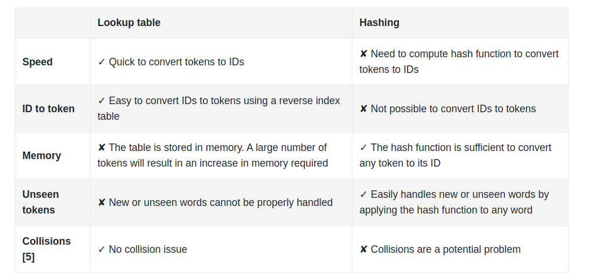

# Machine Learning System Design Interview

# Introduction and Overview

1) ML system design steps

2) When we are in an interview, the first thing is to clarify the requirements.

- Business objective

- Features the system needs to support

- Data

- Constraints

- Scale of the system

- Performance

- Privacy and Ethics

3) In an interview, the first thing is to determine whether ML is necessary or not.

4) Application, business objective and ML objective

5) ETL visualized

6) Data categorization for Machine Learning

7) "Many ML models struggle to learn a task when the features of the dataset are in different ranges"

8) Labelling can be done in two ways:

- Hand Labeling: Done by humans, expensive and slow

- Natural Labeling: No need of human annotators

9) Focal loss is a loss function to mitigate class imbalance.

10) "Model compression refers to the process of making a model smaller".

11) Shadow deployment is a technique to evaluate the performance of a new model in the online environment. The new model and the existing model are predicting the same input but the predictions of the existing model are shown to the user. When we become confident, the predictions of the new model are used. Thanks to shadow deployment, we are minimizing the risk of unreliable outcomes. The con of this method is that we are increasing the serving duration because one input is scored by 2 different models instead of a single one. 

12) The most common reason why an ML model fails is data distribution shift.

# Visual Search System

1) A visual search problem can be thought as a ranking problem.

2) Common image processing operations

3) In order to create a training dataset, we should have a positive image similar to anchor image and many negative images. The number of negative images should be tuned. Negative images can be chosen randomly. However, there are 3 ways to label an image as a positive example.

    - Human Labeling: Accurate training data but expensive operation.
    - User Interactions: It can generate noisy data and lead to poor performance.
    - Artifically create a similar image from the query image, known as self supervision: It can be implemented via rotating the image and labelling it as a positive. The frameworks named [SimCLR](https://github.com/google-research/simclr) and [MoCo](https://paperswithcode.com/method/moco-v2) use this approach efficiently.

4) Contrastive loss function should be chosen. There are different contrastive loss functions.

5) In order to compute similarities, cosine similarity or dot product should can be chosen. Euclidean distance performs bad due to curse of dimensionality. After computing similarities, the computed similarities are fed into a softmax function and then the cross entropy loss is calculated in order for backpropagation.

6) Some offline evaluation metrics for this ranking problem.

7) MRR criteria takes care of only the positive image's prediction.

8) mAP means mean average precision. It is designed for binary relevances.

9) "nDCG works well most times. Its primary shortcoming is that deriving ground truth relevance scores is not always possible. In our case, since the evaluation dataset contains similarity scores, we can use nDCG to measure the performance of the model during the offline evaluation"

10) Some online metrics for evaluation

- Click Through Rate

- Average daily, weekly, and monthly time spent on the suggested images

11) Serving is composed of 2 pipelines. One pipeline is responsible for keeping index table of embeddings of images updated. The other one is responsible for generating similar images for query image.

12) Reranking service is taking care of filtering unappropriate images, removing duplicates and near duplicate images, filtering out private images etc.

13) Approximate nearest neighbor(ANN) should be implemented when data is huge. There are 3 types of ANN's.

- Tree-based ANN:

- Locality-sensitive hashing (LSH)-based ANN: Using a hash function to map points into buckets. Query image is fed into hash function. The images in in the predicted bucket of query image should be recommended.

- Clustering-based ANN: Creating clusters and searching similar images among the cluster

14) There are 2 common libraries to implement ANN. One of them is [faiss](https://github.com/facebookresearch/faiss) of Facebook and the other one is [scann](https://github.com/google-research/google-research/tree/master/scann) of Google.

# Google Street View Blurring System

1) The purpose is to blur license plates and human faces.

2) The input will be an image that may contain zero or multiple objects in itself. The output will contain objects and their locations. The problem should be framed as object detection problem.

3) Generally, an object detection(OD) system has 2 responsibilities.

- Detecting an object's location: Regression

- Determining the class of object: Multiclass classification

4) There are 3 typearchitecturess of OD system.

- One Stage Networks

- Two Stage Networks

- Transformer based architectures: DETR is an example.

5) There are 2 components in two stage networks. The first network is Region Proposal Network and the second network is classifier. Examples of two stage networks are RCNN, Fast R-CNN, Faster R-CNN. Two stage networks run slower but more accurate compared to one stage networks.

6) In one stage networks, there is only one network. YOLO and SSD are examples of one stage networks. It is faster but less accurate compared to two stage networks.

7) A dataset of 1 million images isn't considered to be huge by modern standards.

8) The annotated data is structured as follows.

9) Some augmentation techniques

10) There are 2 approaches to augment data. The first method is offline augmentation. Dataset is first augmented and then stored in storage. Finally, it is used in training. Whereas, the second method is online augmentation. Dataset is augmented in the phase of training. Both approaches have advantages and disadvantages. The pro of offline training is less time spent in training. The con of offline training is storage difficulties. The pro of online augmentation is no need for storage because everything is on the fly. The con of online augmentation is more time spent in training.

11) Some preprocessing operations are resizing, scaling and normalizing.

12) How 2 stage object detection network works

13) MSE(Mean Squared Error) should be use in regression task and Cross Entropy loss should be used in classification task. The final loss should be the sum of regression and classification losses.

14) How Intersection Over Union(IoU) is calculated

15) The performance of the model can be checked via Precision, Average Precision and Mean Average Precision. Precision is dependent on the selected threshold. The less the threshold, the more the precision. In order to remove the effect of threshold, Average Precision is invented. It is calculating the precision against different thresholds using integral for one class(human face). Average Precision can be calculated via a discrete summation over a predefined list of thresholds instead of using integral. Mean Average Precision is the mean of average precisions for different classes.

    - Precision: 
    
    - Average Precision using integral
    
    - Discretized Average Precision
    
    - Mean Average Precision
    

16) A very common problem in object detection is the overlapping boundary boxes. It is necessary to lower the number of overlapping boundary boxes. NMS(Non Maximum Suppression) is a technique to decrease the number of overlapping boundary boxes. "NMS is a post-processing algorithm designed to select the most appropriate bounding boxes. It keeps highly confident bounding boxes and removes overlapping bounding boxes". NMS is a commonly asked algorithm in interviews.

17) The overall design is below.

18) Preprocessing and blurring services are 2 decoupled because preprocessing is a CPU-bound operation and blurring is a GPU-bound operation. It is easier to scale them when they are separated. Blurring service is responsible for making predictions, applying NMS, blurring predicted areas and storing the blurred images in object storage.

# YouTube Video Search

1) The problem can be framed as a ranking problem. The input(video with its metadata like description and title) will be fed into **visual search** and **text search** components separately. Then, the results will be combined.

2) How visual search works. The similarity score between video embedding and text embedding is calculated using dot product. Then, most similar vides are shown for a query.

3) How text search works. Videos which have the most similar titles, descriptions and tags are shown for a query.

4) Inverted index is a popular technique for creating text based document search. Elastic search is an example of Inverted Index. It doesn't use ML. Elastic search is a scalable search engine and document store. For more information as to Elastic Search, click here[https://www.tutorialspoint.com/elasticsearch/elasticsearch_query_dsl.htm].

5) How to represent a text with a numerical vector

6) 3 steps of converting a text to a numerical vector

- Normalization

    - Lowercasing
    - Removing punctuations
    - Trimming whitespaces
    - Removing accents: Noël → Noel
    - Lemmatization

- Tokenization

    - Word tokenization: ["I", "have", "a", "car"]
    - Subword tokenization: n grams
    - Character tokenization

- Tokens to ID's:

    - Lookup table:

    

    - Hashing:

    

6) Converting tokens to ID's are done via Lookup table or Hashing. The comparison is below

7) How to process a video

8) Video decoding is the operation of transforming a video into multiple frames. The total number of frames is by the multiplication of FPS(Frame Per Second) and Duration of Video. If FPS is 25 and the duration of video is 20, there are 500(25*20) frames in the video.

9) There are 2 categories to process text. 

- Statistical Models:
    - Bag Of Words
    - TF-IDF
- ML Based Models:
    - Embedding: Simple and efficient solution to map high-cardinal data into dense vectors
    
    - Word2Vec:
    
    - Transformers: ıts advantage is capturing context
    

10) Video encoding can be done in 2 ways:

- Video Level Model: Expensive, slow in serving

- Frame Level Model: Faster, should be used when temporality isn't crucial. Frame level models aren't good at capturing understanding actions and motions. ViT(Vision transformer) is a frame level model which can be chosen.

11) Contrastive Learning can be used in training. Our annotated dataset is depicted below. The training pipeline is taking video as one input, taking many queries of 1 corresponding positive label and n-1 negative(irrelevant) labels as text input, computing similarities, scaling on softmax and outputing a probability of each text input for the input video.

12) Mean Reciprocal Rank can be a good offline metric.

13) Some online metrics

- CTR: Click Through Rate

- Video Completion Rate

- Total watch time of search results

14) Simplified Design for indexing video pipeline, prediction pipeline and indexing text pipeline.

15) Fusing layer is taking videos(visual search and text search) from the previous step and reranking according to relevance score(like time).

16) Reranking service is applying business-level logic and policies at the end.

# Harmful Content Detection

1) Posts that contain violence, nudity, self-harm and hate speech are recognized as harmful content.

2) Fusion is a concept that is related to combining different inputs of different modalities. There are 2 types of fusions.

    - Late Fusion: Separating each model independently for each modality first. Secondly, the outputs of each model for each modality are fused. Not capturing the relationship for a meme that has a text and image.
    
    

    - Early Fusion: Combining the vectors for each modality first. Then, the combined vector is fed into a single neural network. This approach captures more potentially than late fusion. This approach is harder to train. In the absence of training data, early fusion method fails.

    

3) Choosing the right ML strategy is hard. We have 4 options.

- Simple Binary Classifier: Easy to train, but it lacks of explanation why a content is harmful.

- One binary classifier for each harmful class: Hard to maintain and train.

- Multilabel classifier: Single model is its advantage. But using the same vector for each class isn't appropriate because the inputs may require different transformations.

- Multi task classifier: Learning together to some extent, then each class has its own classification head. This approach is a single model solution and allowing different harmful criteria to get specialized in their classification heads.

4) Framing the problem as a Machine Learning problem using multi task classifier. The advantages of multi task classifier are its simplicity to train(one ML model), redundant operations for each harmful class are removed thanks to transformed features and the learning of a harmful class may contribute to the learning of other harmful class. In multi task training, each task is assigned a loss function based on its ML category.

5) The following data available

- User Data:

- Post Data:

- User-Post Interation Data:

6) BERT is trained in English only. Therefore, DistilmBERT can be used. DistilmBERT is an efficient variant of BERT to produce embeddings. If a sentence in language #1 is close to another sentence in language #2, their embeddings are so similar.

7) [CLIP's visual encoder](https://openai.com/research/clip) and [SimCLR](https://arxiv.org/pdf/2002.05709.pdf) are 2 alternatives to convert an image into a feature vector.

8) [VideoMoCo](https://arxiv.org/pdf/2103.05905.pdf) is a video model transforming a video into a feature vector.

9) The following types of data can be used.

- Textual content
- Image or video
- User reactions to the post
- Author
- Contextual information

10) User reactions such as the number of likes, the number of shares, the number of comments and the number of reports can be fed into the model.

11) User comments should be transformed into a feature vector and the aggregated via averaging.

12) The summary of how textual data, image data, video data, reaction data and comments data can be concatenated

13) Some features on authors can be extracted.

- Violation based features:
    - Number of violations in the past
    - Total user reports: How many times other users reported the author of the post.
    - Profane words rate
- Demographics based features:
    - Age
    - Gender
    - Location(City and country): It is sparse when one-hot encoded. To solve this problem, use embeddings.
- Account Information
    - The age of account
    - The number of followers and followings

14) Contextual information represents information which is not related to the post and the author of the post.
    - Time of day
    - Device: Mobile or Desktop or Tablet

15) Summary of Feature Engineering

16) It would be a good practice to employ natural labeling on training phase and human labeling on validation phase. Natural labeling is less costly but less accurate. Human labeling is more costly and more accurate. Natural labeling can be programmed based on user reports. The reason why to select human labeling in validation is to be sure about the performance of the ML model trained on naturally labeled data.

17) How to compute loss. Each task can have its specific loss functions and their sum can be the total loss.

18) A common challenge in training multimodel ML models is overfitting. One modality(image etc) may prevail over the others. In order to solve this problem, [gradient blending](https://arxiv.org/pdf/1905.12681.pdf) or focal loss can be used.

19) Precision and Recall can be insufficient to evaluate the performance. Therefore, AUROC(Area Under Receiver Operating Characteristic) and AUPRC(Area Under Precision Recall Curve) can be used as offline metrics. To learn the difference between both, take a look at [here](https://machinelearningmastery.com/roc-curves-and-precision-recall-curves-for-classification-in-python/).

20) Some online metrics should also be used to evaluate the performance of the model.

21) How to serve in a real-time system

22) If a post is predicted as harmful with low confidence, it should be manually reviewed. After the manual review, a human assigns a label to the post. Then, this manually labeled post should be stored in the storage and can be useful for further trainings.

# Video Recommendation System

1) A customized homepage is going to be fed via ML.

2) There might be multiple ML objectives.

    - Maximizing number of clicks: Recommending clickbait videos more. Worsening customer experience.
    - Maximizing number of completed videos: Bias to recommending short videos
    - Maximizing total watch time: Biased to the videos watched more
    - Maximizing the number of relevant videos: Based on business rules such as whether a user clicks like button or a user watches at least 50 percent of video, a relevance can be defined. We can construct a dataset and train a model to predict a relevance score.

3) Common types of recommendation systems

4) Youtube is using a CF based model as the first stage to generate candidates. Then it uses content based RS as the second stage to recommend videos.

5) Most companies use hybrid RS. There are 2 types of Hybrid RS's. Parallel or Sequential. Sequential Hybrid RS's are used more. The following design will be based on Sequential Hybrid RS.

6) Available data

- Video

- User

- User-Video Interaction

7) 4 types of different data

- Video features:

    - Video ID: Converted to dense vectors thanks to embedding layer
    - Duration
    - Language
    - Titles and tags: Titles are converted to feature vectors thanks to a context-aware word embedding model such as BERT. Tags are converted to feature vectors thanks to a lightweight pretrained model such as CBOW.

- User demographics

- Contextual Information

- User historical interactions

    - Search History: Mapping each search query into an embedding vector. A user's search history is a variable-sized list of textual queries. To create a fixed size feature vector, average the query embeddings.
    - Liked videos: Video ID's are mapped into an embedding vector using embedding layer. Similar to search history, they are averaged.
    - Watched videos: Similar to liked videos
    - Impressions: Similar to liked videos

8) What we are optimizing is relevancy. Therefore, both implicit and explicit feedbacks are so important for Matrice Factorization methods.

9) The loss function will include the loss computer for observed and unobserved pairs.

10) There are 2 MF optimization techniques. WALS converges faster and it is parallelizable.

- Stochastic Gradient Descent: Used to minimize losses
- Weighted Alternating Least Squares (WALS): Specific to matrix factorization
    - Fix one embedding matrix (U), and optimize the other embedding (V)
    - Fix the other embedding matrix (V), and optimize the embedding matrix (U)
    - Repeat.

11) RS returns predictions based o relevancy score.

12) MF optimizes user-video matrices and obtains video embeddings and user embeddings.

13) MF is built on top of user-video interactions. Thus, it doesn't take other features such as age, time, video and user features into consideration.

