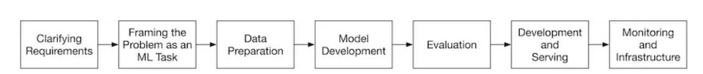

# Machine Learning System Design Interview

# Introduction and Overview

1) ML system design steps

2) When we are in an interview, the first thing is to clarify the requirements.

- Business objective

- Features the system needs to support

- Data

- Constraints

- Scale of the system

- Performance

- Privacy and Ethics

3) In an interview, the first thing is to determine whether ML is necessary or not.

4) Application, business objective and ML objective

5) ETL visualized

6) Data categorization for Machine Learning

7) "Many ML models struggle to learn a task when the features of the dataset are in different ranges"

8) Labelling can be done in two ways:

- Hand Labeling: Done by humans, expensive and slow

- Natural Labeling: No need of human annotators

9) Focal loss is a loss function to mitigate class imbalance.

10) "Model compression refers to the process of making a model smaller".

11) Shadow deployment is a technique to evaluate the performance of a new model in the online environment. The new model and the existing model are predicting the same input but the predictions of the existing model are shown to the user. When we become confident, the predictions of the new model are used. Thanks to shadow deployment, we are minimizing the risk of unreliable outcomes. The con of this method is that we are increasing the serving duration because one input is scored by 2 different models instead of a single one. 

12) The most common reason why an ML model fails is data distribution shift.

# Visual Search System

1) A visual search problem can be thought as a ranking problem.

2) Common image processing operations

3) In order to create a training dataset, we should have a positive image similar to anchor image and many negative images. The number of negative images should be tuned. Negative images can be chosen randomly. However, there are 3 ways to label an image as a positive example.

    - Human Labeling: Accurate training data but expensive operation.
    - User Interactions: It can generate noisy data and lead to poor performance.
    - Artifically create a similar image from the query image, known as self supervision: It can be implemented via rotating the image and labelling it as a positive. The frameworks named [SimCLR](https://github.com/google-research/simclr) and [MoCo](https://paperswithcode.com/method/moco-v2) use this approach efficiently.

4) Contrastive loss function should be chosen. There are different contrastive loss functions.

5) In order to compute similarities, cosine similarity or dot product should can be chosen. Euclidean distance performs bad due to curse of dimensionality. After computing similarities, the computed similarities are fed into a softmax function and then the cross entropy loss is calculated in order for backpropagation.

6) Some offline evaluation metrics for this ranking problem.

7) MRR criteria takes care of only the positive image's prediction.

8) mAP means mean average precision. It is designed for binary relevances.

9) "nDCG works well most times. Its primary shortcoming is that deriving ground truth relevance scores is not always possible. In our case, since the evaluation dataset contains similarity scores, we can use nDCG to measure the performance of the model during the offline evaluation"

10) Some online metrics for evaluation

- Click Through Rate

- Average daily, weekly, and monthly time spent on the suggested images

11) Serving is composed of 2 pipelines. One pipeline is responsible for keeping index table of embeddings of images updated. The other one is responsible for generating similar images for query image.

12) Reranking service is taking care of filtering unappropriate images, removing duplicates and near duplicate images, filtering out private images etc.

13) Approximate nearest neighbor(ANN) should be implemented when data is huge. There are 3 types of ANN's.

- Tree-based ANN:

- Locality-sensitive hashing (LSH)-based ANN: Using a hash function to map points into buckets. Query image is fed into hash function. The images in in the predicted bucket of query image should be recommended.

- Clustering-based ANN: Creating clusters and searching similar images among the cluster

14) There are 2 common libraries to implement ANN. One of them is [faiss](https://github.com/facebookresearch/faiss) of Facebook and the other one is [scann](https://github.com/google-research/google-research/tree/master/scann) of Google.
