# Vs code settings

1 ) Global settings for Vscode setup. It is located on /home/muhammed/.config/Code/User/settings.json.

```settings.json
{
    "terminal.integrated.defaultProfile.linux": "zsh",
    "terminal.integrated.profiles.linux": {
        "bash": {
            "path": "bash",
            "icon": "terminal-bash"
        },
        "zsh": {
            "path": "zsh"
        },
        "fish": {
            "path": "fish"
        },
        "tmux": {
            "path": "tmux",
            "icon": "terminal-tmux"
        },
        "pwsh": {
            "path": "pwsh",
            "icon": "terminal-powershell"
        },
        "zsh (2)": {
            "path": "/usr/bin/zsh"
        }
    },
    "window.zoomLevel": 2,
    "workbench.startupEditor": "none",
    "workbench.iconTheme": "ayu",
    "workbench.colorTheme": "Ayu Dark",
    "workbench.settings.editor": "json",
    "workbench.settings.openDefaultSettings": true,
    "workbench.settings.useSplitJSON": true,
    "[python]": {
        "editor.defaultFormatter": "ms-python.black-formatter"
    },
    "editor.formatOnSave": false,
    "editor.codeActionsOnSave": {
        "source.organizeImports": true
    },
    "code-runner.executorMap": {
        "python": "$pythonPath -u $fullFileName"
    },
    "code-runner.showExecutionMessage": false,
    "code-runner.clearPreviousOutput": true,
    "python.testing.pytestArgs": [
        "pytest"
    ],
    "python.testing.unittestEnabled": false,
    "python.testing.pytestEnabled": true,
    "python.languageServer": "Pylance",
}

```

) 
2) Install the following extensions on Vscode marketplace.

  - Python(installing Pylance, pylint(remove it later), jupyter notebook, debugging etc)
  - isort(sorting our imports)
  - Black Formatter to format our files
  - Code Runner to run our code via right-upper green triangle
  - Ayu to have a different theme workplace

# PyCharm Settings

1) Install Rainbow brackets, rainbow csv, rainbow indent as plugins.
2) Download black pycharm formatter and install it via **load from disc**. Install the library
   via `pip install 'black[d]'`. Follow the
   instructions [here](https://black.readthedocs.io/en/stable/integrations/editors.html)
3) Open up plugin pages and type pylint to search. Install and enable the plugin.
4) Open up plugin pages and type **One Dark Theme**. Install and enable the plugin. Choose *One Dark Vivid Italic* as
   color scheme.
5) Create a .pylintrc file in root folder.

# My-Nginx-Notes

1) Http = Hyper Text Transfer Protocol

2) Protocol = A set of rules that are agreed upon 2 or more parties for communication

3) Http uses port 80 of computer/server but it is easily changeable.

4) All modern Web browsers have Network tab to display Network activities.

5) Generally, data transferred on top of Http protocol are zipped via some algorithm provided by web servers and web browsers are able to unzip it in the background.

6) Daemon in unix-like OS = Service in Windows.

7) Some web servers =  Apache, Nginx, Microsoft IIS, Httpd. Httpd is used with PHP generally.

8) Nginx is
  - A http and reverse proxy server
  - A mail proxy server
  - A generic TCP/UDP proxy server

9) According to [Netcraft](https://www.netcraft.com/), a statistic-oriented website, Nginx usage is around 28% as of 2017 February.

10) A statistic for user wait times is blow:


11) Why to use Nginx:
  - Slow
  - Acceleration
  - Load balancing
  - Scalable concurrent connections handling
  - The ability to operate on relatively cheap hardware.
  - On the fly upgrades
  - Ease of installation and maintenance


12) In apache, a thread is created for each new request. If you have 1000 request at the same time, you have 1000 threads runnig concurrently. However, in NGINX, one thread is used for 1000 requests but it is based on events. vent pased processing is much much faster.

13) NGINX not only supports HTTP and HTTPS, but also IMAP(Internet Message Access Protocol), POP3 (Post Office Protocol) and SMTP(Simple Mail Transfer Protocol).

14) Apache and NGINX can be used together.

15) Web root directory in Apache is `/var/www/html`.

16) Log files of ngin is under `/var/log/nginx` . You will find access.log and error.log.

17) The binary that starts the nginx daemon is under `/usr/bin` . 

18) The web directory from which nginx serves web pages by default is `/usr/share/nginx`.

19) To start nginx service 

```
sudo service nginx start
```

20) Nginx should be compiled from the source rather than installing via apt if you want to customize its settings. For each option(from source or from ubuntu/debian repositories) configuration files location are below:

  - From Source:
    - /etc/nginx/conf.d/
  - From Repo(symblinks to /etc/nginx/sites-available/):
    - /etc/nginx/sites-enabled/

21) Nginx is utilizing an asynchronous event-driven model, delivering reliable performance under significant loads.

22) Main configuration file is `/etc/nginx/nginx.conf`.

23) In NGINX, configuration options are known as *directives*. These *direvtives* are either in a block or not. Some directives which are listed in the beginning of */etc/nginx/nginx.conf* file are user, worker_processes, error_log, pid etc.

24) **http** and **events** are some blocks in */etc/nginx/nginx.conf*.

25) **http** block encapsulates directives for web traffic handling.

26) *include* directive under **http** block is where to look for configuration files if you are using separate configuration files in /etc/nginx/conf.d/ or /etc/nginx/sites-enabled/

27) **server** block should be under **http** . An example server block is below:

```
server {

listen 80 default_server;

listen [::]:80 default_server;

server_name example.com www.example.com;

root /var/www/example.com;

index index.html;

try_files $uri /index.html;

}
```

28) **location** blocks are located under **server** blocks. "NGINX’s location setting helps you set up the way in which NGINX responds to requests for resources inside the server. As the server_name directive informs NGINX how it should process requests for the domain, location directives apply to requests for certain folders and files (e.g. http://example.com/blog/.) "(from [here](https://www.plesk.com/blog/various/nginx-configuration-guide/#:~:text=Every%20NGINX%20configuration%20file%20will,interchangeably%20as%20blocks%20or%20contexts%20.))

29) An example of **server** and **location** blocks are below:

```
server {

  location / { }

  location /photos/ { }

  location /blog/ { }

  location /home/ { }

  location /blog/categories/ { }

}
```

30) We can use regular expression by writing `location ~ SOME_RE_COMMAND_HERE` in location blocks. For case insensitive, use `~*`. For particular string, use `^~`. To stop searching after finding an exact match, use `=`. Exact match will speed up the performance.
```
# a case sensitive Regex
location ~ ^/myblog(/|/index\.py)$ { }
# case insensitive
location ~* ^/myblog(/|/index\.py)$ { }
# particular string
location ^~ /blog/BlogPlanet/ { }
# Exact match, No search after matching
location = / { }
```

31) *root* directive under location block is telling us where to look to give a response to a request. When "NGINX has identified the location directive that is the best match for a specific request, its response will be based on the associated location directive block’s contents"(from [here](https://www.plesk.com/blog/various/nginx-configuration-guide/#:~:text=Every%20NGINX%20configuration%20file%20will,interchangeably%20as%20blocks%20or%20contexts%20.)). Exact paths can be used for *root* direvtive like /home/myuser/.

```
location / {

root html;# /etc/nginx/html

index index.html index.htm;

}
```

32) The content of index.html and index.htm will be returned if no match situation occurs. *index* directive is used not to show a 404 not found error message to clients.

# MLFlow

[Link 1](https://www.youtube.com/watch?v=859OxXrt_TI&ab_channel=InfoQ)

[Link 2](https://www.youtube.com/watch?v=6z0_n8kxh-g&ab_channel=PyData)

1) MLFlow is a platform for the complete ML lifecycle. It is open source and started at DataBricks. It may be installed locally or on a remote server to be used via multiple developers. MLFlow is language agnostic.

2) ML lifecycle is below:

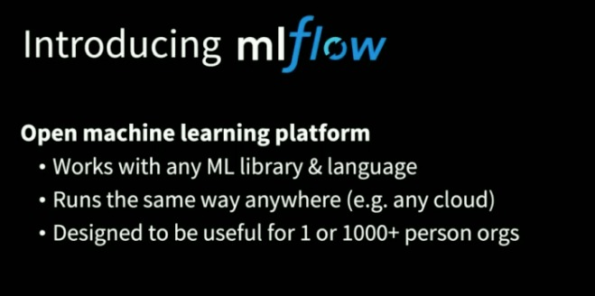

3) There are some platforms like Facebook's FBLearner and Uber's Michelangelo and Google's TFX to standardize ML lifecycle. They aren't completely open source. They are limited to a few algorithms or frameworks. [Weights & Biases](https://wandb.ai/site) is paid service like MLFlow, which is a competitor to MLFlow.

4) Characteristis of MLFlow

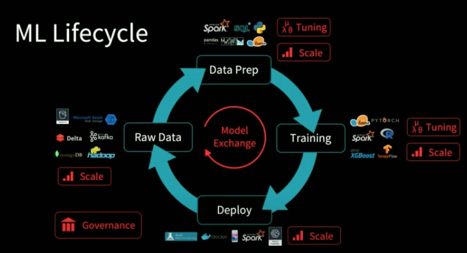

5) MLFlow faciliates reproducibility.

6) MLFlow components:

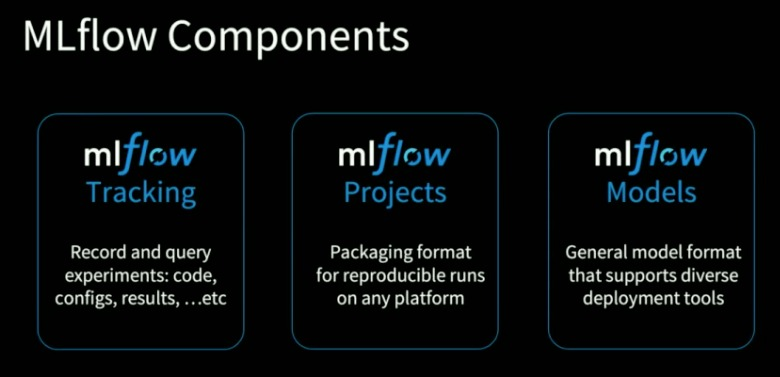

7) **Tracking** is a centralized repository for metadata about training sessions within an organization. **Projects** is a reproducible & self contains packaging format for model training code, ensuring that training code runs the same way regardless of execution environment. **Models** is a general purpose model format enabling any model produced with MLFlow to be deployed to a variety of production environments.

8) Some key concepts in Tracking

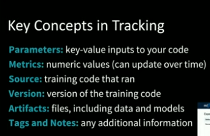

9) MLFlow Tracking Server

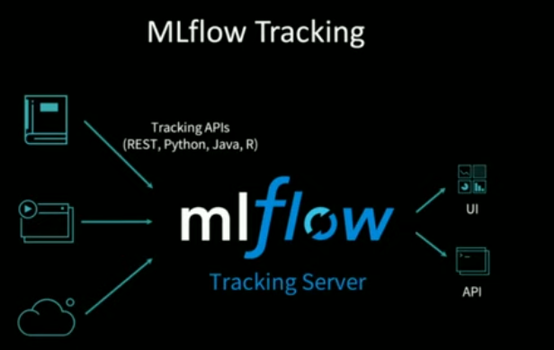

10) MLFlow Tracking usage example

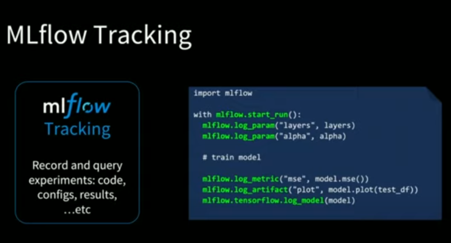

11) A tracking result from MLFlow GUI

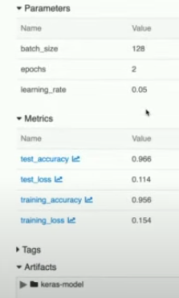

12) MLFlow stores entity(metadata) store and artifact store.

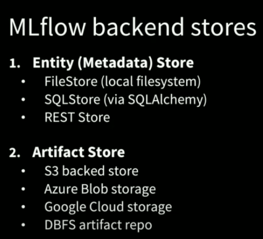

13) MLFlow Project is a directory structure. It automates fetching a project from github and run it via parameters defined conda.yaml.

14) Sample MLFlow Project:

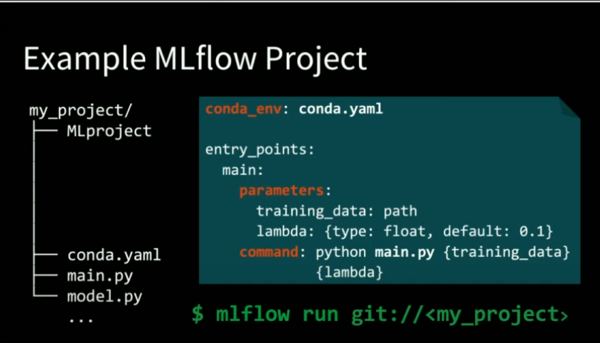

15) ML models can be productionized via various solutions. The motivation behing **MLFlow models** is below. The solution to this complexity is a unified model abstraction called **MLFlow model**.

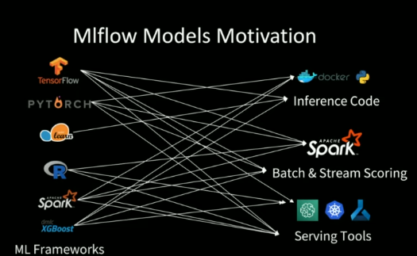

16) A Sample MLFlow models 

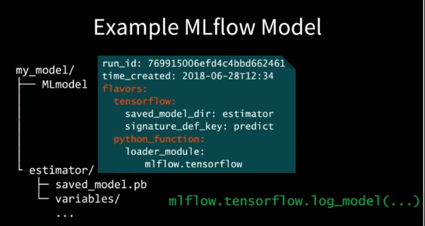

17) MLFlow Flavors Example

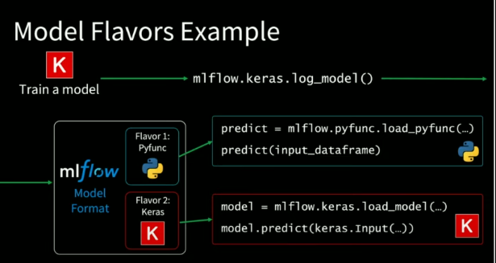

18) 2 key concepts of MLFlow:

- Run: A collection of hyperparameters, training metrics, labels, and artifacts related to a machine learning model

- Experiment: COnsists of lots of different runs.

19) [Comet.ml](https://www.comet.com/docs/v2/api-and-sdk/python-sdk/reference/Comet-Python-API/) is an alternative to MLFlow.


# Basic Concepts

1) Web is a service running on the ineternet.  Internet is anarchitecture, web is a service. There are other services like IRC (internet relay chat) , e-mail, Voip and telnet, which run on the internet.

2) Client makes a request to Server via browser.

3) Web is a term used in order to mean servers that use HTTP

4) Client makes a request using HTTP and TCP/IP and server responds to the client.

5) URL = access_method://server_name:port/location/to/go

6) DNS is abbreviating Domain Name Server. It matches domain names and correspondent IP.

7) HTTP is an application protocol.

8) ISP is abbreviating Internet Service Provider like Turkcell Superonline and Türk Telekom.

9) `ping website.com` is a command to check whether a server is up or not.

10) Protocol Stack is built on OS. Protocol stack is referred as TCP/IP protocol stack.

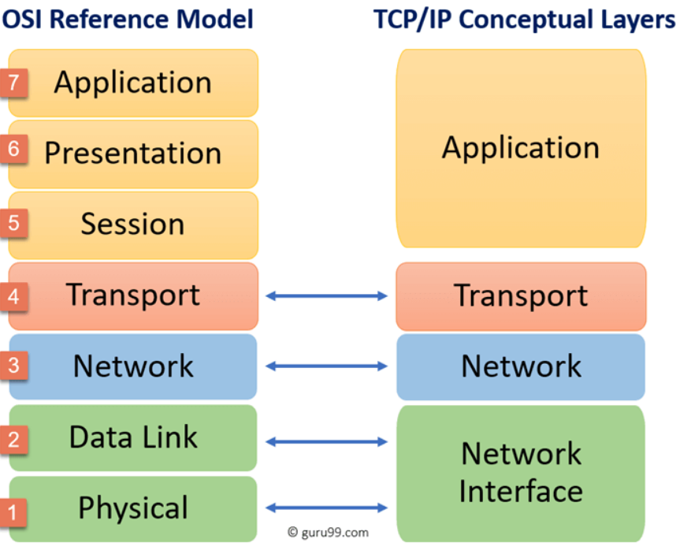

11) Data is composed of chunks(packets).

12) On TCP, each packet was given a port number.

13) On IP, each packet was given its destination IP.

14) On Hardware Layer, alphabetic text was converted to eloctronic signal.

15) The packets transmitted over te internet. When packets reach the destination, IP address and port number info was removed because it already reached.

16) `traceroute` is a Unix-like or Windows command to track packages sent to destination

17) Router directs dispatched packets to its destination

18) ROuter examines destination address of packets and determines where to send it.

19) Client Computer -> Modem -> Public Telephone Network -> Modem Pool -> ISP Port Number -> Router(x10) -> ISP Backbone(x10)

20) DNS is a distributed database which keeps track of computer's names and their corresponing IP addresses. My request to a destination first goes to a DNS Server. After obtaining correspondent IP, my computer connects to target computer.

21) The government is able to block youtube.com because ISP's have DNS's. Google is providing a free DNS.

22) HTTP is Hyper Text Transfer Protocol. It is an application protocol that makes the web works.

23) HTTP is the protocol that web browsers and web servers use to communicate with each other over the internet. HTTP sits on top of TCP layer.

24) Ports can be thought of as separate channels on each computers.

25) TCP receives data for application layer protocol and segments it into chunks. TCP assigns port numbers to these chunks.

26) Some important port numbers

| Port    | Operation |
| --------- | ----------- |
|  20,21    | FTP         |
|  22       | SSH, SFTP   |
|  23       | Telnet      |
|  53       | DNS         |
|  80       | HTTP        |
|  443      | HTTPS       |
|  3389     | RDP         |

27) IP's job is to send and route packets to other computers

28) Packet has IP Header, TCP Header, data from application layer.

29) FTP Server: a computer on the internet that offers FTP

30) Filezilla is an FTP client. There are other methods like using Terminal or using browser.

31) There are 2 types of IP:

- Public IP: Same for devices connected to same modem

- Private IP: Assigned by modem. For each device, it is unique.

32) Public IP address may change around time. A private IP address might be like 192.168.1.100 etc.

33) Routers are handling internet traffic for multiple computers at once using a single public IP address.

34) There are 65525 TCP ports in a computer.

35) Modern internet more closely follows the simpler internet protocol suite, known as TCP/IP.

36) Search engine is a web service helping us find other web pages.

37) Static web server is a server that sends its hosted files to browser.

38) Dynamic web server is a static web server + application server + database.

39) A protocol is a set of rules for communication between 2 computers.

40) Sending an HTML form from our browser to server is made using HTTP.

# FastAPI Notes

1) FastAPI is very fast to make an API.

2) Traditionally, we aren't explicitly defining what kind of data our API is expecting(Flask, Django). When you create an API in FastAPI, you define what kind of data your API is expecting. First advantage of FastAPI is data validation.

3) Another advantage of FastAPI is automatic documentation. It is using FastAPI.

4) The last advantage of FastAPI is AutoCompletion and Code Suggestions in VS Code and PyCharm.

5) To use FastAPI, install FastAPI and Uvicorn via `pip install fastapi` and `pip install uvicorn`. Uvicorn is enabling us to run our API's like a web server.

6) An API Endpoint(can be also called as Route or Path) is the point of entry in a communication channel when two systems are interacting. It refers to touchpoints of the communication between an API and a server. It is like /hello or /get-item.

7) Endpoint HTTP Verbs:

- When we have an endpoint that has a GET method, this endpoint will be returning information.       
- When we have an endpoint that has a POST method, this endpoint will be creating something new(adding a record to DB etc). 
- When we have an endpoint that has a PUT method, PUT method updates the information.
- When we have an endpoint that has a DELETE method, DELETE method deletes the information.
- When we have an endpoint that has a PATCH method, PATCH method PARTIALLY UPDATES the information.
- There are other HTTP words which aren't used frequenly as above one. These are OPTIONS, HEAD, PATCH, TRACE.

8) To run uvicorn, run the following. temp is our file as temp.py but .py not typed. Click [http://127.0.0.1:8000/](http://127.0.0.1:8000/) or [http://127.0.0.1:8000/docs](http://127.0.0.1:8000/docs). An alternative documentation is working on [http://127.0.0.1:8000/redoc](http://127.0.0.1:8000/redoc). Uvicorn can be run from main.py via below

```uvicorn_python.py
if __name__ == '__main__':
    uvicorn.run(app, host='127.0.0.1', port=8000)
```

```uvicorn.sh
uvicorn first_api:app --reload
```

```first_api.py
from fastapi import FastAPI

# Creating a FastAPI instance
app = FastAPI()

@app.get("/")
def home():
    return {"Data": "Testing"}

```

9) Any response coming from an endpoint will be converted to JSON by FastAPI in the background. This operation is known as JSON Serialization.

10) We can send path parameters to /get-item/{item_id} endpoint via [http://127.0.0.1:8000/get-item/1](http://127.0.0.1:8000/get-item/1) and get ***{"name":"bread","price":5.99}***. [http://127.0.0.1:8000/get-item/4](http://127.0.0.1:8000/get-item/4) will return ***Internal Server Error***. [http://127.0.0.1:8000/get-item/any_object](http://127.0.0.1:8000/get-item/any_object)
will return ***{"detail":[{"loc":["path","item_id"],"msg":"value is not a valid integer","type":"type_error.integer"}]}***.

11) We can pass 2 path parameters {item_id, name} to an endpoint like we did in *get_item_2_path_params* function.

12) `from fastapi import Path` is allowing us to add more details or enforcements or constraints to our actual path parameter. Before the information, we need to set a default value to Path. gt means greater than, lt means less than in Path parameters.

13) Query parameter is something that comes after a question mark(?) in a url. An example is https://example.com?redirect=/home&message=fail. **get_item_by_query** is implementing query parameter example. An example url is [http://127.0.0.1:8000/get-by-name?name=milk](http://127.0.0.1:8000/get-by-name?name=milk) and it returns *{"name":"milk","price":20.99}*. [http://127.0.0.1:8000/get-by-name?name=banana](http://127.0.0.1:8000/get-by-name?name=banana) returns *{"Data":"Not Found"}*. We have to fill query parameter if we want to send a request to relevant url. If we don't want to make it obligatory, a default None value should be passed to query parameter. We can define some query parameters as required, some as having a default value, and some entirely optional. product_id is a path parameter. brand is an obligatory query parameter. size is a query parameter having a default value and not have to be filled out. Color is a query parameter which can be None or str but it is None by default.

```query.py
from typing import Union
@app.get('get-product/{product_id}'):
def get_proruct(product_id: int, brand: str, size: str = 'L', color: Union[str, None] = None ):
    pass

```

14) We can combine path parameters and query parameters in an endpoint. *get_item_by_path_param_query_param* does exatly this. [http://127.0.0.1:8000/get-by-name-path-param-and-query/3?test=2](http://127.0.0.1:8000/get-by-name-path-param-and-query/3?test=2) will run **get_item_by_path_param_query_param** function and return *{"name":"egg","price":3.0}*.

15) *create_item* function is a post function. It adds a new record to database(python dictionary in our case). The body should cover the attributes of Item class. Item class is inherited from Basemodel of PyDantic. Open up [docs](http://127.0.0.1:8000/docs) page and send a body via POST /create-item/{item_id}.

16) update_item function is updating an existing data. It is a PUT request. It uses UpdateItem pydantic class.

17) delete_item function is deleting an existing data. If data doesn't exist, it returns a 404 status code.

18) To try POST, PUT and DELETE, run POST request first. Run PUT request second. Run DELETE request last.

19) Typer is a CLI of FastAPI.

20) `from fastapi import FastAPI` is a class that inherits directly from [Starlette](https://www.starlette.io/). We can use the existing features of Starlette.

21) The functions used by FastAPI decorators can return dict, list, int, str, Pydantic Models etc. They are going to be converted into json in the background by FastAPI.

22) We don't have to specify the data type in a function listening an endpoint. However,  we will lose the advantages of having a type hint in this scenario.

23) The order in the file having functions that are decorated by FastAPI matter. Below is an example. We should define `/users/me` before `/users/{item_id}`. This is because `/users/me` also fits `/users_user_id`.

```order_matters.py
@app.get("/users/me")
async def read_user_me():
    return {"user_id": "the current user"}


@app.get("/users/{user_id}")
async def read_user(user_id: str):
    return {"user_id": user_id}
```

24) We can't have the same endpoint for 2 functions.

25) If we want to have path parameters but we want these parameters to be predefined, we should use FastAPI with Enum as below.

```predefined_enum.py
from enum import Enum


class Sport(str, Enum):
    football = "football"
    basketball = "basketball"


@app.get('/get-sport/{sport}')
def get_sport(sport: Sport):
    if sport == Sport.basketball:
        return {"Sport": "basketball"}
    # another way of accessing value
    if sport.value == "football":
        return {"Sport": "football"} 
    return {"Message": "Sport not found in Enum class"}

```

26) [OpenAPI](https://github.com/OAI/OpenAPI-Specification) is a standard to define API's. Following OpenAPI instructions is the best practice.

27) We can have path of a file in endpoint having path parameter. For more details, check out [this link](https://fastapi.tiangolo.com/tutorial/path-params/#path-parameters-containing-paths).

28) A request body is data sent from our client(browser etc.). Response body is data sent from our API. We can generally send request body via POST, PUT and DELETE. However, we can send data via GET but it isn't best practice. The recommended way to send data is to use PyDantic.

29) PyDantic is similar to dataclass. However, it is more validation oriented. PyDantic has a Pycharm plugin in Pycharm. We can convert pydantic objects to dictionaries.

30) We can use request **body parameters**, path parameters and query parameters at the same time like below. item_id is a Path parameter, item is a Body parameter. q is a Query parameter. Setting a Body parameter to None makes it optional. We can also have multiple Body parameters for the same endpoint.

```all_here.py
@app.put("/items/{item_id}")
async def create_item(item_id: int, item: Item, q: Union[str, None] = None):
    result = {"item_id": item_id, **item.dict()}
```

31) `from fastapi import Query` is a way to add extra validation for query parameters. We can add more validation like min_length, regular expression etc. We can pass default values into Query class instead of barely setting equal. We can add title and description to Query class to be displayed on documentation. Also, we can use alias parameter of Query to resolve query parameter that aren't suitable for Python. A query parameter named my-string isn't a valid string name in Python. alias parameter is assigned to Query class and it will map to q in function decoreated by @app.get.

```query.py
async def read_items(q: Union[str, None] = Query(default=None, max_length=50)):

```

32) We can pass many query parameters with same query parameter. [http://127.0.0.1:8000/get-multiple-query/?q=Muhammed&q=Ali](http://127.0.0.1:8000/get-multiple-query/?q=Muhammed&q=Ali) will return **["Muhammed","Ali"]** . We can also assign default values to multiple query parameters via Query class. An example is **['Hasan', 'Hüseyin']**.

```
@app.get('/get-multiple-query/')
def get_multiple_query(q: Union[List[str], None] = Query(default=None)):
    return q
```

33) We can also append validations via `from fastapi import Path` like **Query**. We can also add the same parameters for **Path**. We can also number validations like **gt(greater than)** or **le(less than or equal)**.

34) Path, Query, Body (and others) are subclasses of Param. Actually, Path & Query are functions, not Classes.

35) The below is an example of 2 Body parameters composed of Pydantic model and additional 1 body parameter(importance). `from fastapi import Body` is making importance a Body parameter instead of a Query parameter.

```two_body_and_additional.py
from fastapi import Body
@app.put("/items/{item_id}")
async def update_item(item_id: int, item: Item, user: User, importance: int = Body()):
```

36) `from fastapi import Body` is a parameter called embed. When you set it to True, it will return or expect the latter instead of the former. If we have one body parameter for our endpoint, FastAPI expects the former. If we have more than 1 Body parameters, FastAPI expects a pattern like latter one.

```former.json
{"name": "Muhammed"}
```

```
{
    {"name": "Muhammed"}
}
```

37) `from pydantic import Field` is a way to add validation(less than 50 characters etc) & metadata (title or description) to PyDantic models like we did in `from fastapi import Query, Path, Body`.  Field works the same as Path, Query, Parameter.

```field_example.py
# Field Example
from pydantic import Field


class ItRole(BaseModel):
    role: Union[str, None] = Field(default=None,max_length= 10)
    writes_code: bool = Field(title= "whether the role writes code or not", description= "True if the rol writes code else False" )


@app.post("/it-roles/{role_number}")
async def update_item(role_number: int, it_role: ItRole = Body(embed=True)):
    results = {"item_id": role_number, "it_role": it_role}
    return results

```

38) We can send list style objects to our API and get the result as List or Set. The sent data is below

```list_set.json
{
  "is_collected": true,
  "unique_pieces": [
    "fan", "fan", "anakart"
  ],
  "all_pieces": [
    "fan", "fan", "anakart", "ram", "işlemci"
  ]
}
```

```list_set.py
# List & Set fields

class ComputerPieces(BaseModel):
    is_collected: bool# it is obligatory, can't be None
    unique_pieces: Set[str]# it is obligatory, can't be None
    all_pieces: List[str]# it is obligatory, can't be None

@app.post("/computer-pieces/")
async def post_computer_pieces(computer_piece: ComputerPieces):
    results = {"computer_piece": computer_piece}
    print(results)
    return results

# {'computer_piece': ComputerPieces(is_collected=True, unique_pieces={'anakart', 'fan'}, all_pieces=['fan', 'fan', 'anakart', 'ram', 'işlemci'])}

```

39) We can have nested custom PyDantic models. One PyDantic model can be an attirbute of another PyDantic model. A list or set of custom pydantic model can be an attribute of a custom pydantic model.

```expected.json
{
  "age": 0,
  "teacher": {
    "name": "string",
    "specialty": "string"
  }
}
```

```nested.py
# Nested Models
class Teacher(BaseModel):
    name: str
    specialty: str

class Student(BaseModel):
    age: int
    teacher: Teacher

@app.post('/post-student/')
async def post_student(student: Student):
    print(student)
    return student

```

40) We can have exotic PyDantic data types. Click [here](https://docs.pydantic.dev/usage/types/) to learn more. A popular one is **HttpUrl**.

41) JSON only supports string keys. However, PyDantic has automatic data conversion. Even though the client sends string data in key, we can autoconvert it to integer thanks to Pydantic. For more information, click [here](https://fastapi.tiangolo.com/tutorial/body-nested-models/#bodies-of-arbitrary-dicts)

42) In order to have a examplified documentation, we can add a class name **Config** to a custom PyDantic model. We can make the similar thing via **example** parameter of Field for detailed documentation in custom PyDantic classes. This examplification doesn't apply data validation. It just provides extra documentation. **example** parameter way can be used in Body, Query, Path etc to extend documentation. For plural, use **examples** instead of example in Body, Query, Path.

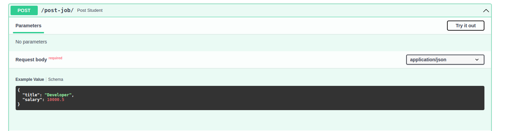

```config_way.py
class Job(BaseModel):
    title: str
    salary: float

    class Config:
        schema_extra = {
            "example": {
                "title": "Developer",
                "salary": 10000.5
            }
        }

@app.post('/post-job/')
async def post_job(job: Job):
    results = {"job": job}
    return results
```

```field_way.py
class Expertise(BaseModel):
    title: str = Field(example="A very nice Item")
    salary: float = Field(example=10000.5)

@app.post('/post-expertise/')
async def post_expertise(expertise: Expertise):
    results = {"expertise": expertise}
    return results

```

43) We can use other data types like datetime, time,  date, timedelta, bytes, UUID etc as parameters in functions decorated by FastAPI.

44) We can also deal with HTTP Cookies in FastAPI. Click [here](https://fastapi.tiangolo.com/tutorial/cookie-params/) for more information.

45) Http Header is an additional way to send data from server to client or from client to server. `from fastapi import Header` is a way to deal with Headers. Most of the standard headers are separated via **-(hyphen)**. Click [here](https://fastapi.tiangolo.com/tutorial/header-params/) for more information about headers.

46) We can also specify return type of a function via decorator's **response_model** parameter. **response_model_exclude_unset** is aparameter in a decorator, which means unset values aren't sent back to clients.

47) We can use inheritance to create a new custom pydantic model from a custom pydantic model. This is especially useful in taking user info from user, returning a success/fail response to user, saving the info into a DB.

48) A GET function can return multiple types of data thanks to `from typing import Union`. Take a look at **get_vehicle** function.

49) In order to get data via Form instead of JSON, use `from fastapi import Form`. It is inherited from Body and similar to Path, Query, Cookie class. Form encodes data in some way and therefore it is more secure. To use form data, install **python-multipart** via `pip install python-multipart`.

50) We can send files from client via `from fastapi import File` and `from fastapi import UploadFile`. It uses POST HTTP word. Both do the same thing. However, File will store data in memory and performs well for small files. File is inherited from From. We can upload several files at the same time via expecting a list of File or UploadFile. We can have Form, File UploadFile at the same time. Install **python-multipart** via `pip install python-multipart`.

51) We should always RAISE exception instead of RETURN. FastAPI has an exception dealer named `from fastapi import HTTPException`.

52) We can add summary, description, response model in the decorators(@app.get, @app.post). This is Path Operation Configuration. We can add tags, description, title, deprecated, response_model to decorators.

53) `from fastapi.encoders import jsonable_encoder` is a way to convert objects created from custom PyDantic models to json-compatible objects.

54) We can either use PUT or PATCH for updating. PUT is generally more used in the industry, even for partial updates.

55) Dependency injection is used in FastAPI. Let's assume we have 4 different endpoints. All of them expect the same type of Path/Query/Body parameters. Instead of explicitly defining each endpoint function, define a dependency and use it in all 4 of endpoints. This dependency will be in function format or Class format. In addition to attaching the dependency to function, we can attach it to whole application. All endpoints attached to this application will use them. Dependencies can be dependent on different dependencies(nested). Dependencies reduce redundant code.

56) If we want to send a pydantic model to an endpoint, we should convert it from pydantic model to a a dictionary.

```python
import requests
from pydantic import BaseModel


class MyModel(BaseModel):
    name: str
    age: int

data_to_send = MyModel(name="John Doe", age=30)


response = requests.post(url, json=data_to_send.dict())

if response.status_code == 200:
    print("Request was successful.")
    response_data = response.json()
    # You can now work with the response data if the server sends any.
else:
    print(f"Request failed with status code {response.status_code}.")

```

57) FastAPI's **lifespan** can be used to load ML models into memory. Click [here](https://fastapi.tiangolo.com/advanced/events/) for more info.

58) When creating an app object via `app = FastAPI()`, we can specify the path of documentation via something like `app = FastAPI(swagger_path = "/")`.

59) "/" directory can be used for healthcheck in FastAPI.

```python
app = FastAPI()

@app.get("/")
def my_function():
    return "some string"

```

60) FastAPI can be used with SQLAlchemy. Data in database is different than a pydantic object. Thus, they should be defined separately.

61) `from fastapi.client import TestClient` can be used to test fastapi endpoints.

```python

from fastapi.testclient import TestClient

# Import some apps
app = FastAPI()

client = TestClient(app)

```

62) FastAPI's dependency injection is faciliating testing. `from fastapi.params import Depends` can be used. DB connection should be given as a parameter to an endpoint.

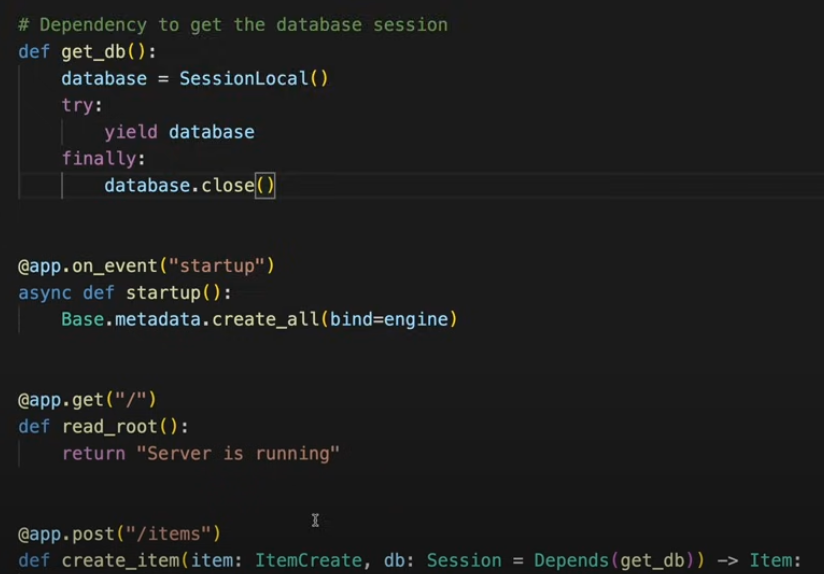

63) For testing, instead of launging a test db or db file in filesystem, a test db can be located in local memory via editing database url to connect to memory.

64) It would be a better practice to separate db connection parts and api parts of fastapi endpoints. Not separating them and testing them together should be called as integration test instead of unit test.

65) Endpoint name should be separated by `-`. An example is **/get-item/** instead of **/get_item/** or **getItem**.

66) One of the reasons why to separate frontend and backend services is security. When both of them are in the same codebase, it may be open to vulnarabilities.

67) Router is a group of endpoints. It helps us organize the code. One app can have multiple attached routers, which are groups of multiple endpoints. Each endpoint under a router can have the same prefix defined in APIRouter.

```python
from fastapi import FastAPI, APIRouter

# Create an instance of the FastAPI application
app = FastAPI()

# Create an instance of the APIRouter
router = APIRouter()

# Define a route within the router
@router.get("/items/")
async def read_items():
    return {"message": "Read all items"}

# Mount the router to the main FastAPI application
app.include_router(router)
```

68) It is a good practice to move operations out of endpoint function. This eliminates calling an endpoint from another endpoint. Both endpoints can call a function.

69) Automation in FastAPI can be thought as the series of operations when something is triggered. For instance, when a price is updated in an e-commerce website by a seller through an endpoint, we might want to trigger other operations like campaign or delivery.

70) It is a good practice to deploy a simple root endpoint to be sure about whether everyting is running properly or not.

71) FastAPI doesn't have direct builtin support for rate limiting. Slowapi is a library that offers rate limiting well. The decorator of rate limiter should be under the decorator of the endpoint. Both of the decorators should be located above a function.


# Big O Notes

1) It lists my notes from [this video](https://www.youtube.com/watch?v=Mo4vesaut8g&ab_channel=freeCodeCamp.org)

2) Big O complexity chart:


3) Orders of Growth. In Big O Notation, determining the efficiency of an algorithm was carried out via considering only the worst case.


4) Big O notation is used to analyze the efficiency of an algorithm as its input approaches to infinity.

5) O(n) means linear scaling. The below function is an example.

```o_n.py
def o_n(arr):
    for i in arr:
        print(i)
```

6) Constant is any step that doesn't scale with the input of a function. The below function scales linearly and therefore their complexity is O(n).

```t.py
def func1(x):
    return x+1
def func2(x):
    return x+200000000
```

7) O(1) is a time complexity with constant.

```o_1.py
def o_1(arr):
    print("hello)
```

8) O(n^2) is a time complexity created via looping over an array twice.

```o_n_2.py
def o_n_2(arr):
    for i in arr:
        for j in arr:
            print(i,j)
```

8) O(n^3) is a time complexity created via looping over an array twice.

```o_n_3.py
def o_n_3(arr):
    for i in arr:
        for j in arr:
            for k in arr:
                print(i,j,k)
```

9) In computer science, unless specified otherwise, we can always assume that the number we want to raise to some number is 2.

10) The time complexity of a recursive function is O(log n).

```o_log_n_recursive.py
def o_log_n_recursive(n):
    if n < 1:
        return "reached to 1"
    else:
        divided_by_2 = n/2
        return o_log_n_recursive(divided_by_2)
```

11) O(log n) can belong to a non-recursive function like below.

```o_log_n_iterative.py
def o_log_n_iterative(n):
    while n > 1:
        n = n / 2
        print(f"{n=}, {n/2=}")

o_log_n_iterative(16)
```

12) Binary Search is carried out on an ordered array. The order doesn't matter. It may be ascending or descending order. The complexity of Bİnary Search is O(log n).

13) O(nlogn) is a time complexity belonging to a function like below. 

```o_n_log_n.py
def o_n_log_n(n):
    m = n
    while n >1:
        n = n/2
        for i in range(m):
            print(n, m)
```

14) Mergesort is an example of O(nlogn). It uses divide and conquer approach.

15) Fibonacci has a time complexity of O(2^n).

16) O(n!) is the worst scenario that can be visualized as below.

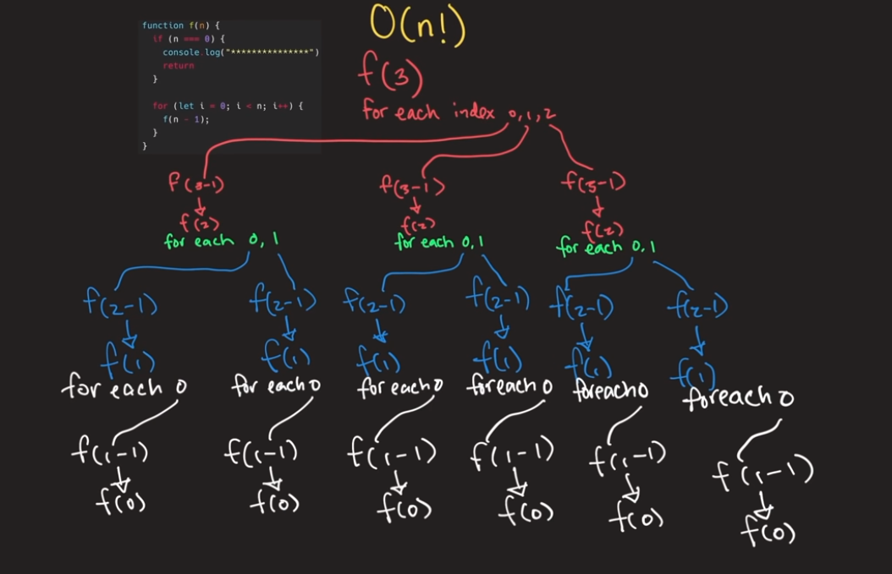

17) Space complexity is realted to how much memory used to execute a program. Space complexity is relevant to how many recursive calls exist in the call stack simultaneously. Each of them takes up memory. THe below function has a space complexity of O(n).

```space_complexity_with_o_n.py
def space_complexity_with_o_n(x):
    if x == 0:
        return finished
    else:
        return space_complexity_with_o_n(x-1)
```

# Vim Notes

1) `:w` is used to save a file without exit.

2) In command mode, **h**, **j**, **k**, **l** is used to move cursor. **h** moves the cursor to the left, **l** moves to cursor to the right. **k** moves the cursor to the above, **j** moves the cursor to the below. 

3) `G` is used to go down and `gg` is used to go down.

4) `}` is used to skip the next code block. `{` is used to skip the former code block.

5) We can append numbers as prefixes to commands. `50j` moves the cursor to 50 lines below. `3}` skips the three next code blocks.

6) Ctrl + R is the undo of undo (`u`). We can do it a couple times.

7) `.` is used to do what we just did. If we pressed `dd` to delete a line and want to delete the next 3 lines, press `.` 3 times instad of pressing `dd` 3 times.

8) `yy` is used to copy a line and `p` is used to paste the copied line to below line and `P` is used to paste the copied line to above line. `p` is used more.

9) `dd` is used to delete a line. It copies the deleted line into clipboard and therefore we can paste it.

10) `V` is opening Visual mode. It enables us to select pieces of lines via `j` and `k` and make an operation after selection. It is a good practice to delete codes in Visual mode. `v` is similar to V but `v` works for inline operations. Ctrl + `v` enables us to edit multiline. Ctrl + `v` can be used with `d`, `y`, `r` and I.

11) `o` is adding a new line to below and enabling insert mode. `O` is adding a new line to above and enabling insert mode.

12) To delete a piece of code, use `d{` from cursor to beginning of the code block or use `d}` from cursor to ending of the code block.

13) `w` is a way to move forward to the next word. `b` is a way to move backward to the previous word. `W` and `B` ignores punctuation. 

14) To move to a specific line(line 20), press `:20`.

15) To jump into the beginning of a line, press `0`. To move to the beginning of the first word in a line, press `^`. To move to the end of a line, press `$`. `0w` is a good practice to the beginning of the line instead of `^`.

16) `t` and `f` means go-to in a line. Pressing t and ! means go to the previous character where ! exists. Pressing f and ! means go to the character where ! exists. 

17) `%` goes to the the complementary part of the code. If we are on **{**, press `%` to move to **}**. If you want to delete all content between **{** and **}**, press `d%`. If you want to copy all content between **{** and **}**, press `y%`.

18) `c` stands for change. `cw` means change word and switches to insert mode. `dw` deletes a word. `d3w` deletes 3 words. `C` deletes the rest of the line and switches to insert mode. `D` deletes rest of the line. `ct&` deletes all of the characters from where the cursor is to **&** character and switches to insert mode. `dt+` deletes all of the characters from where the cursor is to **+** character and switches to insert mode.

19) We can use `*` to move to previous/next word where the cursor locates. If there are 20 abcde strings in the file, we can move via `*`. It ignores pucntuation.

20) `;` is used to inline move. Let's assume there exists 3 question mark in the line(?). We can go to the first one via `f?`. For the second and third one, use `;`.

21) To center a word that the cursor is on on a page, press `zz`.

22) `a` is an alternative to `i`. However, `a` moves the cursor to the next character and switches to nsert mode and `i` doesn't move the cursor to the cursor and switches to insert mode. 

23) `A` is moving to the end of the line and switches to insert mode. `I` moves to the beginning of the line and switches to insert mode.

24) `x` deletes where the cursor is. `20x` deletes the next 20 characters.

25) To convert upercase to lowercase or vice versa, press `~`. If you want to convert the next 10 chracters, press `10~`.

26) If you want to repeat the last thing that you did, press `.`. This is a favorite command of the lecturer. `.` allows us to replay a single command.

27) `r` command is used to replace. `7r6` means replacing the next 7 characters with 6.

28) `>` and `<` are used for indentation and deindentation.

29) Macro is a way to run multiple commands consecutively and then run them all via `@ASSIGNMENT_KEY`. Macro is used in refactoring. Press q to activate.

30) Search can be done via /TEXT_TO_SEARCH. We can press `n` to move to next searched word or press `N` to move to previous searched word.

31) It is good practice to key bind ESC with jj or jk.

32) Google Chrome has also a vim extension. We can use Vim there too.

33) [Awesome Vim](https://github.com/amix/vimrc) is a vim setting that has many features.


# General-IT-Notes
Including my experiences on Software Development

1) Use always explicit directory in crontab. Don't use the former, use the latter.

```crontab -e
# Don't use
* * * * * bash runall.sh
# Use
bash /path/to/directory/runall.sh
```

2) Don't FTP python environment(conda or venv etc.) to VPS. Instead, upload requirements.txt and install it via 

```b.sh
source ENVIRONMENT_NAME/bin/activate

pip install -r requirements.txt
```

3) If a python loop is slow, consider to replace list with set. Set has no indexes therefore it is faster especialy checking an element in an array-like (list, tuple, set) object.

4) htop is a good monitoring tool on Unix alike OS's.

5) On Mac, default shell is zsh, not bash.

6) Asbru Connection manager is a good & free ssh client. Available on Linux. Similar to Mobaxterm, SecureCRT of Mac and Windows.

7) When the electricity powers off or the power cable is broken, install GRUB bootloader menu via inserting an ubuntu medium in a live session if the boot menu doesn't show up.

8) Kowl is a Web GUI to display Apache Kafka Topics.

9) [Jinja Templating](https://jinja.palletsprojects.com/en/3.1.x/) is a fast, expressive, extensible templating engine in Python. We are using it on Django Templates

10) Google Data Studio is completely free visualization tool from Google.

11) Google BigQuery is a big data analytics product from Google. Its architecture is serverless.

12) [Unsplash](https://unsplash.com/) is a websie having lots of high-quality pictures.

13) [fluentd](https://github.com/fluent/fluentd) is an open source log collector. It collects data from various sources and wrtes them to different destinations such as RDBMS, NoSQL technologies, Hadoop, S3.

14) [Electron](https://www.electronjs.org/) is a way to build desktop apps.

