# My-Nginx-Notes

1) Http = Hyper Text Transfer Protocol

2) Protocol = A set of rules that are agreed upon 2 or more parties for communication

3) Http uses port 80 of computer/server but it is easily changable.

4) All modern Web browsers have Network tab to display Netowk activities.

5) Generally, data transferred on top of Http protocol are zipped via some algorithm provided by web servers and web browsers are able to unzip it in the background.

6) Daemon in unix-like OS = Service in Windows.

7) Some web servers =  Apache, Nginx, Microsoft IIS

8) Nginx is
  - A http and reverse proxy server
  - A mail proxy server
  - A generic TCP/UDP proxy server

9) According to [Netcraft](https://www.netcraft.com/), a statistic-oriented website, Nginx usage is around 28% as of 2017 February.

10) A statistic for user wait times is blow:


11) Why to use Nginx:
  - Slow
  - Acceleration
  - Load balancing
  - Scalable concurrent connections handling
  - The ability to operate on relatively cheap hardware.
  - On the fly upgrades
  - Ease of installation and maintenance


12) In apache, a thread is created for each new request. If you have 1000 request at the same time, you have 1000 threads runnig concurrently. However, in NGINX, one thread is used for 1000 requests but it is based on events. vent pased processing is much much faster.

13) NGINX not only supports HTTP and HTTPS, but also IMAP(Internet Message Access Protocol), POP3 (Post Office Protocol) and SMTP(Simple Mail Transfer Protocol).

14) Apache and NGINX can be used together.

15) Web root directory in Apache is `/var/www/html`.

16) Log files of ngin is under `/var/log/nginx` . You will find access.log and error.log.

17) The binary that starts the nginx daemon is under `/usr/bin` . 

18) The web directory from which nginx serves web pages by default is `/usr/share/nginx`.

19) To start nginx service 

```
sudo service nginx start
```

20) Nginx should be compiled from the source rather than installing via apt if you want to customize its settings. For each option(from source or from ubuntu/debian repositories) configuration files location are below:

  - From Source:
    - /etc/nginx/conf.d/
  - From Repo(symblinks to /etc/nginx/sites-available/):
    - /etc/nginx/sites-enabled/

21) Nginx is utilizing an asynchronous event-driven model, delivering reliable performance under significant loads.

22) Main configuration file is `/etc/nginx/nginx.conf`.

23) In NGINX, configuration options are known as *directives*. These *direvtives* are either in a block or not. Some directives which are listed in the beginning of */etc/nginx/nginx.conf* file are user, worker_processes, error_log, pid etc.

24) **http** and **events** are some blocks in */etc/nginx/nginx.conf*.

25) **http** block encapsulates directives for web traffic handling.

26) *include* directive under **http** block is where to look for configuration files if you are using separate configuration files in /etc/nginx/conf.d/ or /etc/nginx/sites-enabled/

27) **server** block should be under **http** . An example server block is below:

```
server {

listen 80 default_server;

listen [::]:80 default_server;

server_name example.com www.example.com;

root /var/www/example.com;

index index.html;

try_files $uri /index.html;

}
```

28) **location** blocks are located under **server** blocks. "NGINX’s location setting helps you set up the way in which NGINX responds to requests for resources inside the server. As the server_name directive informs NGINX how it should process requests for the domain, location directives apply to requests for certain folders and files (e.g. http://example.com/blog/.) "(from [here](https://www.plesk.com/blog/various/nginx-configuration-guide/#:~:text=Every%20NGINX%20configuration%20file%20will,interchangeably%20as%20blocks%20or%20contexts%20.))

29) An example of **server** and **location** blocks are below:

```
server {

  location / { }

  location /photos/ { }

  location /blog/ { }

  location /home/ { }

  location /blog/categories/ { }

}
```

30) We can use regular expression by writing `location ~ SOME_RE_COMMAND_HERE` in location blocks. For case insensitive, use `~*`. For particular string, use `^~`. To stop searching after finding an exact match, use `=`. Exact match will speed up the performance.
```
# a case sensitive Regex
location ~ ^/myblog(/|/index\.py)$ { }
# case insensitive
location ~* ^/myblog(/|/index\.py)$ { }
# particular string
location ^~ /blog/BlogPlanet/ { }
# Exact match, No search after matching
location = / { }
```

31) *root* directive under location block is telling us where to look to give a response to a request. When "NGINX has identified the location directive that is the best match for a specific request, its response will be based on the associated location directive block’s contents"(from [here](https://www.plesk.com/blog/various/nginx-configuration-guide/#:~:text=Every%20NGINX%20configuration%20file%20will,interchangeably%20as%20blocks%20or%20contexts%20.)). Exact paths can be used for *root* direvtive like /home/myuser/.

```
location / {

root html;# /etc/nginx/html

index index.html index.htm;

}
```

32) The content of index.html and index.htm will be returned if no match situation occurs. *index* directive is used not to show a 404 not found error message to clients.

# Apache Airflow

My notes on Apache Airflow from [these video series](https://www.youtube.com/watch?v=AHMm1wfGuHE&list=PLYizQ5FvN6pvIOcOd6dFZu3lQqc6zBGp2)

1) Airflow is a platform to programmatically author,schedule and monitor workflows or data pipelines. Originally developed in Airbnb and then became an incubator for Apache.

2) Workflow is

- A sequence of tasks

- Started on a schedule or triggered by an event

- Frequently used to handle big data processing pipelines.

3) An example workflow is below

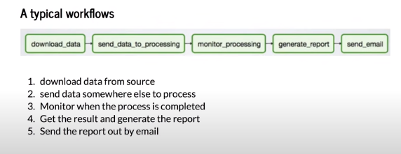

4) A traditional ETL Approach is below

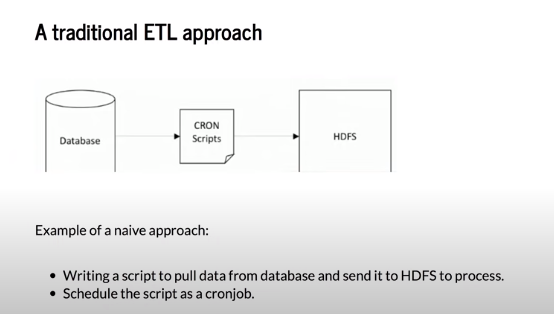

5) Some problems regarding the naive approach

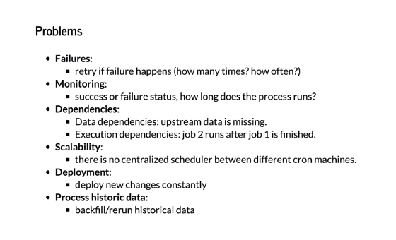

6) A workflow is described as a Directed Acyclic Graph (DAG). A DAG is composed of tasks. Multiple tasks canbe executed independently.

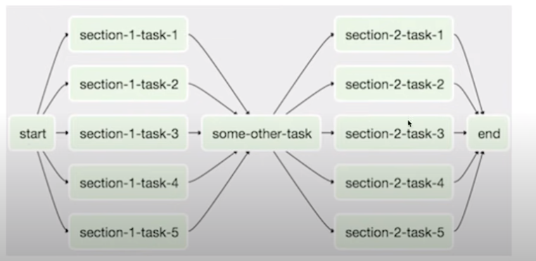

7) An example Airflow DAG is below:

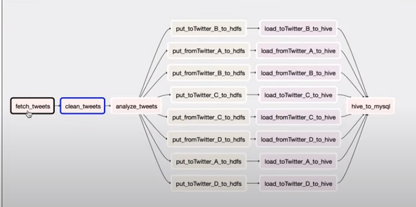

8) Graph View Tab in Airflow gives us nice representation of execution graph.

9) Tree View shows historical graph.

10) Logs of different attempts are shown on Airflow. Inputs and outputs are shown for each attempt.

11) Gantt tab tells us how long each task takes.

12) Not all tasks are consecutively executed.

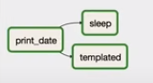

13) Local link for airflow = http://localhost:8080/admin . It works on 8080 port.

14) The hierarchy of Data Science is below:

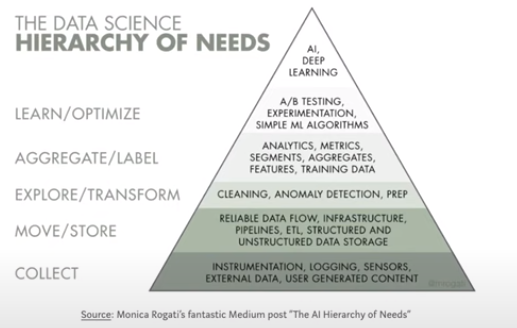

15) Airflow has integrations for PostgreSQL, HDFS, Hive, MySQL, MSSQL and more.

16) We can use Airflow in a Docker container.

17) Run the following commands on a computer having docker and docker compose

```
git clone https://github.com/tuanavu/airflow-tutorial.git
```

18) Google Cloud Composer is a fully managed Apache Airflow to make workflow creation and management easy, powerful and consistent.

19) Google Cloud Composer uses Google Cloud Storage to store airflow dags and we can easily manipulate.

20) Deployment strategies on Google Cloud Composer: 

- We can deploy DAG's via drag&drop Python files or using CLI through uploading files to Google Cloud Composer.

- Auto Deployment: DAGs are stored in a git repo and a CI/CD pipeline created.

21) A DAG file is generally a python script specifying DAG's structure as code.

22) There are 5 steps of writing a DAG.

- Importing modules
- Default Arguments
- Instantiate a DAG
- Tasks
- Setting up Dependencies

23) Some 'importing modules' code are below:

```
import airflow
from airflow import DAG
from airflow.operators.bash_operator import BashOperator
# and other python necessary imports
```

24) Default arguments is a Python dictionary. An example is below

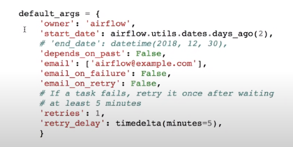

25) Instantiate a DAG object from DAG class. An example is below:

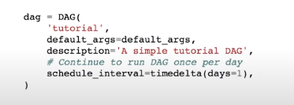

26) Tasks are main components of a DAG. Task 3 is an instance of Jinja Templating.

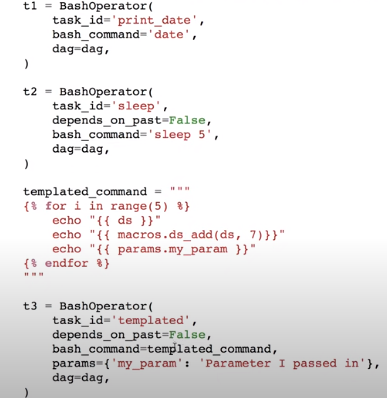

27) We can set dependencies like task 1 should start before task 2 or vice versa via **some_task_name.set_downstream(some_task_name)** or **some_task_name.set_upstream(some_task_name)**. Setting upstream or downstream can be done via **>>** or **<<**.

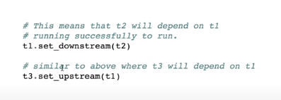

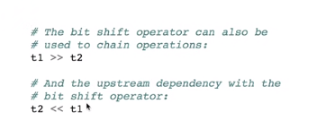


28) ds is an Airflow built-in functionality in Jinja Templates. It is showing current date.

29) DAG (Directed Acyclic Graph) is a graph that no cycles and the data in each node flows forward in only one direction.

30) DAGs don't pefform any actual computation. Instead, operators determine what actually gets done. DAG is an organizer for tasks an set their execution context.

31) When an operator is instantiated, it is referred to as a task. An operator describes a single task in a workflow.

32) Operators are classified into 3 categories

- Sensors: A certain type of operator that will keep running until a certain criteria is met. Generally, first task in workflow
- Operators: triggers a certain action(run a bash command, execute a python function, execute a hive query etc.)
- Transfers: moves data from one location to another

33) Examples for each operator category

- Sensors:  HdfsSensor -  It waits for a file to land in HDFS.
- Operators: BashOperator - It executes a bash command
- Operators: PythonOperator - It calls an arbitrary Python function
- Operators: HiveOperator - Executes hql code or hive scripts in a specific Hive DB.
- Operators: BigQueryOperator: Executes Google BigQuery SQL Queries in a specific DB
- Transfers: MySqlToHiveTransfer: Moves data from MySql to Hive
- Transfers: S3ToRedshiftTransfer: Load files from S3 to Redshift

34) Airflow provies prebuilt operators for many common tasks. Some examples are available on [here](https://github.com/apache/airflow/tree/main/airflow/contrib).

35) We can create a new connection like connection to BigQuery on Apache Airflow. Admin Tab >> Connection >> Create

36) You can use a generated connection in Python script for Airflow

37) A sample DAG file for Big Query can be found [here](https://github.com/tuanavu/airflow-tutorial/blob/master/examples/gcloud-example/dags/bigquery_github/bigquery_github_trends.py)

38) Airflow variables are key-value stores in Airflow's metadata database.

39) Some config variables might be like below:

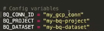

40) Usage of Apache Airflow Variables

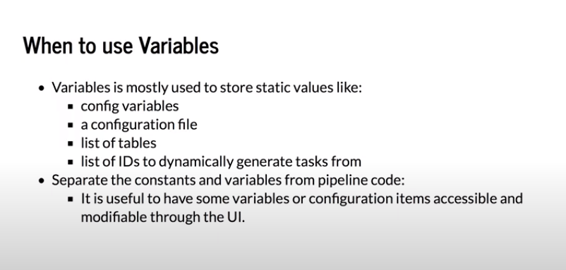

40) We can edit variables by editing code or using Airflow GUI(Admin >> Variables).

41) It is recommended to have limited number of Airflow variables because the more the airflow variables, the more the connections to metadata db.
Using a json like varible which is composed of many key value pairs is a recommended way .

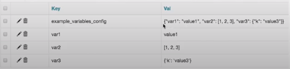

42) We can use Jinja Template to be able to use Airflow variables.

43) We can run CRUD operations on variables through Airflow CLI.

44) Airflow Variables defined via GUI are globally accessible because they are stored in a metadata db.

45) Components of Apache Airflow

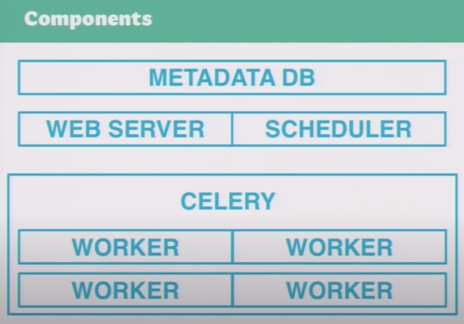


# Basic Concepts

1) Web is a service running on the ineternet.  Internet is anarchitecture, web is a service. There are other services like IRC (internet relay chat) , e-mail, Voip and telnet, which run on the internet.

2) Client makes a request to Server via browser.

3) Web is a term used in order to mean servers that use HTTP

4) Client makes a request using HTTP and TCP/IP and server responds to the client.

5) URL = access_method://server_name:port/location/to/go

6) DNS is abbreviating Domain Name Server. It matches domain names and correspondent IP.

7) HTTP is an application protocol.

8) ISP is abbreviating Internet Service Provider like Turkcell Superonline and Türk Telekom.

9) `ping website.com` is a command to check whether a server is up or not.

10) Protocol Stack is built on OS. Protocol stack is referred as TCP/IP protocol stack.


11) Data is composed of chunks(packets).

12) On TCP, each packet was given a port number.

13) On IP, each packet was given its destination IP.

14) On Hardware Layer, alphabetic text was converted to eloctronic signal.

15) The packets transmitted over te internet. When packets reach the destination, IP address and port number info was removed because it already reached.

16) `traceroute` is a Unix-like or Windows command to track packages sent to destination

17) Router directs dispatched packets to its destination

18) ROuter examines destination address of packets and determines where to send it.

19) Client Computer -> Modem -> Public Telephone Network -> Modem Pool -> ISP Port Number -> Router(x10) -> ISP Backbone(x10)

20) DNS is a distributed database which keeps track of computer's names and their corresponing IP addresses. My request to a destination first goes to a DNS Server. After obtaining correspondent IP, my computer connects to target computer.

21) The government is able to block youtube.com because ISP's have DNS's. Google is providing a free DNS.

22) HTTP is Hyper Text Transfer Protocol. It is an application protocol that makes the web works.

23) HTTP is the protocol that web browsers and web servers use to communicate with each other over the internet. HTTP sits on top of TCP layer.

24) Ports can be thought of as separate channels on each computers.

25) TCP receives data for application layer protocol and segments it into chunks. TCP assigns port numbers to these chunks.

26) Some important port numbers

| Port    | Operation |
| 20,21   | FTP       |
| 22      | SSH, SFTP |
| 23      | Telnet    |
| 53      | DNS       |
| 80      | HTTP      |
| 443     | HTTPS     |
| 3389    | RDP       |

27) IP's job is to send and route packets to other computers

28) Packet has IP Header, TCP Header, data from application layer.

29) FTP Server: a computer on the internet that offers FTP

30) Filezilla is an FTP client. There are other methods like using Terminal or using browser.

31) There are 2 types of IP:

- Public IP: Same for devices connected to same modem

- Private IP: Assigned by modem. For each device, it is unique.

32) Public IP address may change around time. A private IP address might be like 192.168.1.100 etc.

33) Routers are handling internet traffic for multiple computers at once using a single public IP address.

34) There are 65525 TCP ports in a computer.

35) Modern internet more closely follows the simpler internet protocol suite, known as TCP/IP.

36) Search engine is a web service helping us find other web pages.

37) Static web server is a server that sends its hosted files to browser.

38) Dynamic web server is a static web server + application server + database.

39) A protocol is a set of rules for communication between 2 computers.

40) Sending an HTML form from our browser to server is made using HTTP.


# General-IT-Notes
Including my experiences on Software Development

1) Use always explicit directory in crontab. Don't use the former, use the latter.

```crontab -e
# Don't use
* * * * * bash runall.sh
# Use
bash /path/to/directory/runall.sh
```

2) Don't FTP python environment(conda or venv etc.) to VPS. Instead, upload requirements.txt and install it via 

```
source ENVIRONMENT_NAME/bin/activate

pip install -r requirements.txt
```

3) If a python loop is slow, consider to replace list with set. Set has no indexes therefore it is faster especialy checking an element in an array-like (list, tuple, set) object.

4) htop is a good monitoring tool on Unix alike OS's.

5) On Mac, default shell is zsh, not bash.

6) Asbru Connection manager is a good & free ssh client. Available on Linux. Similar to Mobaxterm, SecureCRT of Mac and Windows.

7) When the electricity powers off or the power cable is broken, install GRUB bootloader menu via inserting an ubuntu medium in a live session if the boot menu doesn't show up.

8) Kowl is a Web GUI to display Apache Kafka Topics.

9) [Jinja Templating](https://jinja.palletsprojects.com/en/3.1.x/) is a fast, expressive, extensible templating engine in Python. We are using it on Django Templates

10) Google Data Studio is completely free visualization tool from Google.

11) Google BigQuery is a big data analytics product from Google. Its architecture is serverless.


