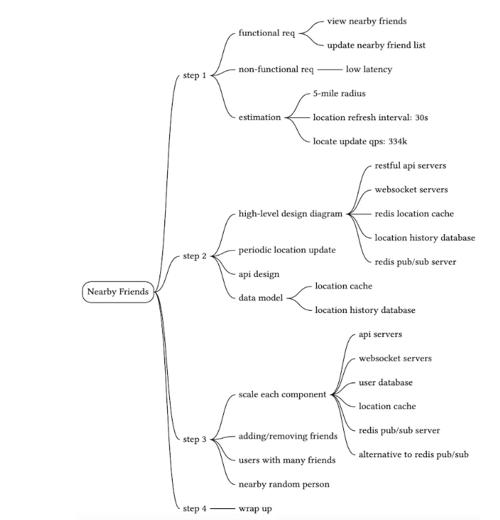
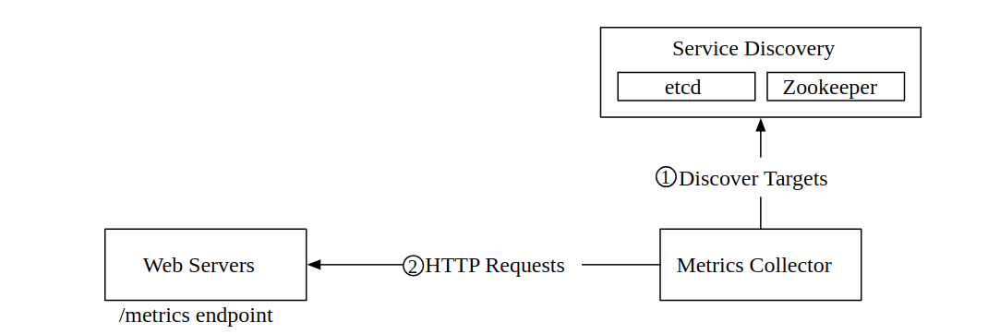
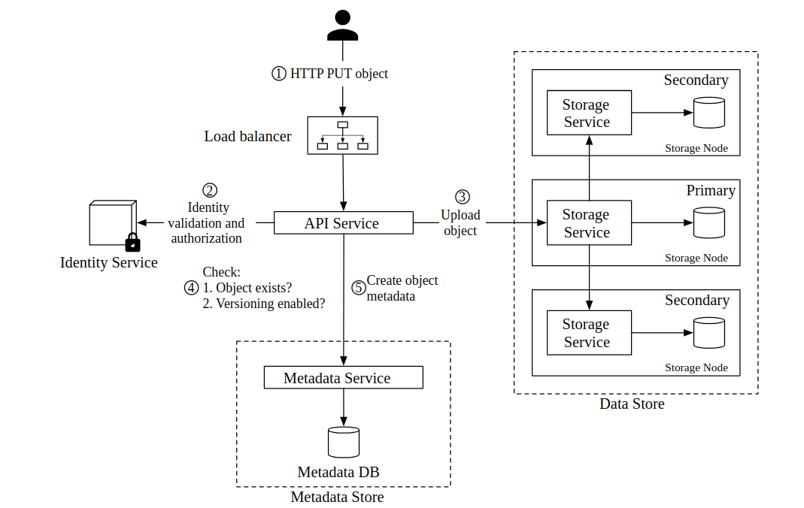
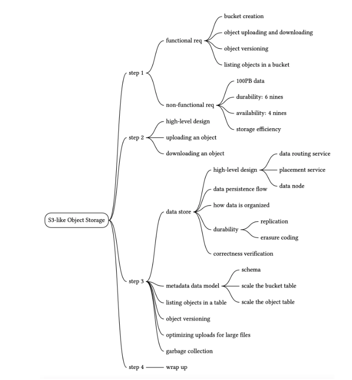

My Learnings on [ByteByteGo](https://bytebytego.com/).

# Scale From 0 to Millions of People

1) HTTP is the communication protocol used between web servers and mobile app.

2) Separating database and app tiers help us scale them independently.

3) CouchDB, Neo4j, Hbase are some NoSQL technologies. There are also Cassandra, Couchbase, MongoDB.

4) 4 categories of NoSQL databases:

    - Key-value stores:
    - Graph stores:
    - Column stores:
    - Document stores:

5) For most developers, RDBMS work very well.

6) NoSQL databases might be the right choice if 

    - the app requiring super-low latency.

    - data are unstructured or no relation exists in data.

    - You only need to serialize and deserialize data (JSON, XML, YAML, etc.).

    - Data to store is huge.

7) When traffic is low, vertical scaling is the way to prefer. The real advantage of vertical scaling(scale up) is its simplicity.

8) When Load Balancer exists, its IP is publicly available by users.

9) Database replication can be used in many database management systems, usually with a master/slave relationship between the original (master) and the copies (slaves). All data-modifying operations(insert, update, delete) must be sent to master(s). Read operations are sent to slave machines.


10) Improving the load/response time can be done by adding a cache layer and shifting static content (JavaScript/CSS/image/video files) to the content delivery network (CDN).

11) A cache is a temporary storage area of expensive operations. Hereby, less db operations are called. Couchbase can be considered as cache in companies.

12) Cache is bringing a solution to solve the problem of lots of DB calls. Cache is located between app and db.


13) Interacting with cache servers is simple because most cache servers provide APIs for common programming languages. The following code snippet shows typical Memcached APIs:

```java

SECONDS = 1
cache.set('myKey, 'hi there', 3600 * SECONDS)
cache.get('myKey')

```

14) Cache should be used in the scenario where READ operations outnumber MODIFY(INSERT/DELETE/UPDATE) operations. Cache server stores data in memory, therefore this is not appropriate for important data. Thus, important data should be stored in persistent locations such as DB, S3 etc.

15) Some considerations on cache usage

    - Decide when to use: Use when READ operations outnumber
    - Expiration policy: Set an appropriate expiration policy. Too small values lead to more DB calls, too big values lead data to become stale.
    - Consistency: Keep the data in store and the data in cache in sync.
    - Mitigating failures: Prefer using a cluster of cache rather than a single cache server.
    - Eviction policy: Removing some elements from cache when it is full. The removal criteria might be least recently used(LRU), least frequently used(LFU) or First in First Out(FIFO).

16) "A CDN is a network of geographically dispersed servers used to deliver static content". Dynamic content caching is a new concept that means caching of HTML pages but it isn't in the scope of this course. If a CDN server locates in Germany, a user from France accesses to it faster than a user from US. CDN Server has a TTL(time to live) for static contents on itself. If it exceeds the limit, the cached static content will be freed out and will be pulled again from web server or S3.


17) Stateless apps are preferrable over stateful apps. Staless apps aren't sharing the storage(RDMS, NoSQL). Staless apps are easily scaled. Stateful app can be thought as 2 web servers each having separate DB's and users whose name start with A-B-C-D-E are directed to server 1 and users whose name start with F-G-H-J-I are directed to server 2. The data on server 1 and server 2 are different and the direction happens in load balancer. Whereas, the DB is the same among 2 servers in the scenario of stateless apps.


18) When there are 2 data centers, users are geoDNS-routed, also known as geo-routed, to the closest data center normally. A challenge of multiple data centers is data syncranization. "In failover cases, traffic might be routed to a data center where data is unavailable".

19) Message Queue is stored in RAM and supports and asynchronous communication. Message queues help decoupling and makes our software loosely coupled.

20) Logging, Metrics and Automation become necessary when things become complicated

21) AWS RDS can provide a database whose ram is 24 TB.

22) Horizontal scaling is also known as sharding. "Sharding separates large databases into smaller, more easily managed parts called shards. Each shard shares the same schema, though the actual data on each shard is unique to the shard". When data wants to be accessed, a hash function  is called. When there are 4 shards, a hash function of mod 4 is called to determine where to allocate/access from where.


23) "The most important factor to consider when implementing a sharding strategy is the choice of the sharding key". "Sharding key (known as a partition key) consists of one or more columns that determine how data is distributed". "When choosing a sharding key, one of the most important criteria is to choose a key that can evenly distributed data".

24) Some problems of sharding

    - Resharding data
    - Celebrity problem
    - Join and de-normalization: When DB is sharded, it is hard to perform join operations

25) Denormalization is a way to solve the problem of running complex joins multiple time. When we want to run a complex join query, running it a lot might be costly. In this scenario, what is required is to run the query once and store it on a table. This is known as denormalization. It leads to redundant data on all shards but prevents us from running the same query multiple times.

26) It is a good practice to move non-relational functionalities to a NOSQL DB.


# Back-of-the-envelope Estimation

1) Back-of-the-envelope calculation means rough/approximate calculation.

2) A byte is a sequence of 8 bits. An ASCII character uses one byte of memory (8 bits).


3) 1 ms(millisecond) = 10^-3 seconds = 1,000 µs(microsecond) = 1,000,000 ns(nanosecond)

4) Some latency numbers


5) Avoid disc seeks and prefer using RAM. Compress data before sending over the network.

6) QPS means query per second. 

7) Commonly asked back-of-the-envelope estimations: QPS, peak QPS, storage, cache, number of servers.

# A Framework For System Design Interviews

1) Asking good questions is vital in system design interviews.

2) DAU means daily active user.

# Design A Rate Limiter

1) "In a network system, a rate limiter is used to control the rate of traffic sent by a client or a service". It can be time-based, IP-based or device based. Rate limiter blocks excess calls.

2) DoS means Denial of Service. 

3) Python libraries [fastapi-limiter](https://pypi.org/project/fastapi-limiter/) and [slowapi](https://pypi.org/project/slowapi/) are 2 libraries to set a rate limit in FastAPI.

4) Rate limiting can be server-side or client-side. Client-side rate limiting is untrusted because it is vulnarable to misuse of forgers. Rate limiting can be programmed in the application code or as a separate service.

5) Rate limiting can be in the middleware as below:


6) Rate limiting is implemented in API Gateway in cloud apps. "API gateway is a fully managed service that supports rate limiting, SSL termination, authentication, IP whitelisting, servicing static content". Rate limiting can be implemented in API Gateway or server-side applications(FastAPI etc.). There is no clear answer to this question.

7) Evolution of an API architecture


8) Algorithms for rate limiting

- Token bucket: Simple, well understood and commonly used by Amazon and Stripe. Bucket size and refill rate are 2 parameters.


- Leaking bucket: Bucket size and outflow rate are 2 parameters. Shopify uses this algorithm.


- Fixed window counter:


- Sliding window log:


- Sliding window counter:


9) High level architecture of rate limiting. At the high level, we need a counter of how many requests are sent from the same user, IP address etc.


10) Redis is a popular option for rate limiting as an in-memory store. Redis has TTL(Time To Live) property.

11) Lyft open sourced its rate limiting library as [here](https://github.com/envoyproxy/ratelimit). It works as a configuration file.

12) When a request is rate limited, a HTTP response called 429 is returned.


13) When a rate limiter server is enough, it is necessary to scale up rate limiter server.

14) A good practice of multiple rate limiters with redis


15) "Multi-data center setup is crucial for a rate limiter because latency is high for users located far away from the data center"

16) We talked about rate limiting at the application level(layer 7) but it is possible to rate limit at other layers. We can rate-limit IP addresses using IP Tables(IP layer 3).

17) Soft rate limiting is permitting users to send requests for a short period of time even if it exceed rate limit. Hard rate limiting isn't rrmitting users to exceed the threshold.

18) Avoid being rate-limited. Use client cache to avoid frequent API calls. Understand the limit and don't send too many requests in a short period of time.

# Design Consistent Hashing

1) For horizontal scaling, it is significant to distribute requests over servers. Hashing is important in this topic.

2) A basic approach as below. However, it is problematic in the case of adding and removing servers.


3) "Consistent hashing is a special kind of hashing such that when a hash table is re-sized and consistent hashing is used, only k/n keys need to be remapped on average, where k is the number of keys, and n is the number of slots. In contrast, in most traditional hash tables, a change in the number of array slots causes nearly all keys to be remapped"

4) SHA-1 is a commonly used hash function.

5) A demonstration of hash space and hash keys


6) Go clockwise from the key position on the ring until a server is found.


7) Adding a server or removing a server is easy in consistent hashing. However, when a server goes offline, its traffic will go to the clockwise server. In this way, traffic will be less even. 

8) A further solution to above problem is to use virtual nodes. The more the virtual nodes, the less the imbalance of distribution.


9) Consistent hashing is used in partitioning component of Amazon's DynamoDB, partitioning across the cluster in Apache Cassandra, Discord chat application etc.

# Design A Key-value Store

1) "A key-value store, also referred to as a key-value database, is a non-relational database". Short keys perform better. Key can be plain text like this_is_a key or hashed value like AB241AD56.

2) "An intuitive approach is to store key-value pairs in a hash table, which keeps everything in memory".

3) To overcome the problems of using single server key-value store, we should prefer

    - Data compression
    - Store only recent data in memory and rest in disc.

4) A distributed key-value store is also called a distributed hash table, which distributes data across many servers.

5) CAP Theorem states that it is impossible to provide Consistency, Availability and Partition tolerance at the same time.
    - Consistency: All clients viewing the same data
    - Availability: All clientst having a response even if some nodes are down.
    - Partition Tolerance: A partition indicates a communication break between two nodes. Partition     tolerance means the system continues to operate despite network partitions


6) Meanings of different combinations

    - CP: Consistency and Partition Tolerance preferred over Availability. Banks prefer. MongoDB follows this combination.
    - AP: Availability and Partition Tolerance preferred over Consistency. Cassandra follows this combination.
    - CA: Consistency and Availability preferred over Partition Tolerance. Since network failure is unavoidable, CA isn't possible in real life.

7) In reality, partitions(breaks) happen in a distributed system.

## Data partition

8) It isn't feasible to store all data in a single server. Thus, it is required to distribute data across many servers. One way to achieve this is to use [consistent hashing](#design-consistent-hashing). "Using consistent hashing to partition data has the following advantages":

- Automatic scaling: Automatically adding and removing servers

- Heterogeneity: The number of virtual nodes is proportional to the capacity of server.

## Data replication

9) Data should be replicated over N servers. N is a tunable parameter. In the scenario below, data is replicated in 3 servers. The logic is to choose 3 servers in the clockwise way. Virtual Nodes shouldn't be taken into consideration.


## Consistency

10) Data should be syncronized since it is distributed over multiple servers.

11) Some hyperparameters to tune

    - N: The number of replicas
    - W: A write quorum of size W. In order for a write operation to be regarded as successful, write operation must be acknowledged by at least W replicas
    - R: A read quorum of size W. In order for a read operation to be regarded as successful, read operation must be acknowledged by at least R replicas.

12) "The configuration of W, R and N is a typical tradeoff between latency and consistency". If W or R is 1, an operation is returned quickly. If W or R > 1, it offers better consistency but less speed.

    - If R = 1 and W = N, the system is optimized for a fast read.

    - If W = 1 and R = N, the system is optimized for fast write.

    - If W + R > N, strong consistency is guaranteed (Usually N = 3, W = R = 2).

    - If W + R <= N, strong consistency is not guaranteed.

13) A consistency model defines the degree of data consistency.

    - Strong consistency: "Any read operation returns a value corresponding to the result of the most updated write data item. A client never sees out-of-date data".
    - Weak consistency: "Subsequent read operations may not see the most updated value".
    - Eventual consistency: "This is a specific form of weak consistency. Given enough time, all updates are propagated, and all replicas are consistent". Dynamo and Cassandra prefer this.

14) "A [vector clock](https://en.wikipedia.org/wiki/Vector_clock) is a [server, version] pair associated with a data item. It can be used to check if one version precedes, succeeds, or in conflict with others".

## Handling failures

15) In a distributed system, at least 2 servers are required to tell that another server is down.

16) [Gossip protocol](https://en.wikipedia.org/wiki/Gossip_protocol#:~:text=A%20gossip%20protocol%20or%20epidemic,all%20members%20of%20a%20group.) is a way to detect decentralized server detection.

17) Sloppy quorum and hinted handoff are 2 techniques to deal with temporary failures. Sloppy quorum is a technique to choose write/read servers. "The first W healthy servers for writes and first R healthy servers for reads on the hash ring". It is an alternative to quorum requirement described above. Hinted handoff means that server A processes requestes of server B if server B is down. If server B becomes up, the data on B gets updated and then requests are directed to server B.

19) It is significant to replicate data over multiple data centers.

20) Merkle tree is a technique to handle permanent failures.

21) A coordinator is a node that acts as a proxy between the client and the key-value store.


22) A summary table of above ones


# Design A Unique ID Generator In Distributed Systems

1) The canonical way to generate unique id's in RDBMS is to use a primary key with auto increment attribute.

2) Auto increment doesn't work in a distributed environment.

3) Unique ID must be unique and sortable.

4) The options to generate unique ID's

- Multi-master replication: Using the auto increment feature of DB's. Instead of increasing one, increase by k.


- Universally unique identifier (UUID): "UUID is a 128-bit number used to identify information in computer systems". "Here is an example of UUID: 09c93e62-50b4-468d-bf8a-c07e1040bfb2".

- Ticket server: Flickr uses. "The idea is to use a centralized auto_increment feature in a single database server (Ticket Server)"


## Snowflake Approach

- Twitter snowflake approach:


# Design A URL Shortener

1) Tinyurl is a url shortener service. It is a paid service.

2) Url shortening is a commonly asked system design question.

3) The ratio of read operation over write operation is around 10 on average.

4) A URL Shortener has the following 2 endpoints:

    - URL shortening: POST request. Inputting a long url, converting it to a short url and outputting a short url.

    - URL redirecting: GET request. Inputting a short url and returning a long url.

5) This is what happens when a shortened url is entered into a browser.


6) There are 2 redirection policies:

    - 301 redirect:

    - 302 redirect:

7) "The most intuitive way to implement URL redirecting is to use hash tables".

8) URL Shortening high level design. It uses a hash function.


9) In the high-level design, hash table is stored in memory. However, the memory is limited and expensive. Thus, hash table should be stored in a RDBMS.

10) Hash function is a function that is used to convert long url into short url.

11) "The hashValue consists of characters from [0-9, a-z, A-Z], containing 10 + 26 + 26 = 62 possible characters".

12) There are 2 types of hash functions.

- Hash + collision resolution: "The first approach is to collect the first 7 characters of a hash value".


- Base 62 conversion: Base conversion helps to convert the same number between its different number representation systems


13) The comparison of Hash + collision resolution and Base 62 conversion


14) A general flow:


15) URL Redirecting with cache, db, load balancer and web servers.


16) "Integrating an analytics solution to the URL shortener could help to answer important questions like how many people click on a link".

# Design A Web Crawler

1) A web crawler is also known as a robot or a spider. Web crawlers are used by search engines.

2) Web crawlers go to a website, then find links on that site, go to links. This lifecycle happens iteratively.


3) Why to use web crawlers:

    - Search engine indexing: The most comon case

    - Web archiving:

    - Web mining:

    - Web monitoring:

4) The algorithm of web crawlers as follows:

    - Given a set of URLs, download all the web pages addressed by the URLs.

    - Extract URLs from these web pages

    - Add new URLs to the list of URLs to be downloaded. Repeat these 3 steps.


5) An average web size is 500 kilobytes.

5) 29 percent of pages on the web are duplicates.

6) A high-level design of web crawler


7) Components of a web crawler:

- Seed URL's: Started as starting point of the crawl process. It can be based on domain or country.

- URL Frontier: Storing URL's to be downloaded. Can be considered as First in First Out queue.

- HTML Downloader: Downloading web pages from the internet.

- DNS Resolver: Translating URL into an IP address

- Content Parser: Parsing and validating the downloaded page.

- Content Seen?: Eliminating data redundancy and shortening process time.

- Content Storage: Storing HTML content. Can be in RAM or disc.

- URL Extractor: Parsing and extracting links from HTML pages

- URL Filter: Excluding some URL's such as blacklisted ones, error links etc.

- URL Seen?: Helping to avoid the same URL multiple times.

- URL Storage: Storing already visited URL's

8) Web can be thought as a directed graph where web pages are nodes and urls are edges.

9) There are 2 common graph traversal algorithms to traverse the web. BFS is commonly used by web crawlers.

    - Depth-first search (DFS):

    - Breadth-first search (BFS):

10) "The URL frontier is an important component to ensure politeness, URL prioritization, and freshness".

## URL frontier

11) Sending too much requests to a server can be regarded as impolite.

12) The idea of politenss is about not to send too many requests from the same host. A design that manages politeness is below


13) Prioritizer is the component of URL Frontier. It prioritizes URLS. A design that manages URL prioritazitons.


14) Prioritizer is the front component of URL Frontier. Politeness is the back component of URL Frontier.


## HTML Downloader

15) Robots.txt is called robot exclusion protocol. It is a standard used by websites to communicate with crawlers. It defines what can be crawled or not .

```robots.txt
User-agent: Googlebot
Disallow: /creatorhub/\*
Disallow: /rss/people/\*/reviews
Disallow: /gp/pdp/rss/\*/reviews
Disallow: /gp/cdp/member-reviews/
Disallow: /gp/aw/cr/
```

16) To have a better performance, crawl jobs are distributed among multiple servers and multiple threads on a server.

17) Some tricks for Performance optimization

- Distributed crawl: Carry out crawling operation on multiple servers.

- Cache DNS Resolver: Response time of DNS Servers might be too high. 

- Locality: Locate servers and caches in close to where the target servers are.

- Short timeout: Specify a response time. If it exceeds, move to the next page.

18) Hashs and checksums help to detect duplicates.

19) In order to retrieve dynamically generated links, perform server-side rendering first before parsing a page.

# Design A Notification System

1) 3 types of notification formats

- Mobile Push:

- SMS:

- E-mail:

2) Notifications can be triggered by client applications. They can also be scheduled on the server side.

3) A summary with third party libraries. APNs means Apple Push Notification Services. FCM means Firebase Cloud Messaging.


4) Twilio and Nexmo are some 3rd party service providers.

5) Companies can build their own e-mail servers but it isn't preferred so much. They prefer to use 3rd party e-mail services like Sendgrip and Mailchimp since it offers a better delivery rate and data analytics.

6) To send a notification on Apple, 3 components needed. 


- Provider: Sending notification requests to APN's

- Device Token: Unique identifier used for sending notifications

- Payload: A json dictionary containing the notification's payload. An example below:

```json
{
   "aps":{
      "alert":{
         "title":"Derbide Gol",
         "body":"Fenerbahçe 1-0 öne geçti",
         "action-loc-key":"PLAY"
      },
      "badge":5
   }
}
```

7) A high-level and decoupled notification service diagram


8) Message queues remove dependencies between components.

9) User info, device info and notification templates are stored in cache.

10) DB stores data about user, notification, settings, etc.

11) Reliability is an important concept. The notification log database is included for data persistance.


12) Some additional components and considerations

- Notification template: Maintaining a consistent format for notifications.

- Notification setting: Storing which user prefers which channel or not. For instance, User with ID 12 want to have e-mail notifications but not want to have SMS notifications. It is checked before sending notifications.

- Rate limiting: To limit number of notifications a user can take

- Retry mechanism: "When a third-party service fails to send a notification, the notification will be added to the message queue for retrying".

- Security in push notifications: Only authenticated clients can send push notifications.

- Monitor queued notifications: Monitoring queue message count. If large, workers not processing well.

- Events tracking: Monitoring after push notifications is so crucial. "Analytics service implements events tracking. Integration between the notification system and the analytics service is usually required".


13) An updated design with above considerations


# Design A News Feed System

1) It is a popular interview question.

2) There can be many NewsFeed API's such as posting a stutus, retrieve news feed, adding friends. The most important ones are feed publishing API and news feed retrieval API.

3) Authentication token is used to authenticate API requests.

4) Feed publishing API has the following features:

- POST /v1/me/feed

    - Params:

    - content: content is the text of the post.

    - auth_token: it is used to authenticate API requests.

5) Newsfeed retrieval API has the following features:

- GET /v1/me/feed

    - auth_token: it is used to authenticate API requests.

6) Feed Publishing API - High Level Design

- Post Service: Persisting post in DB and cache

- Fanout service: Pushing the new content to friends' feed

- Notification service: Informing friends that new content is available.


6) High Level Design of Newsfeed retrieval API


7) Web servers can carry out authentication and rate limiting.


8) "If a user has many friends, fetching the friend list and generating news feeds for all of them are slow and time consuming". It is called hotkey problem.

9) Fanout is the process of delivering a post to all friends. 2 types of fanout:

- Fanout on write(Push model): Real time model. The news feed is generated pre-computed, thus fast.

- Fanout on read(Pull model): On demand model. The news feed is generated on reading time, thus slow.

10) A hybrid approach can be the solution. It states that prefer push model for majority of users and prefer pull model for celebrities.

11) A detailed look at fanout service


12) Graph databases are good at managing friend relationships and recommendations.

13) News feed cache as a <post_id, user_id> mapping table.

14) A detailed look at Newsfeed retrieval


15) Cache is so significant for a newsfeed system.


# Design A Chat System

1) In a chat system, clients don't communicate with each other directly. Each client connects to a chat service.


2) "When a client intends to start a chat, it connects the chats service using one or more network protocols. For a chat service, the choice of network protocols is important".

3) On the sender side, the most common protocol is time based HTTP with keep-alive header. Many popular chat applications use this on the sender side.

4) HTTP is client-initiated. Thus, it isn't easy to send messages from server. Some techniques are introduced to overcome this problem.

    - Polling
    - Long Polling
    - Web Socket

5) Polling is a technique in which the client asks the server whether any message exists periodically. If the frequency is high, it is costly.


6) Long polling can be the solution when polling is inefficient. "In long polling, a client holds the connection open until there are actually new messages available or a timeout threshold has been reached".


7) "WebSocket is the most common solution for sending asynchronous updates from server to client"

8) "WebSocket connection is initiated by the client. It is bi-directional and persistent. It starts its life as a HTTP connection and could be “upgraded” via some well-defined handshake to a WebSocket connection. Through this persistent connection, a server could send updates to a client. WebSocket connections generally work even if a firewall is in place. This is because they use port 80 or 443 which are also used by HTTP/HTTPS connections".

9) Websocket connection can be on sender-side or receiver side. Efficient connection management is crucial on the server side because web socket connections are persistent. Web socket is bidirectional. Web socket is used in online chat applications, online gaming, live data feeds. It uses "ws://" or "wss://". "wss" means secure connection as https means secure connection.


10) Most component of an app(sign up, sign in, profile page etc) could use traditional HTTP way. Web socket isn't indispensable.

11) A high-level design of a chat application


12) Chat service is a stateful service.

13) For a chat application, the most important third party integration is push notification.

14) Presence service is a service responsible for showing online/offline status. It is working real time with ws(websocket) protocol.


15) In a typical chat system, there are 2 types of data. The metadata such as user profile, setting, friend lists is stored in an RDBMS. Replication and sharding are common techniques to satisfy availability and scalability requirements.

16) The second data in a chat app is chat history. The ratio of read to write in a 1 on 1 chat app is 1. The recommended data storage for chat history is key-value store. Facebook Messenger uses HBase, Discord uses Cassandra; bot are key-value stores.

17) Message table of 1 on 1 chat. The primary key is message id.


18) Message table of group chat. The primary key is message id and channel id.


19) Message Id should be unique and sortable by time. The more the id, the more recent the message. [Snowflake's approach](#snowflake-approach) can be a solution for a general id. However, a better solution is to use a local id within one-on-one channel or a group channel. Every message in a 1 on 1 chat or group message has a different message id. Wherease, an id of 12345 in group a can exist as an id of 12345 in group b.

20) Service discovery is responsible for choosing the best server for the client based on some criteria such as geographical location or server capacity. Apache zookeeper is a popular open source solution for service discovery.


21) 1 on 1 chat flow


22) Message synchronization across multiple devices. cur_max_message_id means the latest message id on the device.


23) Small group chat flow. Wechat uses this approach and limits a group to 5000 users. Message sync queue can be thought as an inbox for a recipient. This choice is good for small groups because

    - It simplifies message sync flow as each client only needs to check its own inbox to get new messages.

    - When the group number is small, storing a copy in each recipient’s inbox is not too expensive.

- Sender side


- Receiver side. A receiver can take messages from multiple different users.


24) User login, user logout, disconnect and online status fanout diagrams respectively for Presence service.


# Design A Search Autocomplete System

1) A search autocomplete system is an important feature of many products.

2) One ASCII character holds 1 byte in memory. An average search query is consisting of 20 words, which is equal to 20 bytes. For a query consisting of 20 characters, 20 different requests will be sent to the server.

3) The application has 2 components:

- Data gathering service:"It gathers user input queries and aggregates them in real-time"


- Query Service: It returns 5 responses after taking requests.


## Trie

4) Trie data structure is a tree-like data structure. It is designed for string retrieval operations. It has following parameters:

- p: length of a prefix

- n: total number of nodes in a trie

- c: number of children of a given node

5) The algorithm is slow. Thus, 2 optimizations are introduced.

- Limit the max length of a prefix -> lowering the time complexity to O(1)

- Cache top search queries at each node -> lowering the time complexity to O(1)


## Data gathering service

6) Updating trie on each new query isn't practical. Instead, trie should be updated daily or weekly(recommended). Twitter is a real time app and it updates its autocomplete system hourly or less. Below is a diagram depicting how to update trie.


7) Some explanations of components of data gathering service

- Analytics Logs: Raw data.

- Aggregators: A service transforming raw data into an aggregated form.

- Aggregated data: A table of 2 columns, 1 column is query and 1 column is showing count.

- Workers: A set of servers building up the trie data sructure

- Trie Cache: A distributed cache system. It takes a snapshot of TrieDB.

- TrieDB: Persistent storage. Preferrably a NoSQL solution.

8) Persistent data can be stored in a TrieDB in two ways.

- Document store: A document store solution like MongoDB fits well for serialized data.

- Key-value store: Each prefix corresponding to key of a hash table and data on each node corresponding to value of a hash table.


9) The new design of query service. If query isn't in the cache, it is replenished back to the cache. Hereby, subsequent requests are going to provided by cache.


10) "For web applications, browsers usually send AJAX requests to fetch autocomplete results. The main benefit of AJAX is that sending/receiving a request/response does not refresh the whole web page".

11) Delete layer is located between trie cache and API servers. It is necessary to delete undesired autcomplete suggestions.


12) Scaling the storage is a problem in an autocomplete system. Let's assume we have 26 servers corresponding to 26 character. Each server is assigned to each character. Queries starting with a will be directed to server#1 and so on. In this scenario, data will be unevenly distributed because queries starting with a is much more than queries starting with x. Thus, there should be a sharding map manager to mitigate this phenomenon. For instance, this sharding manager might assign queries starting with a to server 1 and assign queries starting with x-y-z-t to server 26.


13) For multilanguage set up of an autocomplete system, unicodes should be used to create a trierather than regular characters. For different countries, different tries should be built.

# Design YouTube

1) GB cost of CDN for traffic is 0.02 dollar in US.

2) Blob storage and CDN are 2 important services of cloud computing to design Youtube. Netflix uses AWS's cloud services and Facebook uses Akamai's cloud services.

3) Blob Storage Service such as AWS S3 is required to store source videos.

4) A high-level design of Youtube


5) Video transcoding can also be named as video encoding. It is the process of transfoming a video format to other formats(MPEG, HLV).

6) A low-level design of Video Uploading


7) While a client is uploading a video, he also enters video metadata such as description and title. The following diagram shows how this process happens.


8) Different streaming protocols support different video encodings and playback players. Some popular streaming protocols are listed below:

- MPEG-DASH

- Apple HLS

- Microsoft Smooth Streaming

- Adobe HTTP Dynamic Streaming

9) For a streaming service, it can be said that videos are streamed from CDN directly. The edge server closest to client will deliver the video.

10) When a video is recorded, the device assigns a certain format to the video file. If it is desired to run the video on other devices, the video must be converted to relevant bitrates and formats.

11) Many types of encoding algorithms are out there. However, most of them contain 2 parts:

- Container: It is like a basket that contains video file, audio file and metadata.

- Codes: These are compression and decompression algorithms.

12) Transcoding a video is computationally expensive. It has different usages. User A want its video to have a thumbnail and watermark. User B wants its video to have a cutting-edge video quality. Thus, it is required to introduce some abstraction. Facebook achives this via DAG's(Directed Acyclic Graphs). An example DAG is below:


13) A diagram of video encodings


14) Video transcoding architecture


15) Some improvements

- Speed Optimization, Parallel Video Uploading: Video is chunked in client side and then uploaded.

- Speed Optimization, Nearest Data Center: A user in USA uploading the video to a data center in USA rather than in Europe.

- Speed Optimization, Parallelism: Integrating message queues into a video's flow from original storage to CDN in order to have a loosely coupled system 


- Safety optimization, pre-signed upload URL: Only authorized users can upload videos

- Safety optimization, protecting the videos: "To protect copyrighted videos, we can adopt one of the following three safety options"

    - Digital rights management (DRM) systems:

    - AES encryption:

    - Visual watermarking:

16) Serving most popular contents from CDN and others from high-capacity video servers


17) We didn't discuss live streaming but it has a ligher latency requirement.

# Design Google Drive

1) Starting simply and putting everything in a single server. The high-level design is composed of the followings:

    - A web server responsible for downloading and uploading files
    - A database to store metadata of users and files
    - A storage system to store uploaded files

2) 3 Endpoints required 

    - An endpoint to upload a file. Supporting regular upload and resumable upload.
    - An endpoint to download a file
    - An endpoint to list previos revisions.

3) AWS S3 can be used as storage service.

4) The design after some improvements like load balancer, multiplication of web servers, database sharding


5) Sync conflict is an issue when multiple users want to edit the same file.


6) The detailed design


7) "Block servers upload blocks to cloud storage. Block storage, referred to as block-level storage, is a technology to store data files on cloud-based environments. A file can be split into several blocks, each with a unique hash value, stored in our metadata database. Each block is treated as an independent object and stored in our storage system (S3). To reconstruct a file, blocks are joined in a particular order. As for the block size, we use Dropbox as a reference: it sets the maximal size of a block to 4MB"

8) How block servers work when a file is uploaded.


9) Delta syncranization means that only modified blocks are uploaded when a file is modified.


10) A relational database maintains ACID(Atomicity, Consistency, Isolation, Durability). NoSQL databases don't support ACID properties.

11) Database tables and their relationships in a simplified way


12) Upload flow


13) Download flow


14) Notification service is used for informing other clients in order to reduce conflicts. Long polling is preferred over web socket because the relationship isn't bidirectional. Dropbox uses long polling. Notification service is used to keep clients up-to-date.

15) In order to handle such a big project, eliminating redundant data is crucial. Redundant data means 2 blocks are identical if their hash values are the same.

16) It is possible to upload from client to storage by removing block servers. This is faster but not recommended. It requires chunking, compression and encryption on client side, which requires too much effort and is error-prone.

# Proximity Service

1) There are 3 functionalities of the service:

    - Returning all businesses based on user's location and radius
    - Business owners can update their data(business owner is a restaurant on YELP)
    - Customers can view additional data of businesses

2) When working with location data, we should give importance to laws such as GDPR of Europe or KVKK of Turkey.

3) [Google places API](https://developers.google.com/maps/documentation/places/web-service/search) is where we can find useful API implementations.

4) MySQL is #1 solution among RDBMS's for a system requiring lots of read operations over write operations.

5) High level design


6) Business service isn't real time. If a business is added to the app, it is added in the night. In addition, GET requests are sent to the business service by customers to view additional information about businesses.

## Algorithms to fetch nearby businesses

7) Geospatial databases used by companies

- Geohash in Redis

- Postgres with PostGIS extension

8) Database indexing improves search speed in one dimension. Thus, it is required to map 2 dimensional data into 1 dimension via hashing.

9) Geospatial Indexing Approaches


10) In Different types of geospatial indexes, "the high-level idea is to divide the map into smaller areas and build indexes for fast search".

11) Evenly divided grid is a simple solution to create equal-sized grids. However, the challenge is that the distribution of businesses isn't event.

### Geohash

12) Another alternative is geohash. It works by reducing 2 dimensional latitute and longitude data into strings of letters and digits. It works recursively by diving the world into smaller and smaller grids until it reaches the limit of griding. Bing map, mongodb, redis and lyft are using this approach.


13) "1001 10110 01001 10000 11011 11010" is the geohash of Google Headquarter. If it is converted to base32 representation, "9q9hvu" is obtained.

14) Geohash lengths and radiuses. 4 or 5 or 6 are generally enough.


15) Some drawbacks of Geohash are related to boundary issues. 2 points which are too close to each other can fall into different grids. In addition, 2 points that aren't far away from each other can have no overlapping on geohashes.

16) If return list isn't accessing to its limit, we should fill via removing elements from search strings. 9q8zn will be searched over db instead of 9q8zn3. If there aren't enough business when 9q8zn is searched too, the search will be converted to 9q8z.

### Quadtree

17) Quadtree is another population. It works in memory. For 200 million businesses, it takes 2 GB of RAM to store the information. It can dynamically adjust grid size as shown in Denver Example.


18) When 100 is the limit of businesses in a node and there are N businesses, the time complexity is N/100*log(N/100). It takes a few minutes to build the whole quadtree.

19) Updating the tree is hard to implement when a buniess is deleted.

20) It supports fetching k-nearest points. It is especially useful when we are looking for a gas station.

### Google S2

21) Google S2 is another in-memory solution. It uses Hilbert Curve in order to map 2-dimensional data into 1 dimensional data. 2 points close to each other in 2 dimensions are close to each other in 1 dimension based on the transformation of Hilbert Curve. It is used in Google and Tinder.


22) "S2 is great for geofencing because it can cover arbitrary areas with varying levels".


23) Geohash is easy to implement compared to Quadtree and S2.

24) The former is a suggested design in order to store geospatial data over the latter one.

Suggested:

| geohash | business_id |
|-----|------|
| x3t6yu | 111 |
| x3t6yu | 112 |
| x3t6yv | 113 |
| x3t6yv | 114 |

Not suggested:

| geohash | business_id |
|-----|------|
| x3t6yu | [111,112] |
| x3t6yv | [113,114] |

25) Final Design diagram of Location Based Service(LBS)


# Nearby Friends

1) It is a feature of Facebook and Snapchat. It shows logged-in users where his friends are on the map if location info is allowed to be used.

2) The main difference between Nearby Friends service and Proximity Service is that user is moving in nearby friends service whereas businesses are fixed in proximity service.

3) The high level design


4) The load balancer is directing traditional API requests like login, sign up, profile page to API servers. It directs requests related to nearby features to  Web socket servers. API servers are stateless but web socket servers are stateful.

5) Redis pub/sub is a lightweight message bus. Channels on pub/sub is cheap to create. It is similar to Apache Kafka or RabbitMQ but not the same. Channel in Redis pub/sub is similar to topics of Apache Kafka analogically.


6) A diagram showing one user's dispatching his location to his friends users.


7) API Design of Web Socker Servers

- Periodic location update: Client sending location(latitude, longitude) and timestamp to web socket servers.

- Client receives location updates: Friend location data and timestamp are received by a client.

- WebSocket initialization: Client sending location and time stamp and retrieving location data of his friends

- Subscribe to a new friend: WebSocket server sends friend ID and Friend’s latest latitude, longitude, and timestamp are returned.

- Unsubscribe a friend: WebSocket server sends friend ID and no response.

9) Redis is used as cache. Latest locations of users are stored only. Redis's TTL feature is coming in handy when a user turns out to be offline. The design of cache is as follows.


10) Location history will be kept in database for other aims like ML based recommendation engines. Location History isn't directly related to Nearby Features. Cassandra would be a good-fit for heavy write operations like storing location history.


11) Removing a node from web socket servers should be carried out carefully. Autoscaling of a web socket server is under the responsibility of load balancer.

12) On Redis pub/sub, a user subscribes to all friends, irrespective of online and offline. The offline friends will consume less memory because redis pub/sub is lightweight. In addition, offline friends don't consume I/O and CPU resources.

13) An RDBMS can be the best fit for User Database. It also should be sharded by user id.

14) Location cache, which is Redis, also should be sharded with respect to user id. The main bottleneck is Redis Cluster is CPU, not RAM. This cluster is a stateful cluster. "With stateful clusters, scaling up or down has some operational overhead and risks".

15) A unique channel is assigned to each user. When a user is online, he connects to the channels of his friends, whether they are online or not.

16) etcd and Zookeeper are 2 most famous service discovery libraries.

17) How a message is transmitted among Redis pub/sub.


18) How scaling happens in a stateful redis cluster

- "Determine the new ring size, and if scaling up, provision enough new servers."

- "Update the keys of the hash ring with the new content."

- "Monitor your dashboard. There should be some spike in CPU usage in the WebSocket cluster."

19) When a user adds/removes a friend, pub/sub is also notified.

20) When the app introdues a new feature that means that random people around are suggested. The method is similar, pub/sub's are geohashes instead of user id's.


21) Erlang ecosystem can be an alternative to redis pub/sub. On the other hand, hiring Erlang developers is so hard.

22) An outline of Nearby Feature



# Google Maps

1) Geocoding is the process of converting a location to its equivalent latitude and longitude.

2) Instead of rendering the entire map as one large custom image, it is splitted into many tiles(döşeme). The user is downloading only relevant images instead of the entire map.

3) "Most routing algorithms are variations of Dijkstra’s or A* pathfinding algorithms". These routing algorithms run on graphs, which are made up of nodes and edges. The performance of pathfinding algorithm is highly dependent on the size of the graph. Loading the entire world into a graph is going to consume a lot of memory, which is inefficient. Thus, the world should be splitted into many different graphs. Geohash is used in order to split the world into many areas. After splitting, nodes are regarded as intersections and edges as roads.


4) Routing tiles of varying sizes


5) We are desiging the app for mobile. Thus, data usage and memory consumption are 2 important features.

6) Most significant data for storage

- Map of the world: 50 PB data for images. With zoom out, it is around 67 pb.

- Metadata: Metadata for each map

- Road Info: Arterial roads, highways

7) 2 types of requests

- Navigation requests: Sent by clients to initiate a navigation.

- Location update requests: Batched and then sent to the server every 15 seconds.

8) High level design of Google Maps


9) Location service is described below. Location history is buffered in the client and sent in batch to the server at a much ower frequency. Even location data is batched in client side, it is a huge amount of data. Thus, a database which is optimized for heavy-write and also scalable like Cassandra should be preferred. In addition to saving location data on Cassandra, it would better be saved on Kafka for further streaming. The protocol used by client to send location data to server is HTTP with keep-alive option.


10) Navigation service is triggering a GET request with origin and destination parameters. The server responds with how many minutes it takes, which road should be chosen etc.

11) Map rendering can be done dynamically, which means tiles are obtained on the fly. However, this approach requires lots of computation for each request and can't use the advantage of caching. Thus, a second apprach should be employed, which is to serve a pre-generated set of map tiles at each zoom level. Each tile has a geohash. These tiles are static and therefore easy to be cached on CDN. POP means point of presence. Besides caching on CDN, tiles are generally cached on client side because the routes a user takes are the same mostly.


12) For a user whose speed is around 30km/h, the hourly data taken from google maps is around 75 mb.

13) Deploying geohashing in client-side might be hard to maintain because it might be required to modify hashing algorithm. Thus, there should be an intermediary service which is going to take latitude and longitude and zoom level and return geohash. The map tile service is shown below.


14) There are 4 types of data to be considered

- Routing tiles: The initial road dataset is raw. It is transformed into routing tiles by a service named routing tile processing service. The output of routing tile service is routing tiles. Most graph data is adjacency lists depicted below. These adjacency lists should be stored in S3 and routing service will consume it aggresively and cache it.


- User Location Data: Should be stored in Cassandra.


- Geocoding Database: Storing places and their corresponding latitude/longitude pair. Could be cachable on Redis because it is a read-heavy operation.

- Precomputed images of the world map: Precomputed tile stored on CDN backed by S3.

15) Location service, detailed design. Location info fed into Kafka for being processed by Traffic DB and other services.


16) Google maps uses 21 different zoom levels and stores tiles for each zoom level.


17) Thanks to webGL, vector information is sent over the network rather than images. The client draws the paths.

18) Navigation service


- Geocoding service: Responsible for converting text address(X avenue, Y street etc) to latitude, longitude pair.

- Route planner service: Computing a suggested route optimized for travel time.

    - Shortest-path service: Receiving latitude/longitude pairs of origin & destination and returning top-k pairs without considering traffic.

        - The computation is only dependent on the structure of the roads.
        - Received lat-long pairs converted to geohashes
        - The algorithm starts from the origin tile, traverses the graph, and hydrates the neighboring tiles until a set of solutions found.

    

    - Ranker service: After obtaining ETA, this service filtering toll roads or freeways or any other criteria. Then, returning possible routes from the fastest to the slowest.

    - ETA Service: Calculating estimated travel time for each possible route obtained above thanks to Machine Learning.

        - Updater services: Extracting traffic conditions from the streams of location updates snet by active users.

    - Adaptive ETA: Keeping track of all active users, updating them on ETA continuously.

19) Payload of mobile push notification has a limit of 4 kilobytes.

20) Route conditions can change frequently. Thus, server may need to push data to mobile clients. SSE(Server-sent events) and WebSocket are 2 ways to send data from server to client. What both are doing is almost the same. However, the book chose WebSocket.

21) Summary of Google Maps


# Distributed Message Queue

1) Most Popular Message Queues


2) In reality, Apache Kafka and Pulsar aren't message queues and are event streaming platforms.

3) Message queues can also have the following features

- Long data retention

- Repeated consumption of messages

- First in first out

4) A traditional MQ doesn't have the followings

- No guarantee on FIFO

- Not retaining of consumed message

- No repeatedly consuming

5) Traditional MQ's don't have as strong a retention requirement as event streaming platforms. Traditional MQ's like RabbitMQ keep data in RAM and their on-disc overflow capacity are much smaller than event streaming platforms.

6) High Level design of message queue


7) Most common messaging models are as follows

- Point-to-point: Consumed once and by only one consumer. No data retention.


- Publish-subscribe: Topics are the categories used to organize messages. Each topic has a unique name. A message is sent to a topic and received by the consumers subscribing to this topic.


8) Each topic can be partitioned into many partitions. **Partition** is a small subset of the messages for a topic. The servers hosting partitions are calle **broker**s. Each topic partition operates in the form of a queue with FIFO mechanism. "This means we can keep the order of messages inside a partition". The position of a message in the partition is called an offset.


9) A consumer group is a set of consumers.


10) High level design of a MQ


11) The coordination service is responsible for the followings.

- Service Discovery: which brokers are alive

- Leader election: Choosing one master broker. Etcd and zookeeper are commonly used to elect a controller.

12) MQ's are exposed to read-heavy and write-heavy operations. Therefore, RDBMS and NoSQL solutions don't work well. Instead of both solutions, Write-ahead log(WAL) should be used. WAL is just a plain file where new entries are appended to an append-only log file. It is recommended to persiste messages as WAL log files on disk. New messages are appended to only active segment. If active segment becomes full, a new segment is created and turns out to be active. The former active segment becomes read-only. Old non-active segments are truncated if they exceed retention or capacity limit.


13) "Also, a modern operating system caches disk data in main memory very aggressively, so much so that it would happily use all available free memory to cache disk data. The WAL takes advantage of the heavy OS disk caching".

14) An example data used in MQ's. There should be an agreement between producer and consumer on which data to use. 

- The **key** of the message is used to determine the partition of the message. Hash(key) % number_of_partitions is used in assigning which partition to go.

- value is the payload of the message.

- offset is the position of the message in the partition. A message is the combination of **topic**, **partition** and **offset**.

- CRC means Cyclic redundancy check and it ensures the integrity of data.


15) We need to batch messages in producer and consumer. This means that messages will be grouped before sending from the producer to MQ and before sending from MQ to the consumer. This reduces the count of I/O operations. The drawback of batching is the latency. It might hurt latency in case of where latency is the number one priority. This is because a message needs to batched in order to move on producer-MQ-consumer line. The more the batching size, the more the latency.

16) Producer flow is visualized below. Each partition has replicas.  When a message is taken from the producer, the leader replica of the partition takes the message and then the message is sent to follower replicas. This is because of fault tolerance. When sufficient replicas synchronize the messages, the leader replica saves the message on disk. The message saved on disk is ready to be consumed by consumers. "The routing layer is wrapped into the producer and a buffer component is added to the producer".


17) Consumer specifies its offset in a partition and receives back a chunk of events beginning from that position.


18) There are 2 design models in consumer

- Push model: Not used frequently. A message is pushed to the consumer.

- Pull model: Used frequently. A message is pulled from MQ. More suitable for batch processing. The con of pull model is that the consumer keeps pulling data from MQ, which is wating resources.


19) In a distributed system, there might be new issues like a new consumer, an existing consumer's crash, network issues etc. Therefore, the consumers should be rebalanced. The coordinator is responsible for this. The coordinator is a broker responsible for communicating with consumers to achieve consumer rebalancing.


20) In the message queue broker, the state storage stores the mapping between partitions & consumers and the last consumed offsets of consumer groups for each partition.


21) Zookeeper is a good choice for storing metadata. "Apache ZooKeeper is a distributed coordination service that provides a set of primitives for building distributed systems. It is designed to help manage and coordinate distributed applications by providing a centralized and reliable repository for configuration information, naming, synchronization, and group services. ZooKeeper is used in various distributed systems, including but not limited to Apache Hadoop, Apache Kafka, Apache HBase, and many other distributed databases and systems. It plays a fundamental role in maintaining consistency and coordination across multiple nodes in these distributed environments. Its robust and reliable nature makes it a popular choice for building distributed applications that require coordination and consensus".

22) All configurations, state storeages, metadata storage, coordination service are moved to Zookeeper. The brokers are only responsible for maintaining message hereupon.


23) When a leader replica takes the message from producer, it replicates it over replicas. When replication is completed, the leader replica returns an acknowledgement to the producer. Each partition has many replicas. How each partition is replicated is depicted below. Green ones are leader replicas.


24) [Design Data-Intensive Applications](https://www.goodreads.com/book/show/23463279-designing-data-intensive-applications) is a suggedted book on replications.

25) ISR means in-sync replicas. In the following image, replica-1 is leader replica. replica-2 and replica-3 are follower replicas that caught leader replica. replica-4 didn't catch up the leader replica(replica-1). we can define a configuration like replica.lag.max.messages=4, which means that follower replicas can be regarded as in-sync if they are behind the leader replica by no more than 3 messages. ACK=all means all ISR need to take messages. ACK=1 means only 1 replica needs to take the message. ACK=0 means no acknowledgement required.


26) The same design is also applicable for consumer side. Consumers connect to a leader replica to consume messages.

27) Consumer groups are isolated from each other. Thus, it is easy to add or remove a consumer group.

28) What happens when a broker is down.


29) It is a good practive not to have all replicas of a partition of a topic in the same broker.

30) Partitions can also be added or removed.

31) Data delivery semantics can be carried out in different ways.

- At most once: Delivered message once. No more delivery. Message might lose. Used for monitoring metrics.

- At least once: No lose of message but multiple deliveries might happen. Used when data duplication isn't an issue.

- Exactly once: The most difficult one to implement. Used in financial services.

32) Message can be filtered on brokers with tags.


33) Delayed messages are different than instant messages. They can be used in orders of e-commerce.


34) Some popular protocols used in MQ's are AMQP(Advanced Message Queuing Protocol) and Kafka Protocol.

35) Summary of the chapter is below.


# Metrics Monitoring and Alerting System

1) Popular monitoring tools


2) ELK Stack(Elasticsearch, Logstash, Kibana) is a popular stack for collecting and monitoring logs.

3) Let's assume that the system is composed of 1000 server polls. Each poll is composed of 100 servers. 100 metrics per machine is collected. Raw data is stored for 7 days, 1-minute resolution for 30 days, 1-hour resolution for 1 year.

4) Five components of the system


5) Metric data is usually recorded as time series. The example below is showing us the average cpu load on the server named i631.


6) The data is stored like **CPU.load host=webserver01,region=us-west 1613707265 83**. This is called line protocol. It is a common input format for many softwares like Prometheus and OpenTSDB.


7) Data access pattern can be visualized like below. The system is write-heavy.


8) For data storage, RDBMS and NoSQL don't work well. Metrics data are time series in nature. InfluxDB and Prometheus are 2 most used time series data bases. An InfluxDB with 8 cores and 32 gbs of ram can handle more than 250000 writes per second.

9) High level design


10) Metric colectors are gathering data from metric sources. 2 different ways to collect data

- Pull Model: It is hard to maintain such a system due to complexity without service discovery. Service discovery stores configurations and these configurations are passed to metric collectors. In addition, Endpoints should be assigned to metric sources. One metric collector isn't enough. Therefore, there should be a pool. However, having a pool might lead to duplicate records of metrics. In order to overcome duplicate records issue, a consistent hash ring should be used to assign metric collectors to metric sources.





- Push model: A collection agent is installed on every server being monitored. "A collection agent is a piece of long-running software that collects metrics from the services running on the server and pushes those metrics periodically to the metrics collector. The collection agent may also aggregate metrics (especially a simple counter) locally, before sending them to metric collectors". Metrics collectors should be auto-scalable behing a LB.


11) Prometheus is an example of Pull model. Amazon CloudWatch and Graphite are examples of Push model. There is no clear way to prefer one over another.

12) A queueing component like Kafka should be introduced between metric collector and time series tb in case of time series DB unavailability. The consumer can be Apache Flink, Apache Storme or Apache Spark to process data and save it on time series DB.


13) Kafka queue introduced above can be partitioned for better performance. However, having a queueing component like Kafka might be challenging. Facebook's in-memory time series database Gorilla can be used as a time series database without using Kafka.

14) Where to aggregate data

- Collection agent: Aggregating is done at metric source before sending data to metric collector

- Ingestion pipeline: Aggregation is done at consumer before writing to DB

- Query side: Aggregation is done when a query is run. Slow but keeping whole data.

15) There can be a query service. This query service decouples time series DB from clients(Alert service and Visualization Service). In order to run query service more efficiently, cache servers could be added.


16) Having a query service might not be necessary because most visualization services and alert services have plugins in order to connect to popular time series DB's.

17) According to a research, 85% of queries were run against data of the past 26 hours.

18) Whenever storing data, some points to consider are below.

- Data encoding and compression: Instead of absolute timestamp values(32 bits), use a base timestamp value and the time difference(10 seconds represented as 4 bits).


- Downsampling: For the last 7 days, raw data is stored. For the last 30 days, downsample to 1-minute resolution. For the last 365 days, downsample to 1-hourly resolution.

- Cold Storage: Use it in order to store inactive data.

19) Prefer using 3rd party alert and visualization services instead of building our own ones.

20) An alerting tool visualized as below. Alert store is a Key-Value store like Cassandra.


21) Grafana should be used as a visualization tool. It integrates well with most time series DB's.

22) Chapter summary


# Ad Click Event Aggregation

1) Real time bidding(RTB) is visualized.


2) Ad click event aggregation plays a key role in measuring the effectivene of online advertisement. Some metrics are CTR(Click-through ratio) and CVR(Conversion rate).

3) The add data is in the following format.

ad_id, click_timestamp, user_id, ip, and country
| ad_id | click_timestamp | user_id | ip | country |
| ----- | --------------- | ------  | -- | ------- |
| 1 | 25 November 2023 19:15:00 | 1111 | 5.45.56.78 | Turkey |

4) Raw data and aggregated data should be stored. Data should be aggregated in order to lower the volume. Raw data serves as backup data.


5) Collecting clicks from users is a write-heavy operation, which means cassandra is useful. Raw data and aggregated data both can be stored in Cassandra.

6) High level design


7) The aggregation service is using MapReduce Framework to aggregate ad-click events.


8) Map operation of Map Reduce. Using Map Node instead of Kafka is advantegous because We can process data on Map node and have full control over data rather than Kafka.


9) Reduce operation of Map Reduce. Aggregate node is part of Reduce.


10) Lambda architecture, having 2 processing paths simoltaneously. 2 codebases are needed to be maintained.


11) Kappa architecture, combining batch processing and streaming processing. Our design follows Kappa architecture.


12) Recalculation service is introduced in case of bugs in the code. It is a batched job.


13) Event time means when a click happens. Processing time means when processing happens in servers. Both has pros and cons as below. In terms of accuracy, using event time is more reasonable.


14) Some events can be delayed due to network issue, system overload etc. If we don't cover them, accuracy of the system disappears. Watermark technique is introduced in order to solve the problem of delayed events. The extending time period is adjustable. If it is too big, it becomes lates. If it is too small, the accuracy of system may degrade.


15) There are 4 types of window functions.

- Tumbling window(Fixed window)


- Hopping window

- Sliding window


- Session window

16) Exactly-one delivery semantic should be used.

17) One of the main challenges is data duplication. Data should be deduped by configuring the design via someoperations like integrating HDFS.


18) Our app has the 3 components: Message queues, Aggregators and Databases. The design is decoupled efficiently, thus it is easy to scale each one up.

19) When scaling up the consumer, try to do it during off-peak hours to minimize the impact.


20) **ad_id** should be used as hashing key in order to store events of the same **ad_id** in the same partition.

21) Cassandra natively stores horizontal scaling in a similar way to consistent hashing.

22) Hotspot means a service or a shard receiving more data than others. Big companies have much more clicks than others, therefore the aggregator services processing the ads of big companies can be considered as hotspot.

23) Below are some metrics to take care.

- Latency:

- Message queue size:

- CPU, disk, JVM

24) "Reconciliation means comparing different sets of data in order to ensure data integrity".


25) An alternative design with Hive, ElasticSearch and OLAP database like ClickHouse and Druid.


26) Chapter Summary


# Hotel Reservation System

1) Hotel reservation system is similar to airbnb, flight reservation platform and movie ticket booking platform.

2) In this design, we are dealing with hotel reservation. There is a search service in a complete hotel website but we aren't interested in that part.

3) Hotel Related APIs


4) Room Related APIs


5) Reservation related APIs


7) Request parameters of making a new reservation is below. reservationID is used as the idempotency key to prevent double booking. "An idempotency key is a concept commonly used in distributed systems and web APIs to ensure that an operation can be safely retried without causing unintended side effects. The term "idempotent" refers to an operation that produces the same result regardless of how many times it is executed. In the context of APIs and distributed systems, an idempotency key helps maintain this property. In summary, idempotency keys are a mechanism to ensure that repeated requests do not have additional effects, making it safer for clients to retry operations in distributed systems".

```json
{
  "startDate":"2021-04-28",
  "endDate":"2021-04-30",
  "hotelID":"245",
  "roomID":"U12354673389",
  "reservationID":"13422445"
}
```

8) Database schema of Hotel Reservation System. An RDBMS should be chosen because the system is read-heacy and requires consistency, which is easily provided by ACID properties of RDBMS.


9) Reservation status in reservation table


10) High level design


11) In production systems, the services communicate with each other. They use a modern and performant remote procedure call(RPC) like gRPC.

12) "Overall, gRPC provides a modern and efficient way for applications to communicate with each other across different programming languages and platforms, making it a popular choice for building scalable and performant distributed systems."

13) Room type inventory table screenshot


14) Concurrency-related problems might happen. 

- Firstly, The problem is that a user might want to make a reservation twice consecutively. The problem can be resolved by an idempotent key visualized in the first image.


- Secondly, 2 users might want to make a reservation for the remaining 1 room. There are 3 ways to solve this.

    - Pessimistic locking
    - Optimistic locking
    - Database constraints

15) Pessimistic locking is visualized below. It is easy to implement. If a transaction is locked for too long, other transactions might not access the DB. 


15) Optimistic locking is visualized below. A column named version is added to the table. When a user tries to make a reservation, it increases version by 1. Optimistic locking implements no locking on DB. It is faster than pessimistic locking. Let's assume that 2 users trying to reserve the same room type in the same hotel read the last state of DB. The first user achieved to reserve. The attempt of the second user will fail because the second user isn't able to update db due to stale data of its memory. The second user has to retry for the same operation. When data contention is low, optimistic locking is a good solution. It is also a good solution for a hotel reservation system because data retention & QPS is low.


16) Database constraints is visualized below. It is similar to optimistic locking. A constraint is added to DB. When a constraint is violated, the transaction is rolled back. It works well when data contention is low.


17) Instead of an hotel chain, we might be asked to redesign the system for a travel website such as expedia or trivago. In this scenario, it is required for us to shard database with respect to hotel_id.


18) Redis has time-to-live mechanism to expire old data automatically. It also has the mechanism of Least Recently Used(LRU) cache eviction policy to make optimal use of memory.

18) When the design gets larger, it would rather be a good solution to add a cache layer on top of DB.


- Reservation service supports the followings:

    - "Query the number of available rooms for a given hotel ID, room type, and date range"

    - "Reserve a room by executing total_reserved + 1"

    - "Update inventory when a user cancels a reservation"

- Inventory cache: key is hotelId_roomTypeId_date and value is the number of available rooms. It is necessary to prepopulate inventory data to the cache. READ operations are provided from here.

- Inventory DB: Storing inventory data as source of truth.

19) When DB is updated, it is required to update the cache too. In order to update Redis cache, there are 2 ways.

- The first way is to implement the logic in application code, which means updating the cache programatically in the application code.

- Another way is CDC, which is Change Data Capture. When a change happens in a data source, it is reflected on the other data source. One of the most famous CDC's is Debezium. Debezium can reflect the change in the DB to the cache. Debezium is using a source connector to do this. It can also reflect the change in the DB to Kafka or from Kafka to another source.

20) In terms of concurrency, monolithic approach is easy to handle.


21) If we follow pure microservice architecture, it is required for each service to have a separate DB. However, this brings new challenges in terms of concurrency. To solve this problem, there are 2 ways.

- Two-phase commit (2PC): 2PC is a database blocking protocol in order to ensure atomic transaction commit across multiple nodes. Either all nodes succeed or all nodes fail. It is not performant.

- Saga: "Saga. A saga is a sequence of local transactions. Each transaction updates and publishes a message to trigger the next transaction step. If a step fails, the saga executes compensating transactions to undo the changes that were made by preceding transactions. 2PC works as a single commit to perform ACID transactions while Saga consists of multiple steps and relies on eventual consistency"

22) Chapter summary


# Distributed Email Service

1) SMTP, POP, IMAP are native protocols that end users use to connect to mail servers.

2) SMTP(Simple Mail Transfer Platform) is the standard protocol to **send** emails from one mail server to another mail server.

3) POP(Post Office Protocol) and IMAP(Internet Mail Access Protocol) are most important protocols to **receive** and **download** emails.

4) POP is used to receive and download emails. When emails are downloaded, they are deleted from mail server. This means that email is only accessible for one device. It requires mail clients to download the entire email. It mighe be time-consuming when there is a large attachment.

5) "IMAP is also a standard mail protocol for receiving emails for a local email client". When an email is read, the user connects to a remote mail server and data is transferred to the client. IMAP downloads an email when you click. In addition to this, emails aren't deleted from mail servers, which means they are accessible by multiple devices. IMAP is widely used by individual accounts.

6) HTTPS is not a mail protocol but it can be used to access the mailbox particularly for web based email.

7) When a user on a mail server wants to send an email to a gmail address, it finds the most prioritized mail server of the recipient by triggering `nslookup`, `set q=mx` and `gmail.com`. Then grepping the most prioritized mail server via the lowest number. Then, the sender sends the email to this mail server.


8) An attachment is converted to base64 and then sent.

9) The visualization of how an email sent from client A to client B on a tradional mail server. Traditional mail servers were designed to work with a single server only.

- SMTP/POP/IMAP APIs for native mobile clients.

- SMTP communications between sender and receiver mail servers.

- RESTful API over HTTP for full-featured and interactive web-based email applications.


10) Maildir is a popular way to store emails. It can be used in on-premise mail servers when the number of users is small. When the email volume is big, I/O becomes a bottleneck.


11) Some endpoints ona distributed mail server

- POST /v1/messages: Sending an email to recipients, cc's and bcc's

- GET /v1/folders: Listing folders on a mailbox like trash, spam, important etc.

- GET /v1/folders/{:folder_id}/messages: Listing emails in a folder

- GET /v1/messages/{:message_id}: Displaying an email with the details of title, content, is_read flag etc.

12) The high level design of a distributed mail server

- Webmail: Browser

- Web servers: Public-facing request/response services like login, signup, user profile, sending an email, listing folders, listing emails in a folder, loading a single email etc.

- Real-time servers: Stateful servers responsible for providing latest updates in real-time via persistent connections(web socket). The drawback of websocket is browser imcompatility. Long-polling can also be used as a fallback when websocket is problematic.


- Metadata database: Storing mail subject, from users, to users etc.

- Attachment store: S3 is chosen. Maximum attachment size is 25 MB.

- Distributed cache: Storing the recent emails. Redis can be used.

- Search store: It is a distributed document store. "It uses a data structure called inverted index that supports very fast full-text searches".


13) Cassandra supports storing blob data type up to 2 gb theoretically but 1 mb in reality but it isn't recommended to be used in the above scenario as attachment store instead of S3.

14) Email sending flow


15) Some considerations on email sending flow

- If a user sends the email to himself, it doesn't move to step 4. Its lifecycle ends in step 3 and the user gets the email.

- Step 3 is also responsible for basic validation like email size by pre-defined rules.

- If the attachment of the email is too big, it is stored in the object storage and its reference is transferred over the queue.

- Distributed queue improves the design by decoupling the components of mail servers and smtp workers.

- Some messages can be stuck in the queue. This can be the result of non-existing receivers or insufficient smtp workers.

16) Email receiving flow


17) Some details on email receiving flow

- SMTP servers decide what to do based on email acceptance policy.

- Incoming email queue decouples SMTP Servers and Mail Processing workers.

- Mail processing cover filtering out spam emails, stopping viruses,

- If the receiver is online, the email is following step 7 and step 8.

- If the user is offline, the email is stored in storage layer. When he turns out to be online, the email is fetched from storage layer and shown to the user.

18) An email is read once and an average email having HTML components is around 100 kb.

19) It isn't crystal clear to choose the right database/storage. All ones(RDBMS, Object Storage, NoSQL databases) have pros and cons. Important points are below:

- Strong data consistency
- Aiming to reduce disk I/O
- High availablity and fault-tolerant

20) One-sentence definitions of primary, partition and clustering key.

- Primary key: Responsible for uniqueness of records in a table. Example is user_id.

- Partition key: Responsible for how data is distributed across multiple nodes.

- Clustering key: How data is sorted in a partition. The data is physically organized on disk based on the values of the clustering key.

21) Database index might be too costly when UPDATE/DELETE/INSERT operations are heavy. It is required to update the index when a change is made. Columns used in WHERE clauses, JOIN conditions, and ORDER BY clauses are common candidates for indexing.

22) A NoSQL database normally only supports queries on partition and cluster keys. In order to query a table with a non-clustering and non-partition key, we should denormalize it, which means create multiple tables from main table. An example can be is_read status on a NoSQL table. is_read is neither a partition key nor a clustering key. However, we want to query the table by is_read. To be able to query, we should create 2 different tables such as read_table and non_read_table. When an email is read, it is deleted from unread table and inserted into read table. The con of denormalization is that it complicates application code. The pro is that it improves query response time.

22) Some tables as data layer.


23) A email thread is like twitter flood. It is implemented by [JWZ algorithm](https://www.jwz.org/doc/threading.html). The data model of thread is below.


24) A distributed email system takes care of consistency more than availability.

25) According to Statista, 50% of all emails are spam. A new email server will be recognized as spam by corporate email server. In order for email system not to be recognized as spam, there are a few ways.

- Dedicated IPs: Have dedicated ips for sending emails

- Classify emails: Send different categories from different servers. If marketing emails and important emails are sent from the email server, all of them can be regarded as spam.

- Ban spammers quickly

- Feedback Processing: "It’s very important to set up feedback loops with ISPs so we can keep the complaint rate low and ban spam accounts quickly"

    - Hard bounce. This means an email is rejected by an ISP because the recipient’s email address is invalid.

    - Soft bounce. A soft bounce indicates an email failed to deliver due to temporary conditions, such as ISPs being too busy.

    - Complaint. This means a recipient clicks the “report spam” button.


26) When an email is received, sent or deleted, it is required to perform reindexing. Search on email is write-heavy. Search on email is different than search on google.


27) There are 2 ways to support search on email.

- Elasticsearch: Reindexing is done by offline jobs. Kafka is used in the design to decouple services that trigger reindexing.


- Custom search solution(native search embedded in the datastore): Large-scale email providers generally develop their own custom search engines. The bottleneck for such a large system is I/O. "Since the process of building the index is write-heavy, a good strategy might be to use Log-Structured Merge-Tree (LSM) [27] to structure the index data on disk"


28) The differences between elasticsearch and custom search solution 


29) Summary of distributed email service


# S3-like Object Storage

1) Storage systems have 3 categories

- Block Storage: It is invented in 1960's. HDD's and SSD's attached to servers physically are all considered as block storage. Block storage presents raw blocks to the server as a volume. These raw blocks can be used in file system. The server can give the control of those raw blocks to specific applications like databases or caches.

- File Storage: "File storage is built on top of block storage. It provides a higher-level abstraction to make it easier to handle files and directories. Data is stored as files under a hierarchical directory structure. File storage is the most common general-purpose storage solution. File storage could be made accessible by a large number of servers using common file-level network protocols like SMB/CIFS and NFS. The servers accessing file storage do not need to deal with the complexity of managing the blocks, formatting volume, etc. The simplicity of file storage makes it a great solution for sharing a large number of files and folders within an organization."

- Object Storage: Its technology is new. Object storage favors durability, vast scale and low cost. "Object storage stores all data as objects in a flat structure". There is no hierarchy for directory structure. Data in objects storage is accessible via REST API. It is slower than File Storage and Block Storage. AWS S3, Google Object Storage, Azure Blob Storage are examples of Object Storage.


2) Table comparison


3) An object in object storage has the following 2 parts.

- Payload: The data itself.

- Metadata: Key-value pairs characterizing an object.

4) Versioning in an object storage service is valid in bucket level. If versioning is enabled, the former versions of a file can be easily accessible.

5) In oject storage, we can't increment an object. An example is that we have a csv of 100 lines. We can't append a new line to this csv file. We should either delete the former version and upload the latter version or replace it with a new version of the file.

6) 95% of operations over an object storage is READ according to a research done by Linkedin.

7) URI means Uniform Resource Identifier. URL means Uniform Resource Locator. URN means Uniform Resource Name. URI has 2 types as URL and URN. A URI is a string of characters that uniquely identifies a particular resource. It can be further categorized into two types: URLs and URNs. 

- URL: A URL is a specific type of URI that provides the means to access and retrieve a resource over the internet. It includes the protocol to be used, the domain name or IP address, and the path to the resource. Example URL: **https://www.example.com/index.html**.

- A URN is a type of URI that serves as a persistent and location-independent identifier for a resource. It does not specify how to access the resource.  Example URN: **urn:uuid:6e8bc430-9c3a-11d9-9669-0800200c9a66**.

8) Unix File System and Object Storage work similarly.


9) Separating metadata and object is faciliating the design.


10) High Level Design. Data store is carrying out its operations based on UUID.


11) Object uploading flow


12) The format of metadata store. It stores file name, file's UUID and file's bucket ID.


12) Downloading an object flow


13) High level design of datastore. 


14) Datastore has 3 components.

- Data routing service: Responsible for querying placement service to get the knowledge of best data node.

- Placement service: Determining which data nodes should be chosen to store an object. "It maintains a virtual cluster map, which provides the physical topology of the cluster". The placement service monitors data nodes through heartbeats. This service is so critical. Paxos and Raft are 2 consensus protocols to design a cluster of placement service. It is suggested that a placement service is composed of 5 or 7 nodes.


- Data node: Storing the actual object by replicating through multiple data nodes.

15) How data is persisted


16) Different options for replicating data. Each primary node replicates data among 2 secondary nodes.


17) How data is organized via a big file. Storing many small files separately doesn't perform well. This big file is generally a few GB's of data. When it is filed, it is converted from read write file to read only file.


18) If small files are concatenated into a big file, the offsets of files should be kept in a table. The table will persist the information of the uuid of the requested object, the big file which is composed of many small files, the start of the offset and object size.


19) RocksDB is a file based key value store. RocksDB is based on SSTable. It is faster for writes but slower for reads. However, our design is read-heavy. Thus, it would be more reasonable to use an RDBMS.

20) SQLite is a file-based relational database.

21) The error rate of a spinning hard drive is %0.81. When we have one primary and 2 secondary replications, 99.9999 is ensured.

22) In order to provide better durability, different availability zones should be deployed.


23) Erasure coding is another way to provide better durability in cases of failures. It is an alternative to multiple-copy replication. It is about splitting data into chunks and creating parities from these chunks. When a failure occurs, the broken data is saved thanks to remaining chunks and parities.


24) Replication vs Erasure Coding


25) Replication is widely used in latency-sensitive applications. Whereas, erasure coding is mostly adopted when minimizing the storage cost is the focus.

26) Checksum algorithms are used to check the correctness of data in erasure coding. MD5, SHA1, HMAC are some popular checksum algorithms. A good checksum algorithm ouputs different value even for a small change in the input.


27) Database tables for metadata store. Database should be sharded with respect to bucket_name and object_name.


28) `aws s3` command has 3 uses generally.

- Listing all buckets

- Listing all objects in the same level of a bucket

- Listing all objects having a pattern(starting with abc for example) in the same level of a bucket.

29) When the metadata table is sharded, it’s difficult to implement the listing function because we don’t know which shards contain the data

30) Thanks to versioning, the object storage keeps all previous versions of a file.



31) Versioned metadata in metadata database. The bigger the timeuuid, the more recent the object.


32) When a versioned object wants to be deleted, the object is assigned a delete marker. A GET request to fetch this deleted version will return a 404 error.


33) When a big file(GB's) wants to be uploaded to S3, multipart download comes in handy. It splits data into parts for downloading. When a part becomes problematic, other parts remain unaffected. When all parts are uploaded, they are assembled in the application code of storage service.


34) "The garbage collector does not remove objects from the data store, right away. Deleted objects will be periodically cleaned up with a compaction mechanism". Garbage collector might be necessary in cases of

- Lazy object deletion: An object being labelled as deleted but not deleted in reality

- Orphan data: Half uploaded data

- Corrupted data: Data whose checksum fails


35) Chapter summary




