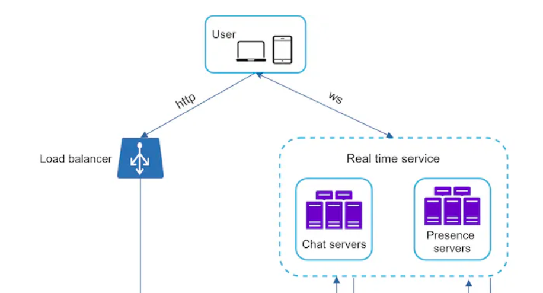
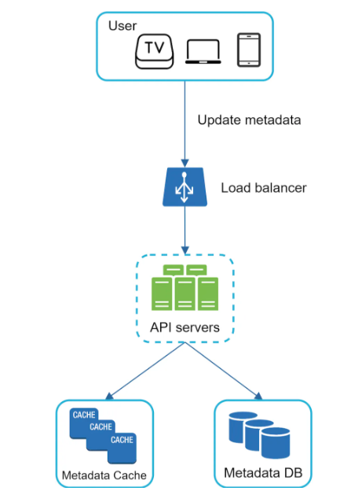
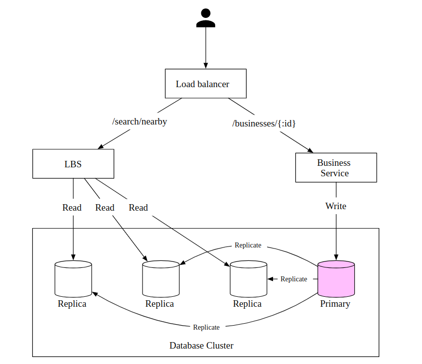
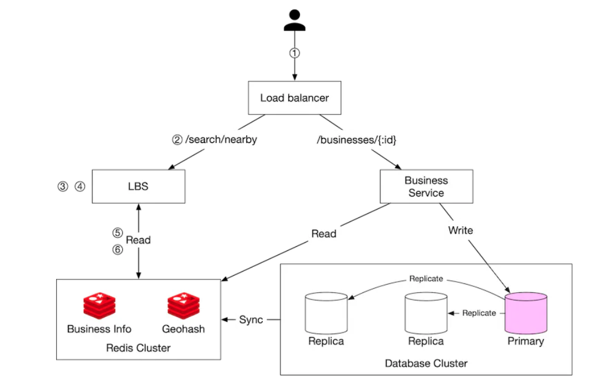

My Learnings on [ByteByteGo](https://bytebytego.com/).

# Scale From 0 to Millions of People

1) HTTP is the communication protocol used between web servers and mobile app.

2) Separating database and app tiers help us scale them independently.

3) CouchDB, Neo4j, Hbase are some NoSQL technologies. There are also Cassandra, Couchbase, MongoDB.

4) 4 categories of NoSQL databases:

    - Key-value stores:
    - Graph stores:
    - Column stores:
    - Document stores:

5) For most developers, RDBMS work very well.

6) NoSQL databases might be the right choice if 

    - the app requiring super-low latency.

    - data are unstructured or no relation exists in data.

    - You only need to serialize and deserialize data (JSON, XML, YAML, etc.).

    - Data to store is huge.

7) When traffic is low, vertical scaling is the way to prefer. The real advantage of vertical scaling(scale up) is its simplicity.

8) When Load Balancer exists, its IP is publicly available by users.

9) Database replication can be used in many database management systems, usually with a master/slave relationship between the original (master) and the copies (slaves). All data-modifying operations(insert, update, delete) must be sent to master(s). Read operations are sent to slave machines.


10) Improving the load/response time can be done by adding a cache layer and shifting static content (JavaScript/CSS/image/video files) to the content delivery network (CDN).

11) A cache is a temporary storage area of expensive operations. Hereby, less db operations are called. Couchbase can be considered as cache in companies.

12) Cache is bringing a solution to solve the problem of lots of DB calls. Cache is located between app and db.


13) Interacting with cache servers is simple because most cache servers provide APIs for common programming languages. The following code snippet shows typical Memcached APIs:

```java

SECONDS = 1
cache.set('myKey, 'hi there', 3600 * SECONDS)
cache.get('myKey')

```

14) Cache should be used in the scenario where READ operations outnumber MODIFY(INSERT/DELETE/UPDATE) operations. Cache server stores data in memory, therefore this is not appropriate for important data. Thus, important data should be stored in persistent locations such as DB, S3 etc.

15) Some considerations on cache usage

    - Decide when to use: Use when READ operations outnumber
    - Expiration policy: Set an appropriate expiration policy. Too small values lead to more DB calls, too big values lead data to become stale.
    - Consistency: Keep the data in store and the data in cache in sync.
    - Mitigating failures: Prefer using a cluster of cache rather than a single cache server.
    - Eviction policy: Removing some elements from cache when it is full. The removal criteria might be least recently used(LRU), least frequently used(LFU) or First in First Out(FIFO).

16) "A CDN is a network of geographically dispersed servers used to deliver static content". Dynamic content caching is a new concept that means caching of HTML pages but it isn't in the scope of this course. If a CDN server locates in Germany, a user from France accesses to it faster than a user from US. CDN Server has a TTL(time to live) for static contents on itself. If it exceeds the limit, the cached static content will be freed out and will be pulled again from web server or S3.


17) Stateless apps are preferrable over stateful apps. Staless apps aren't sharing the storage(RDMS, NoSQL). Staless apps are easily scaled. Stateful app can be thought as 2 web servers each having separate DB's and users whose name start with A-B-C-D-E are directed to server 1 and users whose name start with F-G-H-J-I are directed to server 2. The data on server 1 and server 2 are different and the direction happens in load balancer. Whereas, the DB is the same among 2 servers in the scenario of stateless apps.


18) When there are 2 data centers, users are geoDNS-routed, also known as geo-routed, to the closest data center normally. A challenge of multiple data centers is data syncranization. "In failover cases, traffic might be routed to a data center where data is unavailable".

19) Message Queue is stored in RAM and supports and asynchronous communication. Message queues help decoupling and makes our software loosely coupled.

20) Logging, Metrics and Automation become necessary when things become complicated

21) AWS RDS can provide a database whose ram is 24 TB.

22) Horizontal scaling is also known as sharding. "Sharding separates large databases into smaller, more easily managed parts called shards. Each shard shares the same schema, though the actual data on each shard is unique to the shard". When data wants to be accessed, a hash function  is called. When there are 4 shards, a hash function of mod 4 is called to determine where to allocate/access from where.


23) "The most important factor to consider when implementing a sharding strategy is the choice of the sharding key". "Sharding key (known as a partition key) consists of one or more columns that determine how data is distributed". "When choosing a sharding key, one of the most important criteria is to choose a key that can evenly distributed data".

24) Some problems of sharding

    - Resharding data
    - Celebrity problem
    - Join and de-normalization: When DB is sharded, it is hard to perform join operations

25) Denormalization is a way to solve the problem of running complex joins multiple time. When we want to run a complex join query, running it a lot might be costly. In this scenario, what is required is to run the query once and store it on a table. This is known as denormalization. It leads to redundant data on all shards but prevents us from running the same query multiple times.

26) It is a good practice to move non-relational functionalities to a NOSQL DB.


# Back-of-the-envelope Estimation

1) Back-of-the-envelope calculation means rough/approximate calculation.

2) A byte is a sequence of 8 bits. An ASCII character uses one byte of memory (8 bits).


3) 1 ms(millisecond) = 10^-3 seconds = 1,000 µs(microsecond) = 1,000,000 ns(nanosecond)

4) Some latency numbers


5) Avoid disc seeks and prefer using RAM. Compress data before sending over the network.

6) QPS means query per second. 

7) Commonly asked back-of-the-envelope estimations: QPS, peak QPS, storage, cache, number of servers.

# A Framework For System Design Interviews

1) Asking good questions is vital in system design interviews.

2) DAU means daily active user.

# Design A Rate Limiter

1) "In a network system, a rate limiter is used to control the rate of traffic sent by a client or a service". It can be time-based, IP-based or device based. Rate limiter blocks excess calls.

2) DoS means Denial of Service. 

3) Python libraries [fastapi-limiter](https://pypi.org/project/fastapi-limiter/) and [slowapi](https://pypi.org/project/slowapi/) are 2 libraries to set a rate limit in FastAPI.

4) Rate limiting can be server-side or client-side. Client-side rate limiting is untrusted because it is vulnarable to misuse of forgers. Rate limiting can be programmed in the application code or as a separate service.

5) Rate limiting can be in the middleware as below:


6) Rate limiting is implemented in API Gateway in cloud apps. "API gateway is a fully managed service that supports rate limiting, SSL termination, authentication, IP whitelisting, servicing static content". Rate limiting can be implemented in API Gateway or server-side applications(FastAPI etc.). There is no clear answer to this question.

7) Evolution of an API architecture


8) Algorithms for rate limiting

- Token bucket: Simple, well understood and commonly used by Amazon and Stripe. Bucket size and refill rate are 2 parameters.


- Leaking bucket: Bucket size and outflow rate are 2 parameters. Shopify uses this algorithm.


- Fixed window counter:


- Sliding window log:


- Sliding window counter:


9) High level architecture of rate limiting. At the high level, we need a counter of how many requests are sent from the same user, IP address etc.


10) Redis is a popular option for rate limiting as an in-memory store. Redis has TTL(Time To Live) property.

11) Lyft open sourced its rate limiting library as [here](https://github.com/envoyproxy/ratelimit). It works as a configuration file.

12) When a request is rate limited, a HTTP response called 429 is returned.


13) When a rate limiter server is enough, it is necessary to scale up rate limiter server.

14) A good practice of multiple rate limiters with redis


15) "Multi-data center setup is crucial for a rate limiter because latency is high for users located far away from the data center"

16) We talked about rate limiting at the application level(layer 7) but it is possible to rate limit at other layers. We can rate-limit IP addresses using IP Tables(IP layer 3).

17) Soft rate limiting is permitting users to send requests for a short period of time even if it exceed rate limit. Hard rate limiting isn't rrmitting users to exceed the threshold.

18) Avoid being rate-limited. Use client cache to avoid frequent API calls. Understand the limit and don't send too many requests in a short period of time.

# Design Consistent Hashing

1) For horizontal scaling, it is significant to distribute requests over servers. Hashing is important in this topic.

2) A basic approach as below. However, it is problematic in the case of adding and removing servers.


3) "Consistent hashing is a special kind of hashing such that when a hash table is re-sized and consistent hashing is used, only k/n keys need to be remapped on average, where k is the number of keys, and n is the number of slots. In contrast, in most traditional hash tables, a change in the number of array slots causes nearly all keys to be remapped"

4) SHA-1 is a commonly used hash function.

5) A demonstration of hash space and hash keys


6) Go clockwise from the key position on the ring until a server is found.


7) Adding a server or removing a server is easy in consistent hashing. However, when a server goes offline, its traffic will go to the clockwise server. In this way, traffic will be less even. 

8) A further solution to above problem is to use virtual nodes. The more the virtual nodes, the less the imbalance of distribution.


9) Consistent hashing is used in partitioning component of Amazon's DynamoDB, partitioning across the cluster in Apache Cassandra, Discord chat application etc.

# Design A Key-value Store

1) "A key-value store, also referred to as a key-value database, is a non-relational database". Short keys perform better. Key can be plain text like this_is_a key or hashed value like AB241AD56.

2) "An intuitive approach is to store key-value pairs in a hash table, which keeps everything in memory".

3) To overcome the problems of using single server key-value store, we should prefer

    - Data compression
    - Store only recent data in memory and rest in disc.

4) A distributed key-value store is also called a distributed hash table, which distributes data across many servers.

5) CAP Theorem states that it is impossible to provide Consistency, Availability and Partition tolerance at the same time.
    - Consistency: All clients viewing the same data
    - Availability: All clientst having a response even if some nodes are down.
    - Partition Tolerance: A partition indicates a communication break between two nodes. Partition     tolerance means the system continues to operate despite network partitions


6) Meanings of different combinations

    - CP: Consistency and Partition Tolerance preferred over Availability. Banks prefer. MongoDB follows this combination.
    - AP: Availability and Partition Tolerance preferred over Consistency. Cassandra follows this combination.
    - CA: Consistency and Availability preferred over Partition Tolerance. Since network failure is unavoidable, CA isn't possible in real life.

7) In reality, partitions(breaks) happen in a distributed system.

## Data partition

8) It isn't feasible to store all data in a single server. Thus, it is required to distribute data across many servers. One way to achieve this is to use [consistent hashing](#design-consistent-hashing). "Using consistent hashing to partition data has the following advantages":

- Automatic scaling: Automatically adding and removing servers

- Heterogeneity: The number of virtual nodes is proportional to the capacity of server.

## Data replication

9) Data should be replicated over N servers. N is a tunable parameter. In the scenario below, data is replicated in 3 servers. The logic is to choose 3 servers in the clockwise way. Virtual Nodes shouldn't be taken into consideration.


## Consistency

10) Data should be syncronized since it is distributed over multiple servers.

11) Some hyperparameters to tune

    - N: The number of replicas
    - W: A write quorum of size W. In order for a write operation to be regarded as successful, write operation must be acknowledged by at least W replicas
    - R: A read quorum of size W. In order for a read operation to be regarded as successful, read operation must be acknowledged by at least R replicas.

12) "The configuration of W, R and N is a typical tradeoff between latency and consistency". If W or R is 1, an operation is returned quickly. If W or R > 1, it offers better consistency but less speed.

    - If R = 1 and W = N, the system is optimized for a fast read.

    - If W = 1 and R = N, the system is optimized for fast write.

    - If W + R > N, strong consistency is guaranteed (Usually N = 3, W = R = 2).

    - If W + R <= N, strong consistency is not guaranteed.

13) A consistency model defines the degree of data consistency.

    - Strong consistency: "Any read operation returns a value corresponding to the result of the most updated write data item. A client never sees out-of-date data".
    - Weak consistency: "Subsequent read operations may not see the most updated value".
    - Eventual consistency: "This is a specific form of weak consistency. Given enough time, all updates are propagated, and all replicas are consistent". Dynamo and Cassandra prefer this.

14) "A [vector clock](https://en.wikipedia.org/wiki/Vector_clock) is a [server, version] pair associated with a data item. It can be used to check if one version precedes, succeeds, or in conflict with others".

## Handling failures

15) In a distributed system, at least 2 servers are required to tell that another server is down.

16) [Gossip protocol](https://en.wikipedia.org/wiki/Gossip_protocol#:~:text=A%20gossip%20protocol%20or%20epidemic,all%20members%20of%20a%20group.) is a way to detect decentralized server detection.

17) Sloppy quorum and hinted handoff are 2 techniques to deal with temporary failures. Sloppy quorum is a technique to choose write/read servers. "The first W healthy servers for writes and first R healthy servers for reads on the hash ring". It is an alternative to quorum requirement described above. Hinted handoff means that server A processes requestes of server B if server B is down. If server B becomes up, the data on B gets updated and then requests are directed to server B.

19) It is significant to replicate data over multiple data centers.

20) Merkle tree is a technique to handle permanent failures.

21) A coordinator is a node that acts as a proxy between the client and the key-value store.


22) A summary table of above ones


# Design A Unique ID Generator In Distributed Systems

1) The canonical way to generate unique id's in RDBMS is to use a primary key with auto increment attribute.

2) Auto increment doesn't work in a distributed environment.

3) Unique ID must be unique and sortable.

4) The options to generate unique ID's

- Multi-master replication: Using the auto increment feature of DB's. Instead of increasing one, increase by k.


- Universally unique identifier (UUID): "UUID is a 128-bit number used to identify information in computer systems". "Here is an example of UUID: 09c93e62-50b4-468d-bf8a-c07e1040bfb2".

- Ticket server: Flickr uses. "The idea is to use a centralized auto_increment feature in a single database server (Ticket Server)"


## Snowflake Approach

- Twitter snowflake approach:


# Design A URL Shortener

1) Tinyurl is a url shortener service. It is a paid service.

2) Url shortening is a commonly asked system design question.

3) The ratio of read operation over write operation is around 10 on average.

4) A URL Shortener has the following 2 endpoints:

    - URL shortening: POST request. Inputting a long url, converting it to a short url and outputting a short url.

    - URL redirecting: GET request. Inputting a short url and returning a long url.

5) This is what happens when a shortened url is entered into a browser.


6) There are 2 redirection policies:

    - 301 redirect:

    - 302 redirect:

7) "The most intuitive way to implement URL redirecting is to use hash tables".

8) URL Shortening high level design. It uses a hash function.


9) In the high-level design, hash table is stored in memory. However, the memory is limited and expensive. Thus, hash table should be stored in a RDBMS.

10) Hash function is a function that is used to convert long url into short url.

11) "The hashValue consists of characters from [0-9, a-z, A-Z], containing 10 + 26 + 26 = 62 possible characters".

12) There are 2 types of hash functions.

- Hash + collision resolution: "The first approach is to collect the first 7 characters of a hash value".


- Base 62 conversion: Base conversion helps to convert the same number between its different number representation systems


13) The comparison of Hash + collision resolution and Base 62 conversion


14) A general flow:


15) URL Redirecting with cache, db, load balancer and web servers.


16) "Integrating an analytics solution to the URL shortener could help to answer important questions like how many people click on a link".

# Design A Web Crawler

1) A web crawler is also known as a robot or a spider. Web crawlers are used by search engines.

2) Web crawlers go to a website, then find links on that site, go to links. This lifecycle happens iteratively.


3) Why to use web crawlers:

    - Search engine indexing: The most comon case

    - Web archiving:

    - Web mining:

    - Web monitoring:

4) The algorithm of web crawlers as follows:

    - Given a set of URLs, download all the web pages addressed by the URLs.

    - Extract URLs from these web pages

    - Add new URLs to the list of URLs to be downloaded. Repeat these 3 steps.


5) An average web size is 500 kilobytes.

5) 29 percent of pages on the web are duplicates.

6) A high-level design of web crawler


7) Components of a web crawler:

- Seed URL's: Started as starting point of the crawl process. It can be based on domain or country.

- URL Frontier: Storing URL's to be downloaded. Can be considered as First in First Out queue.

- HTML Downloader: Downloading web pages from the internet.

- DNS Resolver: Translating URL into an IP address

- Content Parser: Parsing and validating the downloaded page.

- Content Seen?: Eliminating data redundancy and shortening process time.

- Content Storage: Storing HTML content. Can be in RAM or disc.

- URL Extractor: Parsing and extracting links from HTML pages

- URL Filter: Excluding some URL's such as blacklisted ones, error links etc.

- URL Seen?: Helping to avoid the same URL multiple times.

- URL Storage: Storing already visited URL's

8) Web can be thought as a directed graph where web pages are nodes and urls are edges.

9) There are 2 common graph traversal algorithms to traverse the web. BFS is commonly used by web crawlers.

    - Depth-first search (DFS):

    - Breadth-first search (BFS):

10) "The URL frontier is an important component to ensure politeness, URL prioritization, and freshness".

## URL frontier

11) Sending too much requests to a server can be regarded as impolite.

12) The idea of politenss is about not to send too many requests from the same host. A design that manages politeness is below


13) Prioritizer is the component of URL Frontier. It prioritizes URLS. A design that manages URL prioritazitons.


14) Prioritizer is the front component of URL Frontier. Politeness is the back component of URL Frontier.


## HTML Downloader

15) Robots.txt is called robot exclusion protocol. It is a standard used by websites to communicate with crawlers. It defines what can be crawled or not .

```robots.txt
User-agent: Googlebot
Disallow: /creatorhub/\*
Disallow: /rss/people/\*/reviews
Disallow: /gp/pdp/rss/\*/reviews
Disallow: /gp/cdp/member-reviews/
Disallow: /gp/aw/cr/
```

16) To have a better performance, crawl jobs are distributed among multiple servers and multiple threads on a server.

17) Some tricks for Performance optimization

- Distributed crawl: Carry out crawling operation on multiple servers.

- Cache DNS Resolver: Response time of DNS Servers might be too high. 

- Locality: Locate servers and caches in close to where the target servers are.

- Short timeout: Specify a response time. If it exceeds, move to the next page.

18) Hashs and checksums help to detect duplicates.

19) In order to retrieve dynamically generated links, perform server-side rendering first before parsing a page.

# Design A Notification System

1) 3 types of notification formats

- Mobile Push:

- SMS:

- E-mail:

2) Notifications can be triggered by client applications. They can also be scheduled on the server side.

3) A summary with third party libraries. APNs means Apple Push Notification Services. FCM means Firebase Cloud Messaging.


4) Twilio and Nexmo are some 3rd party service providers.

5) Companies can build their own e-mail servers but it isn't preferred so much. They prefer to use 3rd party e-mail services like Sendgrip and Mailchimp since it offers a better delivery rate and data analytics.

6) To send a notification on Apple, 3 components needed. 


- Provider: Sending notification requests to APN's

- Device Token: Unique identifier used for sending notifications

- Payload: A json dictionary containing the notification's payload. An example below:

```json
{
   "aps":{
      "alert":{
         "title":"Derbide Gol",
         "body":"Fenerbahçe 1-0 öne geçti",
         "action-loc-key":"PLAY"
      },
      "badge":5
   }
}
```

7) A high-level and decoupled notification service diagram


8) Message queues remove dependencies between components.

9) User info, device info and notification templates are stored in cache.

10) DB stores data about user, notification, settings, etc.

11) Reliability is an important concept. The notification log database is included for data persistance.


12) Some additional components and considerations

- Notification template: Maintaining a consistent format for notifications.

- Notification setting: Storing which user prefers which channel or not. For instance, User with ID 12 want to have e-mail notifications but not want to have SMS notifications. It is checked before sending notifications.

- Rate limiting: To limit number of notifications a user can take

- Retry mechanism: "When a third-party service fails to send a notification, the notification will be added to the message queue for retrying".

- Security in push notifications: Only authenticated clients can send push notifications.

- Monitor queued notifications: Monitoring queue message count. If large, workers not processing well.

- Events tracking: Monitoring after push notifications is so crucial. "Analytics service implements events tracking. Integration between the notification system and the analytics service is usually required".


13) An updated design with above considerations


# Design A News Feed System

1) It is a popular interview question.

2) There can be many NewsFeed API's such as posting a stutus, retrieve news feed, adding friends. The most important ones are feed publishing API and news feed retrieval API.

3) Authentication token is used to authenticate API requests.

4) Feed publishing API has the following features:

- POST /v1/me/feed

    - Params:

    - content: content is the text of the post.

    - auth_token: it is used to authenticate API requests.

5) Newsfeed retrieval API has the following features:

- GET /v1/me/feed

    - auth_token: it is used to authenticate API requests.

6) Feed Publishing API - High Level Design

- Post Service: Persisting post in DB and cache

- Fanout service: Pushing the new content to friends' feed

- Notification service: Informing friends that new content is available.


6) High Level Design of Newsfeed retrieval API


7) Web servers can carry out authentication and rate limiting.


8) "If a user has many friends, fetching the friend list and generating news feeds for all of them are slow and time consuming". It is called hotkey problem.

9) Fanout is the process of delivering a post to all friends. 2 types of fanout:

- Fanout on write(Push model): Real time model. The news feed is generated pre-computed, thus fast.

- Fanout on read(Pull model): On demand model. The news feed is generated on reading time, thus slow.

10) A hybrid approach can be the solution. It states that prefer push model for majority of users and prefer pull model for celebrities.

11) A detailed look at fanout service


12) Graph databases are good at managing friend relationships and recommendations.

13) News feed cache as a <post_id, user_id> mapping table.

14) A detailed look at Newsfeed retrieval


15) Cache is so significant for a newsfeed system.


# Design A Chat System

1) In a chat system, clients don't communicate with each other directly. Each client connects to a chat service.


2) "When a client intends to start a chat, it connects the chats service using one or more network protocols. For a chat service, the choice of network protocols is important".

3) On the sender side, the most common protocol is time based HTTP with keep-alive header. Many popular chat applications use this on the sender side.

4) HTTP is client-initiated. Thus, it isn't easy to send messages from server. Some techniques are introduced to overcome this problem.

    - Polling
    - Long Polling
    - Web Socket

5) Polling is a technique in which the client asks the server whether any message exists periodically. If the frequency is high, it is costly.


6) Long polling can be the solution when polling is inefficient. "In long polling, a client holds the connection open until there are actually new messages available or a timeout threshold has been reached".


7) "WebSocket is the most common solution for sending asynchronous updates from server to client"

8) "WebSocket connection is initiated by the client. It is bi-directional and persistent. It starts its life as a HTTP connection and could be “upgraded” via some well-defined handshake to a WebSocket connection. Through this persistent connection, a server could send updates to a client. WebSocket connections generally work even if a firewall is in place. This is because they use port 80 or 443 which are also used by HTTP/HTTPS connections".

9) Websocket connection can be on sender-side or receiver side. Efficient connection management is crucial on the server side because web socket connections are persistent. Web socket is bidirectional. Web socket is used in online chat applications, online gaming, live data feeds. It uses "ws://" or "wss://". "wss" means secure connection as https means secure connection.


10) Most component of an app(sign up, sign in, profile page etc) could use traditional HTTP way. Web socket isn't indispensable.

11) A high-level design of a chat application


12) Chat service is a stateful service.

13) For a chat application, the most important third party integration is push notification.

14) Presence service is a service responsible for showing online/offline status. It is working real time with ws(websocket) protocol.



15) In a typical chat system, there are 2 types of data. The metadata such as user profile, setting, friend lists is stored in an RDBMS. Replication and sharding are common techniques to satisfy availability and scalability requirements.

16) The second data in a chat app is chat history. The ratio of read to write in a 1 on 1 chat app is 1. The recommended data storage for chat history is key-value store. Facebook Messenger uses HBase, Discord uses Cassandra; bot are key-value stores.

17) Message table of 1 on 1 chat. The primary key is message id.


18) Message table of group chat. The primary key is message id and channel id.


19) Message Id should be unique and sortable by time. The more the id, the more recent the message. [Snowflake's approach](#snowflake-approach) can be a solution for a general id. However, a better solution is to use a local id within one-on-one channel or a group channel. Every message in a 1 on 1 chat or group message has a different message id. Wherease, an id of 12345 in group a can exist as an id of 12345 in group b.

20) Service discovery is responsible for choosing the best server for the client based on some criteria such as geographical location or server capacity. Apache zookeeper is a popular open source solution for service discovery.


21) 1 on 1 chat flow


22) Message synchronization across multiple devices. cur_max_message_id means the latest message id on the device.


23) Small group chat flow. Wechat uses this approach and limits a group to 5000 users. Message sync queue can be thought as an inbox for a recipient. This choice is good for small groups because

    - It simplifies message sync flow as each client only needs to check its own inbox to get new messages.

    - When the group number is small, storing a copy in each recipient’s inbox is not too expensive.

- Sender side


- Receiver side. A receiver can take messages from multiple different users.


24) User login, user logout, disconnect and online status fanout diagrams respectively for Presence service.


# Design A Search Autocomplete System

1) A search autocomplete system is an important feature of many products.

2) One ASCII character holds 1 byte in memory. An average search query is consisting of 20 words, which is equal to 20 bytes. For a query consisting of 20 characters, 20 different requests will be sent to the server.

3) The application has 2 components:

- Data gathering service:"It gathers user input queries and aggregates them in real-time"


- Query Service: It returns 5 responses after taking requests.


## Trie

4) Trie data structure is a tree-like data structure. It is designed for string retrieval operations. It has following parameters:

- p: length of a prefix

- n: total number of nodes in a trie

- c: number of children of a given node

5) The algorithm is slow. Thus, 2 optimizations are introduced.

- Limit the max length of a prefix -> lowering the time complexity to O(1)

- Cache top search queries at each node -> lowering the time complexity to O(1)


## Data gathering service

6) Updating trie on each new query isn't practical. Instead, trie should be updated daily or weekly(recommended). Twitter is a real time app and it updates its autocomplete system hourly or less. Below is a diagram depicting how to update trie.


7) Some explanations of components of data gathering service

- Analytics Logs: Raw data.

- Aggregators: A service transforming raw data into an aggregated form.

- Aggregated data: A table of 2 columns, 1 column is query and 1 column is showing count.

- Workers: A set of servers building up the trie data sructure

- Trie Cache: A distributed cache system. It takes a snapshot of TrieDB.

- TrieDB: Persistent storage. Preferrably a NoSQL solution.

8) Persistent data can be stored in a TrieDB in two ways.

- Document store: A document store solution like MongoDB fits well for serialized data.

- Key-value store: Each prefix corresponding to key of a hash table and data on each node corresponding to value of a hash table.


9) The new design of query service. If query isn't in the cache, it is replenished back to the cache. Hereby, subsequent requests are going to provided by cache.


10) "For web applications, browsers usually send AJAX requests to fetch autocomplete results. The main benefit of AJAX is that sending/receiving a request/response does not refresh the whole web page".

11) Delete layer is located between trie cache and API servers. It is necessary to delete undesired autcomplete suggestions.


12) Scaling the storage is a problem in an autocomplete system. Let's assume we have 26 servers corresponding to 26 character. Each server is assigned to each character. Queries starting with a will be directed to server#1 and so on. In this scenario, data will be unevenly distributed because queries starting with a is much more than queries starting with x. Thus, there should be a sharding map manager to mitigate this phenomenon. For instance, this sharding manager might assign queries starting with a to server 1 and assign queries starting with x-y-z-t to server 26.


13) For multilanguage set up of an autocomplete system, unicodes should be used to create a trierather than regular characters. For different countries, different tries should be built.

# Design YouTube

1) GB cost of CDN for traffic is 0.02 dollar in US.

2) Blob storage and CDN are 2 important services of cloud computing to design Youtube. Netflix uses AWS's cloud services and Facebook uses Akamai's cloud services.

3) Blob Storage Service such as AWS S3 is required to store source videos.

4) A high-level design of Youtube


5) Video transcoding can also be named as video encoding. It is the process of transfoming a video format to other formats(MPEG, HLV).

6) A low-level design of Video Uploading


7) While a client is uploading a video, he also enters video metadata such as description and title. The following diagram shows how this process happens.



8) Different streaming protocols support different video encodings and playback players. Some popular streaming protocols are listed below:

- MPEG-DASH

- Apple HLS

- Microsoft Smooth Streaming

- Adobe HTTP Dynamic Streaming

9) For a streaming service, it can be said that videos are streamed from CDN directly. The edge server closest to client will deliver the video.

10) When a video is recorded, the device assigns a certain format to the video file. If it is desired to run the video on other devices, the video must be converted to relevant bitrates and formats.

11) Many types of encoding algorithms are out there. However, most of them contain 2 parts:

- Container: It is like a basket that contains video file, audio file and metadata.

- Codes: These are compression and decompression algorithms.

12) Transcoding a video is computationally expensive. It has different usages. User A want its video to have a thumbnail and watermark. User B wants its video to have a cutting-edge video quality. Thus, it is required to introduce some abstraction. Facebook achives this via DAG's(Directed Acyclic Graphs). An example DAG is below:


13) A diagram of video encodings


14) Video transcoding architecture


15) Some improvements

- Speed Optimization, Parallel Video Uploading: Video is chunked in client side and then uploaded.

- Speed Optimization, Nearest Data Center: A user in USA uploading the video to a data center in USA rather than in Europe.

- Speed Optimization, Parallelism: Integrating message queues into a video's flow from original storage to CDN in order to have a loosely coupled system 


- Safety optimization, pre-signed upload URL: Only authorized users can upload videos

- Safety optimization, protecting the videos: "To protect copyrighted videos, we can adopt one of the following three safety options"

    - Digital rights management (DRM) systems:

    - AES encryption:

    - Visual watermarking:

16) Serving most popular contents from CDN and others from high-capacity video servers


17) We didn't discuss live streaming but it has a ligher latency requirement.

# Design Google Drive

1) Starting simply and putting everything in a single server. The high-level design is composed of the followings:

    - A web server responsible for downloading and uploading files
    - A database to store metadata of users and files
    - A storage system to store uploaded files

2) 3 Endpoints required 

    - An endpoint to upload a file. Supporting regular upload and resumable upload.
    - An endpoint to download a file
    - An endpoint to list previos revisions.

3) AWS S3 can be used as storage service.

4) The design after some improvements like load balancer, multiplication of web servers, database sharding


5) Sync conflict is an issue when multiple users want to edit the same file.


6) The detailed design


7) "Block servers upload blocks to cloud storage. Block storage, referred to as block-level storage, is a technology to store data files on cloud-based environments. A file can be split into several blocks, each with a unique hash value, stored in our metadata database. Each block is treated as an independent object and stored in our storage system (S3). To reconstruct a file, blocks are joined in a particular order. As for the block size, we use Dropbox as a reference: it sets the maximal size of a block to 4MB"

8) How block servers work when a file is uploaded.


9) Delta syncranization means that only modified blocks are uploaded when a file is modified.


10) A relational database maintains ACID(Atomicity, Consistency, Isolation, Durability). NoSQL databases don't support ACID properties.

11) Database tables and their relationships in a simplified way


12) Upload flow


13) Download flow


14) Notification service is used for informing other clients in order to reduce conflicts. Long polling is preferred over web socket because the relationship isn't bidirectional. Dropbox uses long polling. Notification service is used to keep clients up-to-date.

15) In order to handle such a big project, eliminating redundant data is crucial. Redundant data means 2 blocks are identical if their hash values are the same.

16) It is possible to upload from client to storage by removing block servers. This is faster but not recommended. It requires chunking, compression and encryption on client side, which requires too much effort and is error-prone.

# Proximity Service

1) There are 3 functionalities of the service:

    - Returning all businesses based on user's location and radius
    - Business owners can update their data(business owner is a restaurant on YELP)
    - Customers can view additional data of businesses

2) When working with location data, we should give importance to laws such as GDPR of Europe or KVKK of Turkey.

3) [Google places API](https://developers.google.com/maps/documentation/places/web-service/search) is where we can find useful API implementations.

4) MySQL is #1 solution among RDBMS's for a system requiring lots of read operations over write operations.

5) High level design



6) Business service isn't real time. If a business is added to the app, it is added in the night. In addition, GET requests are sent to the business service by customers to view additional information about businesses.

## Algorithms to fetch nearby businesses

7) Geospatial databases used by companies

- Geohash in Redis

- Postgres with PostGIS extension

8) Database indexing improves search speed in one dimension. Thus, it is required to map 2 dimensional data into 1 dimension via hashing.

9) Geospatial Indexing Approaches


10) In Different types of geospatial indexes, "the high-level idea is to divide the map into smaller areas and build indexes for fast search".

11) Evenly divided grid is a simple solution to create equal-sized grids. However, the challenge is that the distribution of businesses isn't event.

### Geohash

12) Another alternative is geohash. It works by reducing 2 dimensional latitute and longitude data into strings of letters and digits. It works recursively by diving the world into smaller and smaller grids until it reaches the limit of griding. Bing map, mongodb, redis and lyft are using this approach.


13) "1001 10110 01001 10000 11011 11010" is the geohash of Google Headquarter. If it is converted to base32 representation, "9q9hvu" is obtained.

14) Geohash lengths and radiuses. 4 or 5 or 6 are generally enough.


15) Some drawbacks of Geohash are related to boundary issues. 2 points which are too close to each other can fall into different grids. In addition, 2 points that aren't far away from each other can have no overlapping on geohashes.

16) If return list isn't accessing to its limit, we should fill via removing elements from search strings. 9q8zn will be searched over db instead of 9q8zn3. If there aren't enough business when 9q8zn is searched too, the search will be converted to 9q8z.

### Quadtree

17) Quadtree is another population. It works in memory. For 200 million businesses, it takes 2 GB of RAM to store the information. It can dynamically adjust grid size as shown in Denver Example.


18) When 100 is the limit of businesses in a node and there are N businesses, the time complexity is N/100*log(N/100). It takes a few minutes to build the whole quadtree.

19) Updating the tree is hard to implement when a buniess is deleted.

20) It supports fetching k-nearest points. It is especially useful when we are looking for a gas station.

### Google S2

21) Google S2 is another in-memory solution. It uses Hilbert Curve in order to map 2-dimensional data into 1 dimensional data. 2 points close to each other in 2 dimensions are close to each other in 1 dimension based on the transformation of Hilbert Curve. It is used in Google and Tinder.


22) "S2 is great for geofencing because it can cover arbitrary areas with varying levels".


23) Geohash is easy to implement compared to Quadtree and S2.

24) The former is a suggested design in order to store geospatial data over the latter one.

Suggested:

| geohash | business_id |
|-----|------|
| x3t6yu | 111 |
| x3t6yu | 112 |
| x3t6yv | 113 |
| x3t6yv | 114 |

Not suggested:

| geohash | business_id |
|-----|------|
| x3t6yu | [111,112] |
| x3t6yv | [113,114] |

25) Final Design diagram of Location Based Service(LBS)



# Nearby Friends

1) It is a feature of Facebook and Snapchat. It shows logged-in users where his friends are on the map if location info is allowed to be used.

2) The main difference between Nearby Friends service and Proximity Service is that user is moving in nearby friends service whereas businesses are fixed in proximity service.

3) The high level design


4) The load balancer is directing traditional API requests like login, sign up, profile page to API servers. It directs requests related to nearby features to  Web socket servers. API servers are stateless but web socket servers are stateful.

5) Redis pub/sub is a lightweight message bus. Channels on pub/sub is cheap to create. It is similar to Apache Kafka or RabbitMQ but not the same. Channel in Redis pub/sub is similar to topics of Apache Kafka analogically.


6) A diagram showing one user's dispatching his location to his friends users.


7) API Design of Web Socker Servers

- Periodic location update: Client sending location(latitude, longitude) and timestamp to web socket servers.

- Client receives location updates: Friend location data and timestamp are received by a client.

- WebSocket initialization: Client sending location and time stamp and retrieving location data of his friends

- Subscribe to a new friend: WebSocket server sends friend ID and Friend’s latest latitude, longitude, and timestamp are returned.

- Unsubscribe a friend: WebSocket server sends friend ID and no response.

9) Redis is used as cache. Latest locations of users are stored only. Redis's TTL feature is coming in handy when a user turns out to be offline. The design of cache is as follows.


10) Location history will be kept in database for other aims like ML based recommendation engine. Location History isn't directly related to Nearby Features.

11) Removing a node from web socket servers should be carried out carefully. Autoscaling of a web socket server is under the responsibility of load balancer.

12) On Redis pub/sub, a user subscribes to all friends, irrespective of online and offline. The offline friends will consume less memory because redis pub/sub is lightweight. In addition, offline friends don't consume I/O and CPU resources.


